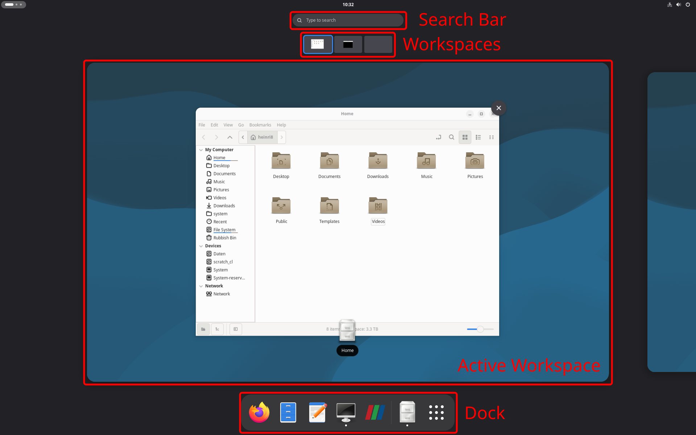

# The Gnome Desktop

This seminar utilizes the **Debian 13** operating system with the **GNOME** desktop environment. 

Linux looks and feels different than Windows. In Windows, the operating system and the graphical interface are one tightly integrated package. In Linux, they are separate. Debian handles the underlying system (managing files, hardware, and running OpenFOAM), while GNOME is the graphical user interface of the system, the windows, buttons, and menus used to interact with.

Here is a quick guide to navigating GNOME and where to find everything.

## Comparison between Windows and Gnome

| Windows Feature | GNOME Equivalent | How to access it |
| :--- | :--- | :--- |
| Start Menu | Activities Overview | Press the `Super` key (the Windows key on your keyboard) or click "Activities" in the top left. |
| Taskbar | The Dash (Dock) | Press the `Super` key. The dock appears at the bottom of the screen. |
| Windows Explorer | Files (Nautilus) | Open the "Files" app from the Dash or App Grid. |
| System Tray (Bottom Right) | Quick Settings (Top Right) | Click the top-right corner of the screen (Wi-Fi, sound, power). |
| Command Prompt / PowerShell | Terminal | Press `Super`, type "Terminal", and press Enter. |

## Key Features of GNOME

### The "Activities" Overview and the Super Key
GNOME is designed around minimizing distractions. When you log in, you will see an empty desktop. There are no desktop icons and no traditional Start button. Everything revolves around the **Activities Overview**:

* Press the **`Super` key** (the key with the Windows logo) or click the top-left corner of the screen to open the Activities overview.
* In the Activities overview, the screen zooms out. You will see all your open windows, your workspaces, the search bar at the top, and the **Dash** (dock) at the bottom.
* There are two ways to launch applications:
  1. Click on the dots icon in the dock at the bottom within the Activities overview and select an application.
  2. Simply start typing the name of an application within the Activities overview. For example, to open the file manager, press `Super`, type `files`, and hit `Enter`. This is the fastest way to work.
* You can add and remove apps from the dock via drag-and-drop.
* Windows can be **snapped** to take up exactly half the screen. Drag a window to the left or right edge of the screen.

### The File Manager
The GNOME file manager is simply called **Files**. There are some differences in the file system between Windows and Linux:
* Linux does not use lettered drives. Everything starts at the "root" directory, denoted by a forward slash `/`. 
* Your personal files are stored in your Home directory (`/home/username/` or simply `~`). When you open the Terminal, it automatically starts here.
* In Linux, any file or folder that starts with a dot (e.g., `.bashrc`) is hidden. **To view hidden files** in GNOME, press `Ctrl + H` or right-click in the folder and select **Show Hidden Files**.

### Workspaces (Virtual Desktops)

To keep the workflow organized, GNOME uses **Workspaces**:
* Press the `Super` key and look at the top (or right side) of the screen to see your workspaces. You can drag and drop open windows into different workspaces to keep your Terminal separate from your visualization tools.
* Switch between workspaces quickly by pressing `Super + PageUp` or `Super + PageDown`.
* For example, you might have one window for your Terminal (running the simulation), one for ParaView (visualizing the results), and a web browser open to this tutorial.

### Quick Settings
The Quick Settings menu provides access to volume, network connectivity, power management, and user session options (such as logging out or shutting down). To open this menu, click the status icons located in the **top-right corner** of the screen.