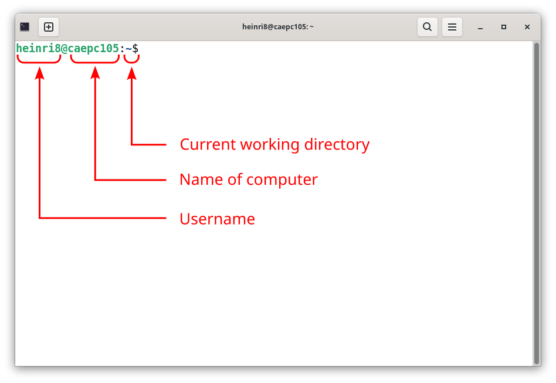

# The Linux Terminal

While graphical interfaces are suitable for file management and web browsing, computational fluid dynamics workflows using OpenFOAM rely entirely on the command-line interface, known as the **Terminal**.

Open the Terminal by pressing the `Super` key, typing `terminal`, and pressing `Enter`.  The terminal will open and you will see a prompt similar to this:



## Understanding the Command Prompt

When the Terminal opens, a command prompt appears, waiting for input. It typically follows this format:
`username@computername:~$`

* `username`: The current user's account name.
* `computername`: The hostname of the machine.
* `~` (tilde): Indicates the current working directory. In Linux, the tilde is a shortcut representing the user's Home directory (`/home/username`).
* `$`: Indicates that the terminal is ready to accept a standard command.


## Command Structure

A typical Linux command consists of up to three parts, separated by spaces:

```bash
command [options] [arguments]
```

1. `command` is the program to be executed.
2. `[options]` are *optional* paramters, which modify the behavior of the command, usually preceded by a hyphen (e.g., `-l` for a long, detailed format).
3. `arguments` are the target file or directory the command should act upon.


## Quality-of-Life Features

Navigating the terminal requires typing, but there are two critical features designed to speed up the workflow and reduce typographical errors:

* **Tab Completion:** When typing a file or directory name, pressing the `Tab` key will automatically complete the name. If multiple files share the same starting letters, pressing `Tab` twice will display all possible options. **This feature should be used constantly.**
* **Command History:** Pressing the `Up Arrow` and `Down Arrow` keys cycles through previously executed commands. This eliminates the need to retype long commands.


## Expanded Command Dictionary

The following commands form the foundation of navigating and manipulating files within a Linux environment.

### Navigation & Viewing

| Command | Description | Common Usage & Flags |
| :--- | :--- | :--- |
| `pwd` | **P**rint **W**orking **D**irectory. Displays the absolute path of the current directory. | `pwd` |
| `ls` | **L**i**s**t. Displays the contents of a directory. | `ls -l` (detailed list), `ls -a` (shows hidden files). |
| `cd` | **C**hange **D**irectory. Moves the working location. | `cd ..` (moves up one directory), `cd ~` (returns to Home). |
| `cat` | con**cat**enate. Outputs text file contents to the screen. | `cat system/controlDict` |
| `clear` | Clears the terminal screen of all previous output. | `clear` |

### File & Directory Management

| Command | Description | Common Usage & Flags |
| :--- | :--- | :--- |
| `mkdir` | **M**a**k**e **Dir**ectory. Creates a new folder. | `mkdir new_folder` |
| `cp` | **C**o**p**y. Duplicates a file or directory. | `cp file.txt copy.txt`. Use `cp -r` to copy a whole directory. |
| `mv` | **M**o**v**e. Moves a file. It is also used to **rename** files. | `mv old_name.txt new_name.txt` |
| `rm` | **R**e**m**ove. Deletes a file. **Warning: There is no recycle bin in the terminal. Deletion is permanent.** | `rm file.txt`. Use `rm -r` to delete a directory. |