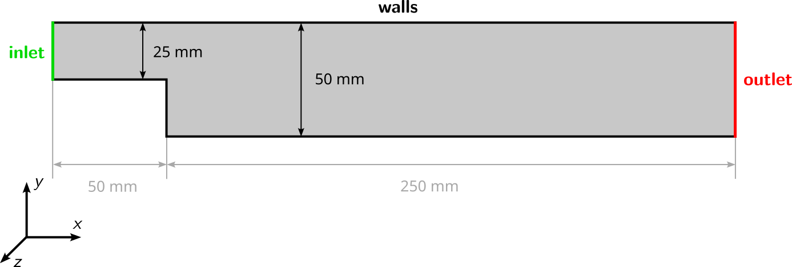
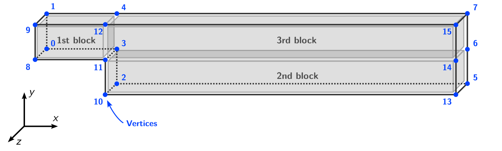
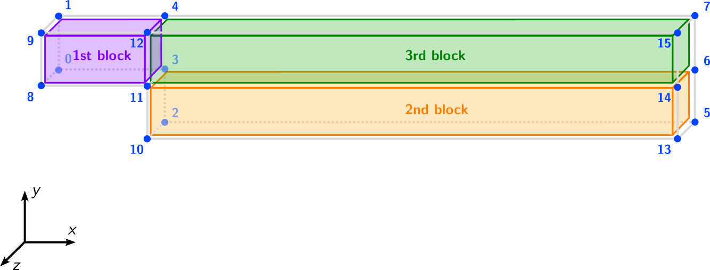
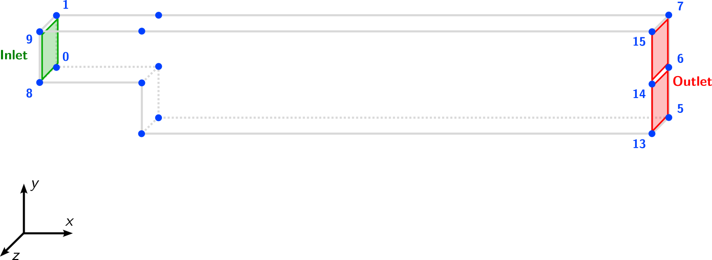
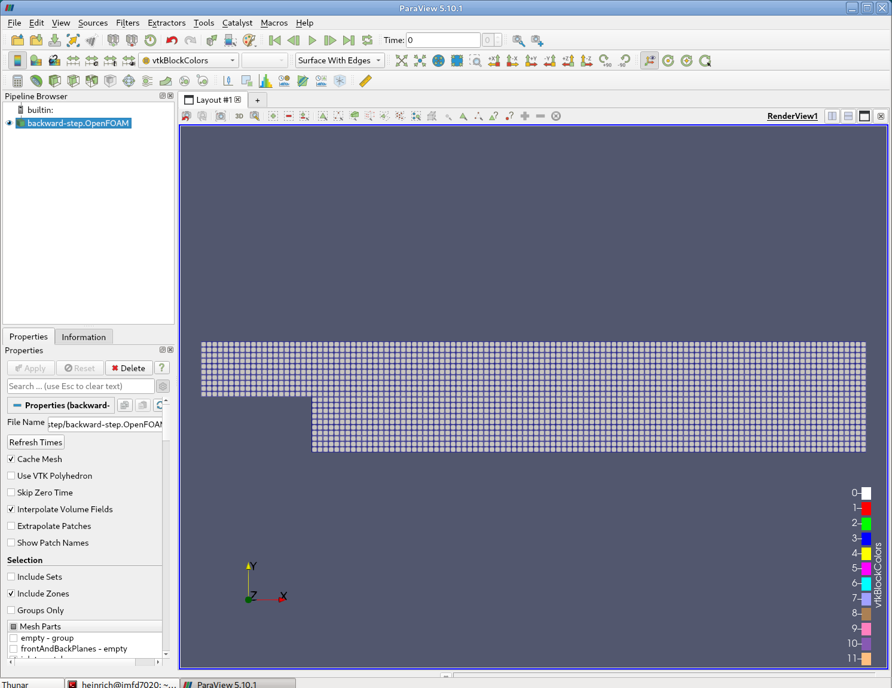
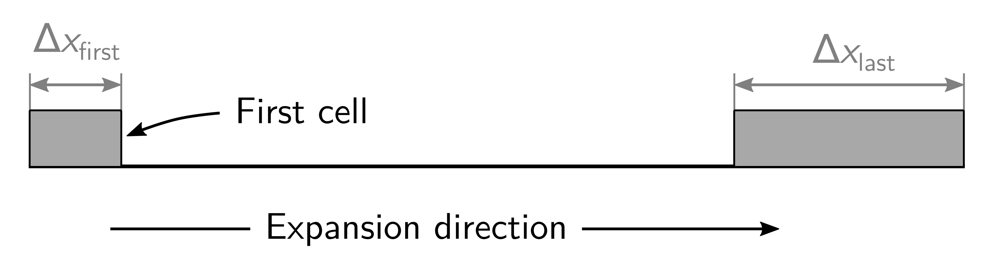

# Block-structured Mesh Generation

## Introduction

This second part explains how the OpenFOAM meshing tool `blockMesh` can be used to create block-structured meshes. At the end, the mesh will be visualized using ParaView. The geometry of the case looks as follows:



Navigate with your terminal to the extracted sub-directory `2_backward-step` within the `2_mesh_generation` directory.


## OpenFOAM case structure

The folder structure for the backward-facing step case looks similar to the elbow case. In this tutorial case, the backward step folder contains the following subfolders and files:

```
2_backward-step
└── system
    ├── blockMeshDict
    └── controlDict
                
1 directories, 2 files
```

Compared to the elbow case, there is only one additional file called `blockMeshDict` in the `system` folder.


## Mesh generation

The backward-step domain is meshed using a block-structured topology consisting of three connected blocks representing a two-dimensional channel with a backward-facing step.

Instead of importing an already existing grid, the mesh for this case will be created using the OpenFOAM utility `blockMesh`, which creates high-quality, parametric block-structured meshes with (optional) grading and curved edges. The utility has no graphical user interface and the mesh is generated from a dictionary file named `blockMeshDict` located in the `system` directory of the case. In this case, the file has the following structure:

```
/*--------------------------------*- C++ -*----------------------------------*\
 =========                 |
 \\      /  F ield         | OpenFOAM: The Open Source CFD Toolbox
  \\    /   O peration     | Website:  https://openfoam.org
   \\  /    A nd           | Version:  13
    \\/     M anipulation  |
\*---------------------------------------------------------------------------*/
FoamFile
{
    format      ascii;
    class       dictionary;
    object      blockMeshDict;
}
// * * * * * * * * * * * * * * * * * * * * * * * * * * * * * * * * * * * * * //

vertices
(
    ...
);

blocks
(
    ...
);

defaultPatch
{
    ...
}

boundary
(
    ...
);

// ************************************************************************* //
```

The file structure follows the overall meshing process of `blockMesh`:

1. All coordinates of the vertices of the individual blocks are defined in a list `vertices`.
2. Based on these vertices, the individual blocks are created and meshed under `blocks`.
3. Default patches without specification can be set in the optional `defaultPatch` entry.
4. The boundary patches of the case are defined in `boundary`.


### Definition of the vertices

At first, the coordinates of the 16 vertices are specified in a list, where the vertices are numbered internally starting from zero. Then, each vertex can be accessed by its position in the list. This `vertices` subdict looks as follows in `blockMeshDict`:

```
vertices
(
    (-50 25  -1)
    (-50 50  -1)
    (0   0   -1)
    (0   25  -1)
    (0   50  -1)
    (250 0 -1)
    (250 25   -1)
    (250 50  -1)

    (-50 25  1)
    (-50 50  1)
    (0   0   1)
    (0   25  1)
    (0   50  1)
    (250 0   1)
    (250 25   1)
    (250 50  1)  
);
```

The resulting vertices look like follows with the vertices and their numbering in blue and the geometry in grey:




### Creation of blocks

These vertices are used to define the three blocks of the block-structured mesh. Each block consisting of hexahedral cells only consists of exactly 8 vertices, which are defined based on their index in the vertex list. This reads as follows for this case:

```
blocks
(
    // 1st block
    hex (0 3 4 1 8 11 12 9)
    (20 10 1)
    simpleGrading (1 1 1)

    // 2nd block
    hex (2 5 6 3 10 13 14 11)
    (100 10 1)
    simpleGrading (1 1 1)

    // 3rd block
    hex (3 6 7 4 11 14 15 12)
    (100 10 1)
    simpleGrading (1 1 1)
);
```

This means that the first block contains of vertices with the label `(0 3 4 1 8 11 12 9)`. The ordering of the vertices is important as the local coordinate system of each block must be oriented right-handed. The second entry for this block `(20 10 1)` gives the number of cells in each direction, e.g. the block contains 20 cells in $$x$$-direction, 10 cells in $$y$$-direction and 1 cell in $$z$$-direction. The third entry of the first block `simpleGrading (1 1 1)` defines the cell expansion ratios for each direction in the block. The expansion ratio enables the mesh to be graded, or refined, in specified directions. In this case, since we want an equidistant mesh, grading is set to 1 in all three directions.

Based on the length of the first block of $$50\,\text{mm}$$ and a cell count of 20 cells in $$x$$-direction, a cell size of $$2.5\,\text{mm}$$ can be derived. The resulting block-structure is visualized in the following figure with the first block in violet, the second one in orange and the third one in green:



{: .note }
> It is important that the resolution of the blocks is consistent. For example, the number of cells in $x$-direction for the second and third block must be the same! Otherwise, these blocks would not match.


### Definition of the boundaries

The boundary of the mesh is given in a list named boundary. The boundary is broken into patches, where each patch in the list has its name as the keyword, which is the choice of the user; the name is used as an identifier for setting boundary conditions in the field data files. The patch information is then contained in sub-dictionary with:

- `type`: the patch type, either a generic `patch` on which some boundary conditions are applied or a particular geometric condition, for example of type `wall`
- `faces`: a list of block faces that make up the patch

Each block face is defined by a list of 4 vertex numbers. The list can begin with any vertex in no particular order. For example, the `inlet` patch is made up of the vertices `(0 1 9 8)`, which is visualized in the following figure:



The resulting `boundary` entry in the `blockMeshDict` looks as follows:

```
boundary
(
    inlet
    {
        type patch;
        faces
        (
            (0 1 9 8)
        );
    }

    outlet
    {
        type patch;
        faces
        (
            (5 6 14 13)
            (6 7 15 14)
        );
    }

    walls
    {
        type wall;
        faces
        (
            (1 4 12 9)
            (4 7 15 12)
            (0 3 11 8)
            (2 3 11 10)
            (2 5 13 10)
        );
    }
);
```


### Definition of default boundaries

`blockMesh` collects block faces that are omitted from the patches in the `boundary` list and assigns them to a default patch. The default patch can be configured through a `defaultPatch` sub-dictionary, including `type` and `name`, e.g.

```
defaultPatch
{
    name    frontAndBackPlanes;
    type    empty;
}
```

The two-dimensional mesh for this case can finally be created and stored in the `constant/polyMesh` folder. For this, execute the `blockMesh` command in the terminal with the current working directory being the backward-step folder:

```bash
blockMesh
```


## Mesh quality

Once the mesh has been created with `blockMesh`, it is once again recommended to check the mesh statistics and quality criteria. This can easily be done using the utility `checkMesh` from within the `backward-step` folder:

```bash
checkMesh
```

The most relevant output is as follows:

```
// * * * * * * * * * * * * * * * * * * * * * * * * * * * * * * * * * * * * * //
Create time

Create polyMesh for time = 0

Time = 0s

Mesh stats
    points:           4682
    internal points:  0
    faces:            8940
    internal faces:   4260
    cells:            2200
    faces per cell:   6
    boundary patches: 4
    point zones:      0
    face zones:       0
    cell zones:       0

...

Checking geometry...
    Overall domain bounding box (-50 0 -1) (250 50 1)
    Mesh has 2 geometric (non-empty/wedge) directions (1 1 0)
    Mesh has 2 solution (non-empty) directions (1 1 0)
    All edges aligned with or perpendicular to non-empty directions.
    Max cell openness = 0 OK.
    Max aspect ratio = 1 OK.
    Minimum face area = 5. Maximum face area = 6.25.  Face area magnitudes OK.
    Min volume = 12.5. Max volume = 12.5.  Total volume = 27500.  Cell volumes OK.
    Mesh non-orthogonality Max: 0 average: 0
    Non-orthogonality check OK.
    Face pyramids OK.
    Max skewness = 0 OK.
    Coupled point location match (average 0) OK.

Mesh OK.
    
End
```

This gives us all relevant mesh statistics and quality criteria of the mesh:
- The mesh consists of 2200 cells,
- has 4 different boundary patches.

As this is a block-structured mesh with uniform cell size, the mesh quality is excellent with criteria such as:
- max cell aspect ratio of 1,
- a uniform cell volume $$12.5\,\text{m}^3$$,
- a maximum mesh non-orthogonality of 0, and
- a max cell skewness of 0.

The final output `Mesh OK.` indicates that no critical problems or errors were found during `checkMesh`. Therefore, we can continue with this mesh and proceed with the simulation.


## Viewing the mesh

Once the mesh has been created and its quality checked, it is a good idea to visualize the mesh to check for any errors. For that, we use the post-processing software **ParaView** as a background process, which allows the shell to accept additional commands while it is still running. Since it is convenient to keep **ParaView** open while running other commands from the terminal, we will launch it in the background using the `&` operator by typing:

```bash
paraFoam &
```

In the **Pipeline Browser** on the left, the user can see that ParaView has opened `backwards-step.OpenFOAM`, the module for the backward-step case. Clicking on the green **Apply** button in the **Properties** panel displays the computational domain. Selecting **Surface with Edges** in the top center menu bar shows the computational mesh as follows:




## Mesh grading

### Motivation

In the previous tutorial, the `simpleGrading` for each block was set to `(1 1 1)`, which produces a uniform cell distribution with equal cell sizes throughout the block. While this is the simplest approach, it is rarely optimal for CFD simulations.

In most flows, the gradients of velocity, pressure, and temperature are largest near solid walls and in regions with strong flow features such as recirculation zones. Resolving these gradients accurately requires a higher mesh density in these areas. However, increasing the resolution uniformly throughout the entire domain would result in an unnecessarily large mesh and excessive computational cost.

Mesh grading solves this by gradually varying the cell size within a block, concentrating cells where they are needed most while keeping the mesh coarser in regions where the flow is relatively uniform.


### The expansion ratio

The `simpleGrading` entry defines the **expansion ratio** for each of the three local block directions. The expansion ratio is defined as the ratio of the last cell size to the first cell size along that direction:

$$\text{Expansion ratio} = \frac{\Delta x_\text{last}}{\Delta x_\text{first}}$$

This means:
- A ratio of **1** produces uniform cells (no grading).
- A ratio **greater than 1** produces cells that grow along the direction, i.e. small cells at the start and large cells at the end.
- A ratio **less than 1** produces cells that shrink along the direction, i.e. large cells at the start and small cells at the end.

The following figure illustrates the effect of different expansion ratios on a single block:




### Applying grading to the backward-facing step

For the backward-facing step, the flow separates at the step edge and a recirculation zone develops behind the step. Therefore, the mesh should be refined near the step edge in the $$x$$-direction, where the flow separates and reattaches.

To refine towards the step edge in the $$x$$-direction, consider the local coordinate system of each block. In the outlet blocks, the local $$x$$-direction runs from the step ($$x = 0$$) to the outlet ($$x = 250\,\text{mm}$$). Since we want small cells at the start (near the step), the ratio must be greater than 1. In the inlet block, the local $$x$$-direction runs from the inlet ($$x = -50\,\text{mm}$$) to the step ($$x = 0$$). Here, we want small cells at the end (near the step), so the ratio must be less than 1.

{: .tip }
> When two adjacent blocks share a face, the cell sizes at their shared interface must match. This means the expansion ratio at the end of one block must be consistent with the expansion ratio at the start of the neighbouring block.

The updated `blocks` entry with grading applied looks as follows:

```
blocks
(
    // Inlet block
    hex (0 3 4 1 8 11 12 9)
    (20 10 1)
    simpleGrading (0.1 1 1)

    // Lower outlet block
    hex (2 5 6 3 10 13 14 11)
    (100 10 1)
    simpleGrading (10 1 1)

    // Upper outlet block
    hex (3 6 7 4 11 14 15 12)
    (100 10 1)
    simpleGrading (10 1 1)
);
```

Regenerate and inspect the mesh:

```bash
blockMesh
checkMesh
```

The `checkMesh` output will now show a maximum aspect ratio greater than 1, since the cells near the step edge are compressed in the $$x$$-direction while remaining uniform in $$y$$:

```
Checking geometry...
    ...
    Max aspect ratio = 3.99276 OK.
    ...
    Mesh non-orthogonality Max: 0 average: 0
    Non-orthogonality check OK.
    ...
```

Even though the aspect ratio has increased, the non-orthogonality remains at 0 because grading only changes the cell *size*, not the cell *shape* — all cells remain perfect hexahedra aligned with the coordinate axes.

Open the mesh in ParaView to visually confirm the grading:

```bash
paraFoam &
```


The mesh should clearly show smaller cells near the step edge, with cells gradually growing towards the outlet.


## Conclusion

This concludes the second case in the **Meshing Tutorial**. We have:
- Created a block-structured mesh of a backward facing step using `blockMesh`,
- Checked the mesh quality with `checkMesh`,
- Visualized the mesh with **ParaView**.