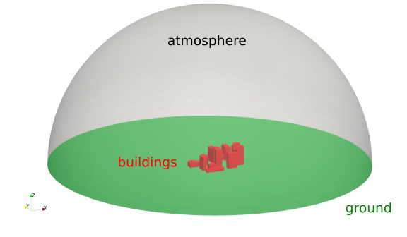
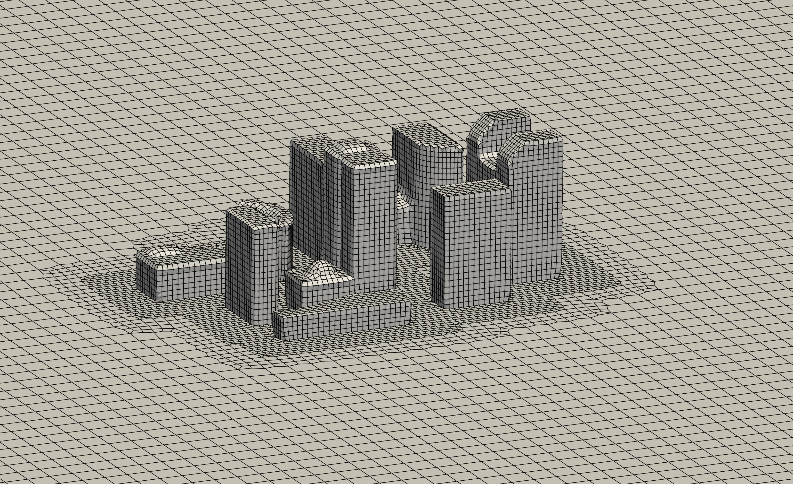

# Hex-dominant Mesh Generation

## Introduction

This tutorial explains how the OpenFOAM meshing tool `cartesianMesh` is used to create unstructured, hexahedral-dominated mesh of a set of buildings. At the end, the mesh will be visualized using ParaView. The geometry of the case with the corresponding patch names looks as follows:



Navigate with your terminal to the extracted sub-directory `2_buildings` within the `2_mesh_generation` directory.


## Case structure

In OpenFOAM, the computational mesh, field data, model properties and numerical model parameters are stored in a set of files within a case directory. The case directory is given a suitably descriptive name, here `buildings`. This folder contains the following subfolders and files:

```
buildings
├── system
|   ├── controlDict
|   ├── fvSchemes
|   ├── fvSolution
|   └── meshDict
└── buildings.obj
 
1 directory, 5 files
```

The relevant files for this tutorial case are:
 - `meshDict` in the `system` directory: Contains the configuration for the automated meshing process.
 - `buildings.obj`: The geometry file forming the boundaries of the computational domain.


## Automated Mesh Generation

The `cartesianMesh` utility automatically generates a hexahedral-dominant 3-dimensional mesh from a user-provided surface geometries. Supported surface formats are, among others, Stereolithography (STL) or Wavefront Object (OBJ). The meshing process is as follows:
 1. A structured background mesh is generated based on a user-defined maximum cell size.
 2. Local mesh refinement is applied on individual patches or regions within the solution domain (optional).
 3. The cells are snapped to the provided geometry to form a smooth mesh.
 3. Inflation layers are introduced on individual patches (optional).

### Meshing configuration

The meshing process with `cartesianMesh` is solely controlled via the `meshDict` configuration file in the `system` directory. At the beginning of this tutorial, this file has the following minimal structure:

```
// * * * * * * * * * * * * * * * * * * * * * * * * * * * * * * * * * * * * * //

surfaceFile "buildings.obj";

maxCellSize 10;
```

These two settings are at least required for creating a mesh:
 - `surfaceFile`: Name of the geometry file in the case folder, here `buildings.obj` which is located in the OpenFOAM case folder.
 - `maxCellSize`: Maximum cell size in meters for creating the background mesh.

With this minimal example, the unstructured hexahedral-dominated mesh can be created using the following command:

```bash
cartesianMesh
```

Within a few seconds, the mesh is created automatically. In order to inspect the mesh, start ParaView:

```bash
paraFoam &
```

The surface mesh at the `buildings` surface can then be visualized with the following settings:


At this point, the mesh is too coarse to resolve either the geometric features of the buildings nor the flow field in the wake. Reducing the maximum cell size of the backgroud mesh would result in a disproportionately large mesh. Therefore, the mesh is locally refined at the surface of the building. This can be achieved by adding the following lines below the entry `maxCellSize` to the `meshDict`:

```
localRefinement
{
    buildings
    {
        additionalRefinementLevels  2;
        refinementThickness         10;
    }
}
```

This setting can be summarized as follows:
 - `localRefinement` is the keyword for `cartesianMesh` to apply a surface-based refinement
 - `buildings` is the name of the patch, at which a surface-based refinement should be applied
 - `additionalRefinementLevels` specifies how often the background mesh at the surface should be refined, e.g., split by two in all three directions in space.
 - `refinementThickness` defines how far the refinement from the surface should reach out into the volume mesh.

So in this tutorial case, the cells at the patch `buildings` are refined twice and the refinement reaches out 10 meters into the volume mesh. In order to create the new mesh with the updated `meshDict`, the `cartesianMesh` utility has to be executed once again:

```bash
cartesianMesh
```

{: .warning }
> Rerunning the meshing tool `cartesianMesh` again will **overwrite** the previous mesh!

The following figure visualizes the resulting surface mesh at the buildings surface with the significantly improved resolution at the building surface:

