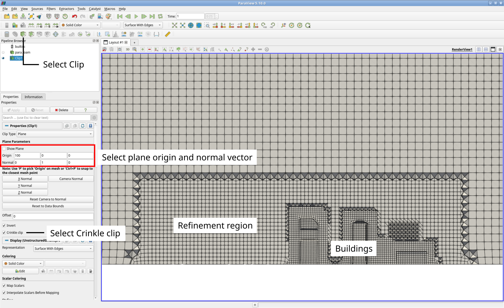
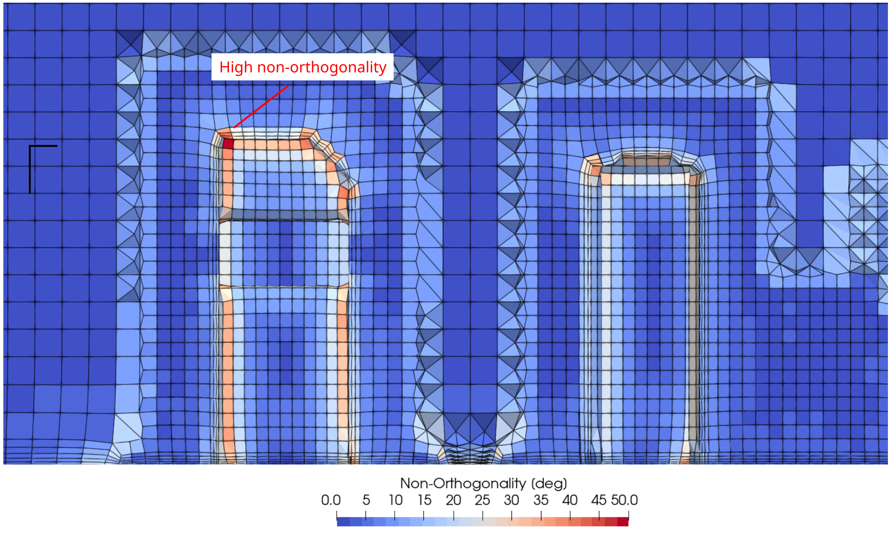

# Hex-dominant Mesh Generation

## Introduction

This tutorial explains how the OpenFOAM meshing tool `cartesianMesh` is used to create unstructured, hexahedral-dominated mesh of a set of buildings. At the end, the mesh will be visualized using ParaView. The geometry of the case with the corresponding patch names looks as follows:


Navigate with your terminal to the extracted sub-directory `2_buildings` within the `2_mesh_generation` directory.


## Case structure

In OpenFOAM, the computational mesh, field data, model properties and numerical model parameters are stored in a set of files within a case directory. The case directory is given a suitably descriptive name, here `2_buildings`. This folder contains the following subfolders and files:

```
2_buildings
├── system
|   ├── controlDict
|   ├── fvSchemes
|   ├── fvSolution
|   └── meshDict
└── geometry.obj
 
1 directory, 5 files
```

The *relevant* files for this tutorial case are:
 - `meshDict` in the `system` directory: Contains the configuration for the automated meshing process.
 - `geometry.obj`: The geometry file forming the boundaries of the computational domain.


## Automated Mesh Generation

The `cartesianMesh` utility automatically generates a hexahedral-dominant 3-dimensional mesh from a user-provided surface geometries. Supported surface formats are, among others, Stereolithography (STL) or Wavefront Object (OBJ). The meshing process is as follows:
 1. A structured background mesh is generated based on a user-defined maximum cell size.
 2. Local mesh refinement is applied on individual patches or regions within the solution domain (optional).
 3. The cells are snapped to the provided geometry to form a smooth mesh.
 3. Inflation layers are introduced on individual patches (optional).

### Meshing configuration

The meshing process with `cartesianMesh` is solely controlled via the `meshDict` configuration file in the `system` directory. At the beginning of this tutorial, this file has the following minimal structure:

```
// * * * * * * * * * * * * * * * * * * * * * * * * * * * * * * * * * * * * * //

surfaceFile "geometry.obj";

maxCellSize 10;
```

These two settings are at least required for creating a mesh:
 - `surfaceFile`: Name of the geometry file in the case folder, here `geometry.obj` which is located in the OpenFOAM case folder.
 - `maxCellSize`: Maximum cell size in meters for creating the background mesh.

With this minimal example, the unstructured hexahedral-dominated mesh can be created using the following command:

```bash
cartesianMesh
```

Within a few seconds, the mesh is created automatically and stored inside the `constant/polyMesh` directory. In order to inspect the mesh, start ParaView:

```bash
paraFoam &
```

The mesh close to the surface of the buildings can then be visualized by only selecting the `buildings` and `ground` patch at the Properties Panel in ParaView:


### Surface-based mesh refinement

At this point, the mesh is too coarse to resolve either the geometric features of the buildings nor the flow field in the wake. Reducing the maximum cell size of the backgroud mesh would result in a disproportionately large mesh. Therefore, the mesh is locally refined at the surface of the building. This can be achieved by adding the following lines below the entry `maxCellSize` to the `meshDict`:

```
localRefinement
{
    buildings
    {
        additionalRefinementLevels  2;
        refinementThickness         10;
    }
}
```

This setting can be summarized as follows:
 - `localRefinement` is the keyword for `cartesianMesh` to apply a surface-based refinement.
 - `buildings` is the name of the patch, at which a surface-based refinement should be applied.
 - `additionalRefinementLevels` specifies how often the background mesh at the surface should be refined, e.g., split by two in all three directions in space.
 - `refinementThickness` defines how far the refinement from the surface should reach out into the volume mesh.

{: .tip }
> It is possible to refine multiple patches at once by adding their respective refinement settings based on patch the name to the `localRefinement` entry.

So in this case, the cells at the patch `buildings` are refined twice (resulting cell size is then $$10/2^2 = 2.5\,\text{m}$$) and the refinement reaches out 10 meters into the volume mesh. In order to create the new mesh with the updated `meshDict`, the `cartesianMesh` utility has to be executed once again:

```bash
cartesianMesh
```

{: .warning }
> Rerunning the meshing tool `cartesianMesh` again will overwrite the mesh previously stored in `constant/polyMesh`!

Once the mesh has been recreated, the visualization in ParaView can be updated by clicking the Refresh button the Properties Panel. The following figure shows the resulting surface mesh close to the buildings with a significantly improved resolution:


### Region-based mesh refinement

Although the surface of the buildings is refined well, the wake of the buildings is still too coarse to resolve the expected flow structures. This issue cannot be resolved by increasing the refinement thickness of the surface-based refinemt as this would result in a disproportionately large mesh. Therefore, a refinement region must be defined covering the wake, in which the mesh will also be refined. This can be accomplished by adding the following lines to `meshDict` below the previous entries:

```
objectRefinements
{
    wake
    {
        type        box;
        centre      (200 0 0);
        lengthX     400;
        lengthY     150;
        lengthZ     200;
        additionalRefinementLevels    1;
    }
}
```

This setting can be summarized as follows:
 - `objectRefinements` is the keyword for `cartesianMesh` to apply a region-based refinement.
 - `wake` can be any name for this refinement.
 - `type` specifies the shape of the region-based refinment.
 - `center` and `length` specify the center and the dimensions of the refinement box in all three directions in space.
 - `additionalRefinementLevels` specifies how often the background mesh at the surface should be refined, e.g., split by two in all three directions in space.

{: .tip }
> There are numerous different shape types for refinement, such as cone, sphere, or line.
>
> It is possible to have multiple refinement regions at once by adding their respective refinement settings to the `objectRefinements` entry.

In this case, the refinement region is a box with the center coordinates `(200 0 0)` and the dimensions of 400 by 150 by 200 meters. The cells within this box are refined once (resulting cell size is then $$10/2^1 = 5\,\text{m}$$). In order to create the new mesh with the updated `meshDict`, the `cartesianMesh` utility has to be executed once again:

```bash
cartesianMesh
```

Once the mesh has been recreated, the visualization in ParaView can be updated by clicking the Refresh button the Properties Panel. In order to show wake region, select the `internalMesh` in the Properties Panel, and then the Clip filter with a center of origin of `(200 0 0)` with a normal vector of `(0 1 0)`. Selecting Crinkle clip completely shows all intersected cells. The following figure shows the resulting clp through the volume mesh with the refinement region on the left of the buildings:




### Inflation layer addition

Although being hexahedral-dominant, the mesh still lacks inflation layers to accurately resolve the boundary layer. These can to be added to the patches `ground` and `buildings` with the following entry below the region-based refinement in `meshDict`:

```
boundaryLayers
{
    patchBoundaryLayers
    {
        buildings
        {
            nLayers           3;

            thicknessRatio    1.3;
        }
        ground
        {
            nLayers           5;

            thicknessRatio    1.3;
        }
    }
}
```

This setting can be summarized as follows:
 - `boundaryLayers` is the keyword for `cartesianMesh` to add inflation layers.
 - `patchBoundaryLayers` collects all specified patches and their individual settings for inflation layers.
 - `nLayers` is the number of inflation layers added.
 - `thicknessRatio` is the growth ratio between two consequitive inflation layers.

{: .note }
> `cartesianMesh` automatically sets the thickness of the first inflation layer based on cell size and thickness ratio. It can optionally be specified using the entry `maxFirstLayerThickness`.

In this case, three and five inflation layers are added to the patch `buildings` and `ground`, respectively, both with a growth ratio of 1.3. In order to create the new mesh with the updated `meshDict`, the `cartesianMesh` utility has to be executed once again:

```bash
cartesianMesh
```

Once the mesh has been recreated, the visualization in ParaView can be updated by clicking the Refresh button the Properties Panel. This results in the following cross-sectional view of the mesh:


### Renaming patches

When using `cartesianMesh` for mesh generation, all patches by default are of type `wall`. This is obviously incorrect for the `atmosphere` patch, which should act like an inlet and outlet. Therefore, the patch type has to be changed. This can be accomplished by adding the following lines below the inflation layer setup within the `meshDict` as follows:

```
renameBoundary
{
    newPatchNames
    {
        atmosphere
        {
            type    patch;
            newName atmosphere;
        }
    }
}
```

This setting can be summarized as follows:
 - `renameBoundary` is the keyword for `cartesianMesh` change patch names and types.
 - `newPatchNames` collects all specified patches and their individual settings in question for change.
 - `type` specifies the new patch type of the specified patch.
 - `newName` defines the new patch name.

In this case, only patch `atmosphere` will get the new patch type `patch` suitable for inlet and outlets. The new patch name is equal to the original one as it should not be changed. In order to create the new mesh with the updated `meshDict`, the `cartesianMesh` utility has to be executed once again:

```bash
cartesianMesh
```

At this point the mesh generation is complete. It consists of:
 - Background mesh with a cell size of 10 m.
 - Surface-based refinement at the `buildings` patch
 - Region-based refinement in the wake of the buildings
 - Inflation layers at both the ground and the buildings
 - Correct patch type for the atmosphere.


## Checking mesh quality

Once the mesh generation is complete, the mesh quality must be checked using the OpenFOAM tool `checkMesh`. In order to visualize the mesh quality metrics in ParaView, the optional parameter `-writeAllFields` can be added to the command as follows:

```bash
checkMesh -writeAllFields
```

The most relevant output from `checkMesh` can be summarized as follows:
 - Total cell count of 455804 cells
 - A maximum aspect ratio of 12.78
 - A mesh non-orthogonality of less than 62.30
 - A maximum skewness of 2.48

All these metrics are well below the critical thresholds for OpenFOAM and the mesh can be considered of high quality. 

{: .note }
> If the mesh quality is not be sufficient, `checkMesh` would highlight the critical metric and the check mesh would fail.


After refreshing the case in ParaView, all important quality metrics are available as field variables for visualization and inspection. For instance, the non-orthogonality (as field named `nonOrthoAngle`) is highest within the inflation layers around the buildings:




## Conclusion

This concludes the second case in the **Meshing Tutorial**. We have:
- Created a hexahedral-dominant mesh using the OpenFOAM utility `cartesianMesh` for the flow around a group of buildings with:
    - Surface-based refinement around the buildings
    - Region-based refinement in the wake of the buildings
    - Inflation layers at both the ground and the buildings
    - Correct patch type for the atmosphere.
- Checked the mesh quality with `checkMesh`, and
- Visualized the mesh with **ParaView**.