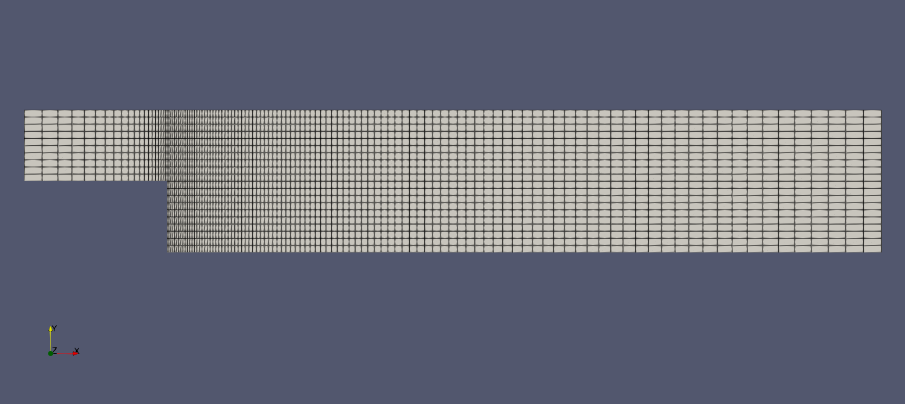
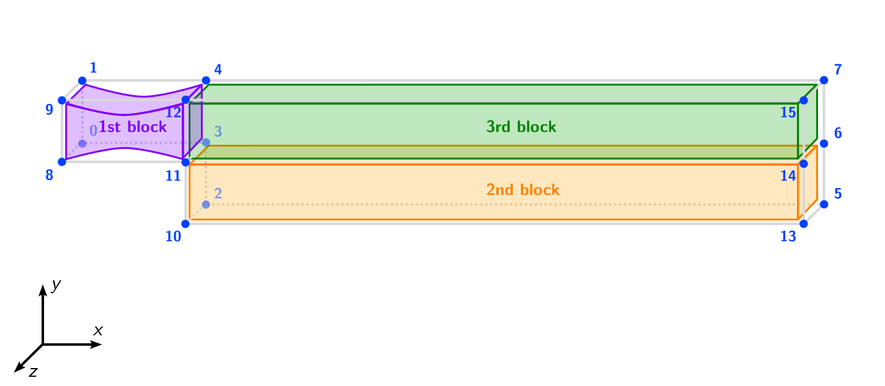
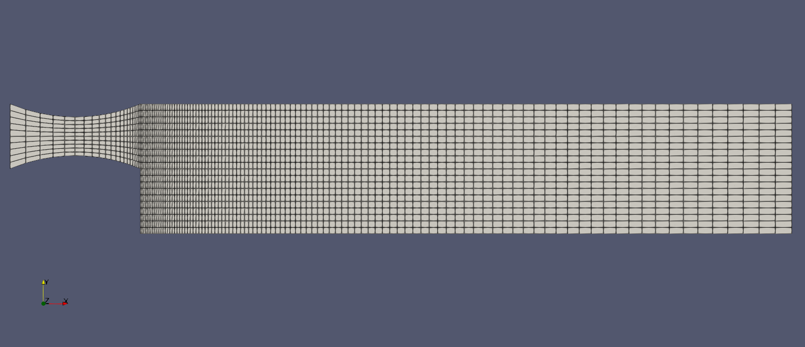

# Advanced Meshing with blockMesh

## Introduction

In the previous tutorial, every coordinate, cell count, and dimension in the `blockMeshDict` was specified as a hardcoded number. While this works, it becomes impractical for real-world cases: changing the step height, for example, requires modifying multiple vertex coordinates, and it is easy to introduce inconsistencies. In professional CFD workflows, meshes must be parameterized so that geometry and resolution changes can be applied in a single location.

This tutorial introduces four features of the OpenFOAM dictionary language that transform `blockMeshDict` from a static input file into a parametric, scriptable mesh definition:

1. **Variables** — replace repeated numerical values with named parameters.
2. **`#calc`** — evaluate C++ expressions to compute derived quantities at run-time.
3. **Grading** — refine the mesh towards walls and regions of interest using cell expansion ratios.
4. **Curved edges** — define non-straight edges between block vertices using arcs and splines.

All four features are applied to the same backward-facing step case from the previous tutorial. Navigate with your terminal to the `2_backward-step` sub-directory within the `2_mesh_generation` directory. If you want to preserve the original case, create a copy first:

```bash
cp -r 2_backward-step 3_advanced
cd 3_advanced
```


## Variables in `blockMeshDict`

### Motivation

Consider the vertex list from the previous tutorial. The step height of $$25\,\text{mm}$$ appears as the literal number `25` in several different vertex coordinates. Similarly, the inlet length of $$50\,\text{mm}$$ appears as `-50` in four vertices. If the step height needs to be changed, every occurrence must be found and updated manually - a process that is tedious and error-prone.

OpenFOAM dictionaries support **variable declarations**: a name is assigned a value, and the variable can then be referenced anywhere in the file using the `$` prefix.


### Declaring variables

Variables are declared at the top of the file, after the header and before the entries that reference them. For the backward-facing step, the following variables capture all geometric dimensions:

```
// Geometric parameters
xInlet      -50;
xStep       0;
xOutlet     250;

yBottom     0;
yMid        25;
yTop        50;

zBack       -1;
zFront      1;
```

Each variable is declared using the syntax `name value;` — the same syntax as any other OpenFOAM dictionary entry. Variable names should be descriptive and follow a consistent naming convention.


### Referencing variables

Once declared, variables are referenced with the `$` prefix. The vertex list from the previous tutorial can now be rewritten as follows:

```
vertices
(
    ($xInlet  $yMid     $zBack)     // 0
    ($xInlet  $yTop     $zBack)     // 1
    ($xStep   $yBottom  $zBack)     // 2
    ($xStep   $yMid     $zBack)     // 3
    ($xStep   $yTop     $zBack)     // 4
    ($xOutlet $yBottom  $zBack)     // 5
    ($xOutlet $yMid     $zBack)     // 6
    ($xOutlet $yTop     $zBack)     // 7

    ($xInlet  $yMid     $zFront)    // 8
    ($xInlet  $yTop     $zFront)    // 9
    ($xStep   $yBottom  $zFront)    // 10
    ($xStep   $yMid     $zFront)    // 11
    ($xStep   $yTop     $zFront)    // 12
    ($xOutlet $yBottom  $zFront)    // 13
    ($xOutlet $yMid     $zFront)    // 14
    ($xOutlet $yTop     $zFront)    // 15
);
```

Compared to the original file, this version is both more readable and more maintainable. The inline comments `// 0`, `// 1`, etc. are optional but help track the vertex indices. Changing the step height from $$25\,\text{mm}$$ to $$30\,\text{mm}$$ now requires editing only a single line instead of sixteen coordinates.

{: .tip }
> Adding inline comments with the vertex index next to each vertex definition makes the `blockMeshDict` much easier to debug. This is considered good practice, especially for cases with many vertices.


### Parameterizing the block resolution

Variables are not limited to vertex coordinates. The cell counts in the `blocks` entry can be parameterized in the same way. Add the following resolution variables below the geometric parameters:

```
// Mesh resolution
nxInlet     20;
nxOutlet    100;
nyHalf      10;
nz          1;
```

The `blocks` entry then becomes:

```
blocks
(
    // 1st block
    hex (0 3 4 1 8 11 12 9)
    ($nxInlet $nyHalf $nz)
    simpleGrading (1 1 1)

    // 2nd block
    hex (2 5 6 3 10 13 14 11)
    ($nxOutlet $nyHalf $nz)
    simpleGrading (1 1 1)

    // 3rd block
    hex (3 6 7 4 11 14 15 12)
    ($nxOutlet $nyHalf $nz)
    simpleGrading (1 1 1)
);
```

A mesh refinement study, where the resolution is systematically doubled, can now be performed by changing just four values instead of editing every block individually.

{: .note }
> The `boundary` and `defaultPatch` entries remain unchanged — they reference vertex indices, not coordinates or variables.


## Computing values with `#calc`

### Motivation

Some values in the `blockMeshDict` are not independent but are derived from other parameters. For example, `yMid` and `yTop` are both directly proportional to `stepHeight`. Declaring all three independently introduces the risk of inconsistency. The `#calc` directive solves this by evaluating C++ expressions inline.


### Syntax

The `#calc` directive takes a C++ expression enclosed in double quotes and evaluates it at parse time. Variables can be referenced inside the expression using the `$` prefix:

```
variableName  #calc "C++ expression using $otherVariable";
```

### Deriving dependent dimensions

With `#calc`, the geometric parameters can be reduced to a set of truly independent values. The following definition derives `yMid`, `yTop`, and `xInlet` from the step height and inlet length and is placed at the top of `blockMeshDict`:

```
// Independent geometric parameters
stepHeight  25;
inletLength 50;
outletLength 250;

// Derived coordinates
xInlet      #calc "-$inletLength";
xStep       0;
xOutlet     $outletLength;

yBottom     0;
yMid        #calc "$stepHeight";
yTop        #calc "2*$stepHeight";

zBack       -1;
zFront      1;
```

Now, `yMid` and `yTop` are automatically derived from `stepHeight`. If the step height changes, both coordinates update automatically, and the mesh remains consistent.


### Computing the cell count from a target cell size

In practice, the mesh resolution is often specified through a target cell size rather than a fixed number of cells. The `#calc` directive can compute the required cell count at run-time. The following lines replace the previous hard-coded mesh resolution:

```
// Mesh resolution
cellSize    2.5;
nxInlet     #calc "round($inletLength / $cellSize)";
nxOutlet    #calc "round($outletLength / $cellSize)";
nyHalf      #calc "round($stepHeight / $cellSize)";
nz          1;
```

With this approach, changing `cellSize` from `2.5` to `1.25` automatically doubles the resolution in all directions. The `round()` function ensures that the result is an integer, as required by `blockMesh`.

{: .note }
> The `#calc` directive evaluates standard C++ expressions. This means that C++ mathematical functions such as `sin()`, `cos()`, `sqrt()`, `pow()`, and `round()` are available.


### Generating the mesh

Overwrite the old mesh and create the new one by running `blockMesh` again and verify the result with `checkMesh`:

```bash
blockMesh
checkMesh
```

The output of `checkMesh` should be identical to the previous tutorial, confirming that the parameterized `blockMeshDict` produces the same mesh as the original hardcoded version.


## Mesh grading

### Motivation

In the previous tutorial, the `simpleGrading` for each block was set to `(1 1 1)`, which produces a uniform cell distribution with equal cell sizes throughout the block. While this is the simplest approach, it is rarely optimal for CFD simulations.

In most flows, the gradients of velocity, pressure, and temperature are largest near solid walls and in regions with strong flow features such as recirculation zones. Resolving these gradients accurately requires a higher mesh density in these areas. However, increasing the resolution uniformly throughout the entire domain would result in an unnecessarily large mesh and excessive computational cost.

Mesh grading solves this by gradually varying the cell size within a block, concentrating cells where they are needed most while keeping the mesh coarser in regions where the flow is relatively uniform.


### The expansion ratio

The `simpleGrading` entry defines the **expansion ratio** for each of the three local block directions. The expansion ratio is defined as the ratio of the last cell size to the first cell size along that direction:

$$\text{Expansion ratio} = \frac{\delta_e}{\delta_s}$$

This means:
- A ratio of **1** produces uniform cells (no grading).
- A ratio **greater than 1** produces cells that grow along the direction, i.e. small cells at the start and large cells at the end.
- A ratio **less than 1** produces cells that shrink along the direction, i.e. large cells at the start and small cells at the end.

The following figure illustrates the effect of different expansion ratios on a single block:


### Applying grading to the backward-facing step

For the backward-facing step, the flow separates at the step edge and a recirculation zone develops behind the step. Therefore, the mesh should be refined near the step edge in the $$x$$-direction, where the flow separates and reattaches.

To refine towards the step edge in the $$x$$-direction, consider the local coordinate system of each block. In the outlet blocks, the local $$x$$-direction runs from the step ($$x = 0$$) to the outlet ($$x = 250\,\text{mm}$$). Since we want small cells at the start (near the step), the ratio must be greater than 1. In the inlet block, the local $$x$$-direction runs from the inlet ($$x = -50\,\text{mm}$$) to the step ($$x = 0$$). Here, we want small cells at the end (near the step), so the ratio must be less than 1.

{: .tip }
> When two adjacent blocks share a face, the cell sizes at their shared interface must match. This means the expansion ratio at the end of one block must be consistent with the expansion ratio at the start of the neighbouring block. For larger cases, computing one ratio as the inverse of the other using #calc helps avoid inconsistencies.

The updated `blocks` entry with grading applied looks as follows:

```
blocks
(
    // Inlet block
    hex (0 3 4 1 8 11 12 9)
    ($nxInlet $nyHalf $nz)
    simpleGrading (0.1 1 1)

    // Lower outlet block
    hex (2 5 6 3 10 13 14 11)
    ($nxOutlet $nyHalf $nz)
    simpleGrading (10 1 1)

    // Upper outlet block
    hex (3 6 7 4 11 14 15 12)
    ($nxOutlet $nyHalf $nz)
    simpleGrading (10 1 1)
);
```

Regenerate and inspect the mesh:

```bash
blockMesh
checkMesh
```

The `checkMesh` output will now show a maximum aspect ratio greater than 1, since the cells near the step edge are compressed in the $$x$$-direction while remaining uniform in $$y$$:

```
Checking geometry...
    ...
    Max aspect ratio = 3.99276 OK.
    ...
    Mesh non-orthogonality Max: 0 average: 0
    Non-orthogonality check OK.
    ...
```

Even though the aspect ratio has increased, the non-orthogonality remains at 0 because grading only changes the cell *size*, not the cell *shape* — all cells remain perfect hexahedra aligned with the coordinate axes.

Open the mesh in ParaView to visually confirm the grading:

```bash
paraFoam &
```



The mesh should clearly show smaller cells near the step edge, with cells gradually growing towards the outlet.


## Curved edges

### Motivation

So far, all edges between block vertices have been straight lines, which is the default behavior of `blockMesh`. However, many real-world geometries involve curved surfaces. In this section, the straight inlet face of the backward-facing step is replaced with a curved arc, simulating a rounded inlet contour.

The following figure illustrates the modification: the straight inlet edge between vertices 0-3 and 1-4 (and correspondingly 8-11 and 9-12 on the front plane) is replaced by a circular arc that creates a nozzle-like constriction.



### The `edges` entry

Curved edges are defined in an optional `edges` list in the `blockMeshDict`, placed between the `vertices` and `blocks` entries. Each entry specifies the edge type, the two vertex indices, and additional geometric information depending on the edge type. The most common edge types are:

| Edge type | Description | Required information |
| :--- | :--- | :--- |
| `arc` | Circular arc | A single interpolation point on the arc |
| `spline` | Cubic spline | A list of interpolation points |
| `polyLine` | Piecewise linear | A list of interpolation points |

Any edge not listed in the `edges` entry remains a straight line.

### Defining the arc

For the circular arc, a single interpolation point must be specified. This point lies on the arc, typically at the midpoint between the two vertices. For the edge between vertex 0 and vertex 3, the interpolation point is placed at the horizontal midpoint of the edge and offset in the positive $$y$$-direction by a distance `contraction` - a new variable added to the geometric parameters at the top of `blockMeshDict`:

```
// Independent geometric parameters
stepHeight          25;
inletLength         50;
outletLength        250;
contraction         5;
```

The coordinates of the interpolation point can be computed using `#calc` inside the `edges` dictionary placed between `vertices` and `blocks`:

```
edges
(
    arc 0 3
    (
        #calc "-0.5*$inletLength"
        #calc "$stepHeight + $contraction"
        $zBack
    )
    arc 1 4
    (
        #calc "-0.5*$inletLength"
        #calc "2*$stepHeight - $contraction"
        $zBack
    )
    arc 8 11
    (
        #calc "-0.5*$inletLength"
        #calc "$stepHeight + $contraction"
        $zFront
    )
    arc 9 12
    (
        #calc "-0.5*$inletLength"
        #calc "2*$stepHeight - $contraction"
        $zFront
    )
);
```


### The complete parameterized `blockMeshDict`

The complete `blockMeshDict` incorporating variables, `#calc`, grading, and the curved inlet edge is shown below:


```
/*--------------------------------*- C++ -*----------------------------------*\
  =========                 |
  \\      /  F ield         | OpenFOAM: The Open Source CFD Toolbox
   \\    /   O peration     | Website:  https://openfoam.org
    \\  /    A nd           | Version:  13
     \\/     M anipulation  |
\*---------------------------------------------------------------------------*/
FoamFile
{
    format      ascii;
    class       dictionary;
    object      blockMeshDict;
}
// * * * * * * * * * * * * * * * * * * * * * * * * * * * * * * * * * * * * * //

// Independent geometric parameters
stepHeight          25;
inletLength         50;
outletLength        250;
contraction         5;

// Derived coordinates
xInlet      #calc "-$inletLength";
xStep       0;
xOutlet     $outletLength;

yBottom     0;
yMid        #calc "$stepHeight";
yTop        #calc "2*$stepHeight";

zBack       -1;
zFront      1;

// Mesh resolution
cellSize    2.5;
nxInlet     #calc "round($inletLength / $cellSize)";
nxOutlet    #calc "round($outletLength / $cellSize)";
nyHalf      #calc "round($stepHeight / $cellSize)";
nz          1;

vertices
(
    ($xInlet  $yMid     $zBack)     // 0
    ($xInlet  $yTop     $zBack)     // 1


    ($xStep   $yBottom  $zBack)     // 2
    ($xStep   $yMid     $zBack)     // 3
    ($xStep   $yTop     $zBack)     // 4
    ($xOutlet $yBottom  $zBack)     // 5
    ($xOutlet $yMid     $zBack)     // 6
    ($xOutlet $yTop     $zBack)     // 7

    ($xInlet  $yMid     $zFront)    // 8
    ($xInlet  $yTop     $zFront)    // 9

    ($xStep   $yBottom  $zFront)    // 10
    ($xStep   $yMid     $zFront)    // 11
    ($xStep   $yTop     $zFront)    // 12
    ($xOutlet $yBottom  $zFront)    // 13
    ($xOutlet $yMid     $zFront)    // 14
    ($xOutlet $yTop     $zFront)    // 15
);

edges
(
    arc 0 3
    (
        #calc "-0.5*$inletLength"
        #calc "$stepHeight + $contraction"
        $zBack
    )
    arc 1 4
    (
        #calc "-0.5*$inletLength"
        #calc "2*$stepHeight - $contraction"
        $zBack
    )
    arc 8 11
    (
        #calc "-0.5*$inletLength"
        #calc "$stepHeight + $contraction"
        $zFront
    )
    arc 9 12
    (
        #calc "-0.5*$inletLength"
        #calc "2*$stepHeight - $contraction"
        $zFront
    )
);

blocks
(
    // 1st block
    hex (0 3 4 1 8 11 12 9)
    ($nxInlet $nyHalf $nz)
    simpleGrading (0.1 1 1)

    // 2nd block
    hex (2 5 6 3 10 13 14 11)
    ($nxOutlet $nyHalf $nz)
    simpleGrading (10 1 1)

    // 3rd block
    hex (3 6 7 4 11 14 15 12)
    ($nxOutlet $nyHalf $nz)
    simpleGrading (10 1 1)
);


defaultPatch
{
    name    frontAndBackPlanes;
    type    empty;
}
    
boundary
(
    inlet
    {
        type patch;
        faces
        (
            (0 1 8 9)
        );
    }

    outlet
    {
        type patch;
        faces
        (
            (5 6 14 13)
            (6 7 15 14)
        );
    }

    walls
    {
        type wall;
        faces
        (
            (1 4 12 9)
            (4 7 15 12)
            (0 3 11 8)
            (2 3 11 10)
            (2 5 13 10)
        );
    }
);

// ************************************************************************* //
```


### Generating and inspecting the curved mesh

Regenerate the mesh and check its quality:

```bash
blockMesh
checkMesh
```

The `checkMesh` output will now show a non-zero maximum non-orthogonality and skewness in the inlet region due to the curved edge. Combined with the grading from the previous section, the mesh quality metrics will differ from the original uniform mesh:

```
Checking geometry...
    ...
    Max aspect ratio = 4.53411 OK.
    Mesh non-orthogonality Max: 19.999 average: 2.43141
    Non-orthogonality check OK.
    ...
    Max skewness = 1.02488 OK.
```

{: .note }
> The non-orthogonality and skewness introduced by the curved edge are expected and acceptable. As long as `checkMesh` reports `Mesh OK.`, the mesh is suitable for simulation.

Open the mesh in ParaView to visually verify the curved inlet:

```bash
paraFoam &
```

Click **Apply** and select **Surface with Edges** to inspect the mesh. The inlet face should now display a visible curvature, and the cells in the inlet block will be deformed to conform to the arc.




## Conclusion

This concludes the third part of the Meshing Tutorial. We have:
- Replaced hardcoded values in the `blockMeshDict` with named variables for improved readability and maintainability,
- Used the `#calc` directive to compute derived quantities such as negative coordinates and cell counts from a target cell size,
- Applied mesh grading with `simpleGrading` to refine the mesh near the step edge,
- Introduced curved edges using the `arc` edge type to create a rounded inlet geometry.

These features are essential for professional CFD workflows, where meshes must be parameterized for design studies, sensitivity analyses, and mesh convergence studies.