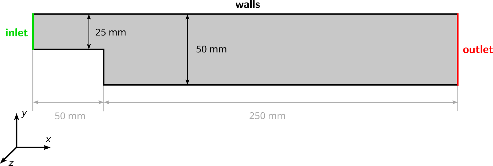
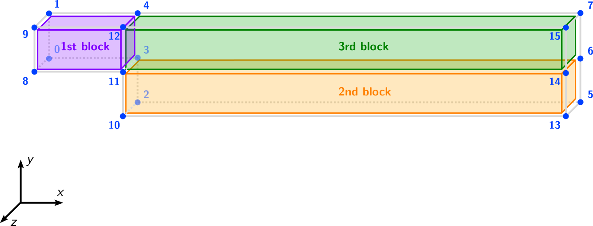
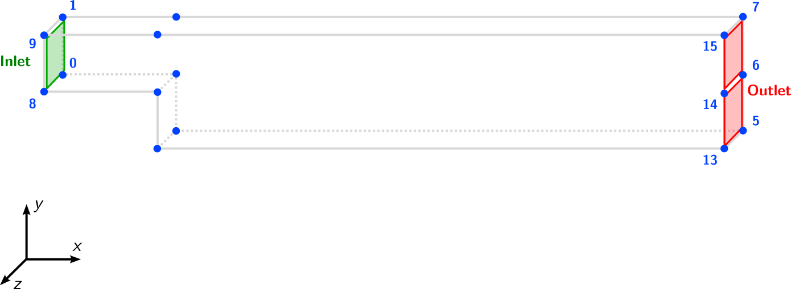
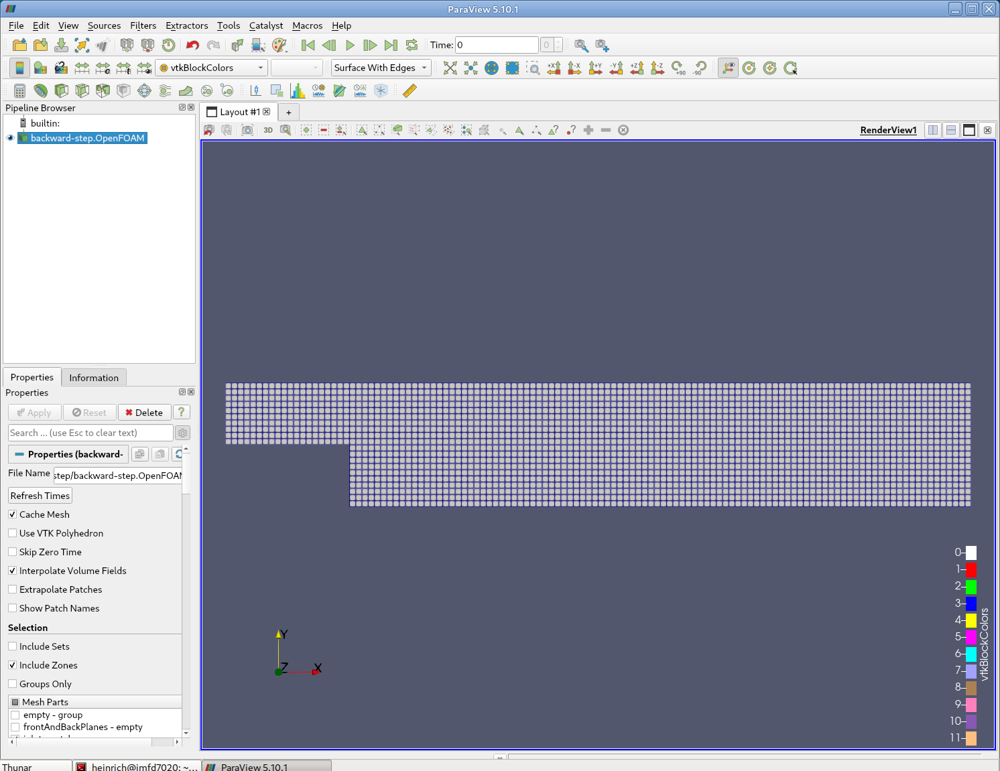

# Block-structured Mesh Generation

## Introduction

This tutorial explains how the OpenFOAM meshing tool `blockMesh` can be used to create block-structured meshes. At the end, the mesh will be visualized using ParaView. The geometry of the case looks as follows:



Navigate with your terminal to the extracted sub-directory `backward-step` within the `2_mesh_generation` directory.

## OpenFOAM case structure

In OpenFOAM, the computational mesh, field data, model properties and numerical model parameters are stored in a set of files within a case directory. The case directory is given a suitably descriptive name, here `backward-step`. This folder contains the following subfolders and files:

```
backward-step
└── system
    ├── blockMeshDict
    ├── controlDict
    ├── fvSchemes
    └── fvSolution
                
1 directory, 4 files
```

The relevant file for this tutorial case is:
 - `blockMeshDict` in the `system` directory: Contains the configuration for the block-structured meshing process.

## Mesh generation

The backward-step domain is meshed using a block-structured topology consisting of three connected blocks representing a two-dimensional channel with a backward-facing step.

Instead of importing an already existing grid, the mesh for this case will be created using the OpenFOAM utility `blockMesh`, which creates hiqh-quality, parametric block-structured meshes with (optional) grading and curved edges. The utility has no graphical user interface and the mesh is generated from a dictionary file named `blockMeshDict` located in the `system` directory of the case. In this case, the file has the following structure:

```
/*--------------------------------*- C++ -*----------------------------------*\
 =========                 |
 \\      /  F ield         | OpenFOAM: The Open Source CFD Toolbox
  \\    /   O peration     | Website:  https://openfoam.com
   \\  /    A nd           | Version:  v2412
    \\/     M anipulation  |
\*---------------------------------------------------------------------------*/
FoamFile
{
    format      ascii;
    class       dictionary;
    object      blockMeshDict;
}
// * * * * * * * * * * * * * * * * * * * * * * * * * * * * * * * * * * * * * //

convertToMeters 0.001;

vertices
(
    ...
);

blocks
(
    ...
);


boundary
(
    ...
);

// ************************************************************************* //
```

The file structure follows the overall meshing process of `blockMesh`:
 1. A general scaling factor `convertToMeters` is specified valid for all vertex coordinates
 2. All coordinates of the vertices of the individual blocks are defined in a list `vertices`.
 3. Based on these vertices, the individual blocks are created and meshed under `blocks`.
 4. The boundary patches of the case are defined in `boundary`.

### Definition of the scaling factor

In this example, the channel has a total length of $$300\,\text{mm}$$. Therefore, the vertices are defined in $$\text{mm}$$ and the mesh is scaled by a factor of 0.001 to maintain SI units of meters.

```
14  // * * * * * * * * * * * * * * * * * * * * * * * * * * * * * * * * * * * * * //
15
16  convertToMeters 0.001;
```

### Definition of the vertices

At first, the coordinates of the 16 vertices are specified in a list, where the vertices are numbered internally starting from zero. Then, each vertex can be accessed by its position in the list. This part looks as follows in `blockMeshDict` for the first four vertices:

```
18  vertices
19  (
20      (-50 0   -1)
21      (-50 25  -1)
22      (0   -25 -1)
23      (0   0   -1)
24      (0   25  -1)
25      (250 -25 -1)
26      (250 0   -1)
27      (250 25  -1)
28
29      (-50 0   1)
30      (-50 25  1)
31      (0   -25 1)
32      (0   0   1)
33      (0   25  1)
34      (250 -25 1)
35      (250 0   1)
36      (250 25  1)      
37  );
```

The resulting vertices look like follows with the vertices and their numbering in blue and the geometry in grey:


### Creation of blocks

These vertices are used to define the three blocks of the block-structured mesh. Each block consisting of hexahedral cells only consists of exactly 8 vertices, which are defined based on their index in the vertex list. This reads as follows for this case:

```
39  blocks
40  (
41      // 1st block
42      hex (0 3 4 1 8 11 12 9)
43      (20 10 1)
44      simpleGrading (1 1 1)
45
46      // 2nd block
47      hex (2 5 6 3 10 13 14 11)
48      (100 10 1)
49      simpleGrading (1 1 1)
50
51      // 3rd block
52      hex (3 6 7 4 11 14 15 12)
53      (100 10 1)
54      simpleGrading (1 1 1)
55  );
```

This means that the first block contains of vertices with the label `(0 3 4 1 8 11 12 9)`. The ordering of the vertices is important as the local coordinate system of each block must be oriented right-handed. The second entry for this block `(20 10 1)` gives the number of cells in each direction, e.g. the block contains 20 cells in $$x$$-direction, 10 cells in $$y$$-direction and 1 cell in $$z$$-direction. The third entry of the first block `simpleGrading (1 1 1)` defines the cell expansion ratios for each direction in the block. The expansion ratio enables the mesh to be graded, or refined, in specified directions. In this case, since we want an equidistant mesh, grading is set to 1 in all three directions.

Based on the length of the first block of $$50\,\text{mm}$$ and a cell count of 20 cells in $$x$$-direction, a cell size of $$2.5\,\text{mm}$$ can be derived. The resulting block-structure is visualized in the following figure with the first block in violett, the second one in orange and the third one in green:



{: .note }
> It is important that the resolution of the blocks is consistent. For example, the number of cells in $$x$$-direction for the second and third block must be the same! Otherwise, these blocks would not match.

### Definition of the boundaries

The boundary of the mesh is given in a list named boundary. The boundary is broken into patches, where each patch in the list has its name as the keyword, which is the choice of the user; the name is used as an identifier for setting boundary conditions in the field data files. The patch information is then contained in sub-dictionary with:

 - `type`: the patch type, either a generic `patch` on which some boundary conditions are applied or a particular geometric condition, for example of type `wall`
 - `faces`: a list of block faces that make up the patch

Each block face is defined by a list of 4 vertex numbers. The list can begin with any vertex in no particular order. For example, the `inlet` patch is made up of the vertices `(0 1 9 8)`, which is visualized in the following figure:



The resulting `boundary` entry in the `blockMeshDict` looks as follows:

```
boundary
(
    inlet
    {
        type patch;
        faces
        (
            (0 1 8 9)
        );
    }

    outlet
    {
        type patch;
        faces
        (
            (5 6 14 13)
            (6 7 15 14)
        );
    }

    walls
    {
        type wall;
        faces
        (
            (1 4 12 9)
            (4 7 15 12)
            (0 3 11 8)
            (2 3 11 10)
            (2 5 13 10)
        );
    }
);
```

`blockMesh` collects block faces that are omitted from the patches in the `boundary` list and assigns them to a default patch. The default patch can be configured through a `defaultPatch` sub-dictionary, including `type` and `name`, e.g.

```
defaultPatch
{
    name    frontAndBackPlanes;
    type    empty;
}
```

The two-dimensional mesh for this case can finally be created and stored in the `constant/polyMesh` folder. For this, execute the `blockMesh` command in the terminal with the current working directory being the backward-step folder:

```bash
blockMesh
```

## Mesh quality

Once the mesh has been created with `blockMesh`, it is once again recommended to check the mesh statistics and quality criteria. This can easily be done using the utility `checkMesh` from within the `backward-step` folder:

```
checkMesh
```

The most relevant output is as follows:

```
// * * * * * * * * * * * * * * * * * * * * * * * * * * * * * * * * * * * * * //
Create time

Create polyMesh for time = 0

Time = 0s

Mesh stats
    points:           4682
    internal points:  0
    faces:            8940
    internal faces:   4260
    cells:            2200
    faces per cell:   6
    boundary patches: 4
    point zones:      0
    face zones:       0
    cell zones:       0

...

Checking geometry...
    Overall domain bounding box (-0.05 -0.025 -0.001) (0.25 0.025 0.001)
    Mesh has 2 geometric (non-empty/wedge) directions (1 1 0)
    Mesh has 2 solution (non-empty) directions (1 1 0)
    All edges aligned with or perpendicular to non-empty directions.
    Boundary openness (-6.00733e-20 -6.84835e-18 -2.15273e-16) OK.
    Max cell openness = 1.35525e-16 OK.
    Max aspect ratio = 1 OK.
    Minimum face area = 2.5e-06. Maximum face area = 6.25e-06.  Face area magnitudes OK.
    Min volume = 6.25e-09. Max volume = 6.25e-09.  Total volume = 1.375e-05.  Cell volumes OK.
    Mesh non-orthogonality Max: 0 average: 0
    Non-orthogonality check OK.
    Face pyramids OK.
    Max skewness = 0 OK.
    Coupled point location match (average 0) OK.

Mesh OK.
    
End
```

This gives us all relevant mesh statistics and quality criteria of the mesh:
 - `Mesh stats` contains all general statistics about the mesh, such as number of points, faces, cells, and patches, as well as cell types.
 - `Checking topology` checks for the correct topology of the mesh both for cells and patches.
 - `Checking geometry` reveals information regarding mesh quality with statistics such as maximum non-orthogonality, aspect ration, and skewness, repectively.

All critital mesh quality statistics are within the tolerable limits and the final output `Mesh OK.` indicates that no critical problems or errors were found during `checkMesh`. Therefore, we can continue with this mesh and proceed with the simulation.


## Viewing the mesh

Once the mesh has been created and its quality checked, it is a good idea to visualize the mesh to check for any errors. For that, we use the post-processing software **ParaView** as a background process, which allows the shell to accept additional commands while it is still running. Since it is convenient to keep **ParaView** open while running other commands from the terminal, we will launch it in the background using the `&` operator by typing:

```
paraFoam &
```

In the **Pipeline Browser** on the left, the user can see that ParaView has opened `backwards-step.OpenFOAM`, the module for the backward-step case. Clicking on the green **Apply** button in the **Properties** panel displays the computational domain. Selecting **Surface with Edges** in the top center menu bar shows the computational mesh as follows:



## Conclusion

This concludes the third case in the **Meshing Tutorial**. We have:
* Created a block-structured mesh of a backward facing step using `blockMesh`,
* Checked the mesh quality with `checkMesh`,
* Visualized the mesh with **ParaView**.
