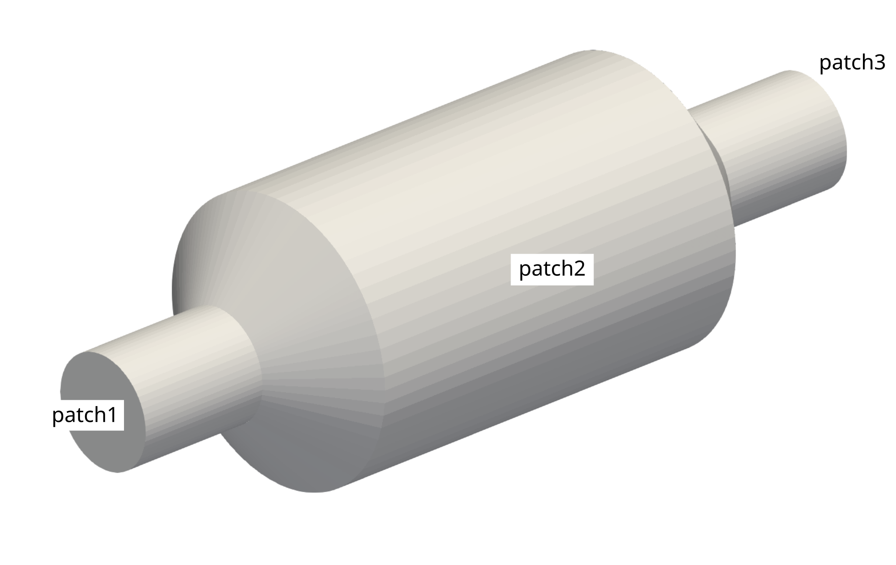

# Exercise

## Introduction

The geometry of a catalytic converter is given (see Figure below). For the simulation of the interior flow a unstructured, hexahedral-dominated mesh should be created.

Navigate with your terminal to the extracted sub-directory `3_catalytic_converter` within the `2_mesh_generation` directory. This folder only contains the geometry file `geometry.obj`. 

## Tasks

1. Copy the `system` directory from the buildings case to `3_catalytic_converter`.
2. Adjust the `meshDict` to create an unstructured, hexahedral-dominated mesh meeting the following requirements:
  - Maximum cell size of 8 mm
  - Surface-based refinement at `patch2` with a cell size of 2 mm and a refinement thickness of 4 mm
  - Region-based refinement at the center of the catalytic converter between $$-100 \leq x \leq 100$$ with a cell size of 4 mm
  - Inflation layers at `patch2` with 5 layers and a growth ratio of 1.2
  - Rename the patches to `inlet`, `outlet` and `walls` and set their corresponding types correctly
  - The total cell count should be around 200 000 cells
3. Make sure the scaling of the mesh is correct.
4. Check the mesh quality and identify regions with elevated non-orthogonality.
5. Create two copies the `3_catalytic_converter` directory named `3_catalytic_converter_medium` and  `3_catalytic_converter_fine`. Repeat the mesh generation in these new directories and create a refined *medium* and *fine* mesh suitable for a mesh independency study.