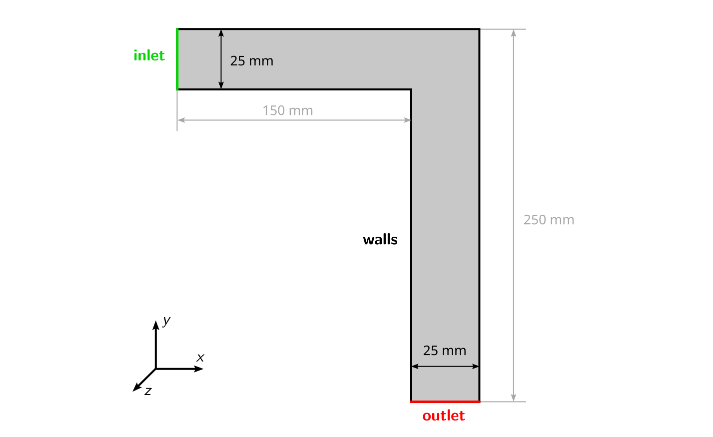

# Exercise

## 1. Increase Mesh Resolution

For a comprehensive mesh dependency study, at least three different meshes with successively finer mesh resolutions are required, ideally with a constant refinement ratio. So far we have used 10 cells across and 20 cells along the inlet channel, respectively, with 100 cells downstream the backwards-facing step. In this task, two additional meshes with higher mesh resolution should be created.

Instead of overwriting the original mesh, create a copy of the `2_backward-step` case directory in which the new mesh will be created.

### Tasks

1. Create a copy of the `2_backward-step` case directory named `3_backward-step_medium` in which the new mesh will be created.
2. Double the number of cells per block in `blockMeshDict` for the *medium-sized* mesh and recreate the mesh using `blockMesh`.
3. Check the mesh statistics for each mesh using `checkMesh`. How does the total number of cells change for refinement? 
4. Repeat this process and generate a second copy of `2_backward-step` named `4_backward-step_fine` for a *fine* mesh with quadruple number of cells in all directions. Create the mesh with `blockMesh` and check mesh statistics and quality with `checkMesh`.


## 2. Boundary Layer Refinement via Wall Grading

In the previous tutorial, grading was applied in the *x*-direction to refine the mesh towards the step edge. In real CFD applications, however, the largest velocity gradients typically occur in the **boundary layers** along solid walls. Resolving these gradients requires fine cells in the wall-normal direction, which for this geometry means grading in the *y*-direction.

In the inlet block, both the lower face (*y* = 25 mm) and the upper face (*y* = 50 mm) are walls. A single expansion ratio cannot refine towards both ends simultaneously. For such cases, `simpleGrading` accepts a **multi-grading syntax** that splits a block direction into segments, each with its own length fraction, cell fraction, and expansion ratio:

```
simpleGrading
(
    0.1                                    // x: keep the existing grading
    ((0.5 0.5 5) (0.5 0.5 0.2))            // y: refine towards both walls
    1                                      // z
)
```

The first *y*-triplet allocates 50 % of the block length and 50 % of the cells with an expansion ratio of 5, producing small cells at the lower wall that grow towards the block centre. The second triplet mirrors this with ratio 0.2, shrinking cells back towards the top wall. The length fractions and cell fractions in each direction must each sum to 1.

Start by creating a new copy of the graded backward-facing step case named `5_backward-step_wall-graded`. The existing *x*-grading from the tutorial should be retained, only the *y*-grading needs to be added.

### Tasks

1. For each of the three blocks, identify which faces in the local *y*-direction coincide with a solid wall and which are internal interfaces between blocks.
2. Apply *y*-grading to the two outlet blocks such that the smallest cells lie next to the respective wall. Ensure that the cell sizes at the shared interface (*y* = 25 mm) match between the two blocks.
3. Apply the multi-grading syntax to the inlet block to refine towards both walls.
4. Recreate the mesh with `blockMesh` and check the new maximum aspect ratio with `checkMesh`. Confirm that the non-orthogonality and skewness remain at zero.
5. Open the mesh in ParaView and verify visually that cells are clustered near the walls and remain coarse in the channel core.


## 3. L-shaped Pipe Bend

The current mesh topology consists of three blocks forming a backwards-facing step. With this simple topology, different geometries can easily be created by altering the vertex coordinates and adjusting the patch assignment. In this task, a new geometry should be created by adjusting the `blockMeshDict` based on the backward-facing step mesh topology.

### Tasks

1. Redefine the vertex positions until the geometry resembles the L-shaped pipe geometry.
2. Adjust the number of cells per block to achieve a uniform mesh with a cell size of 2.5 mm.
3. Correct the patch types and names to reflect the changed layout of the geometry.

