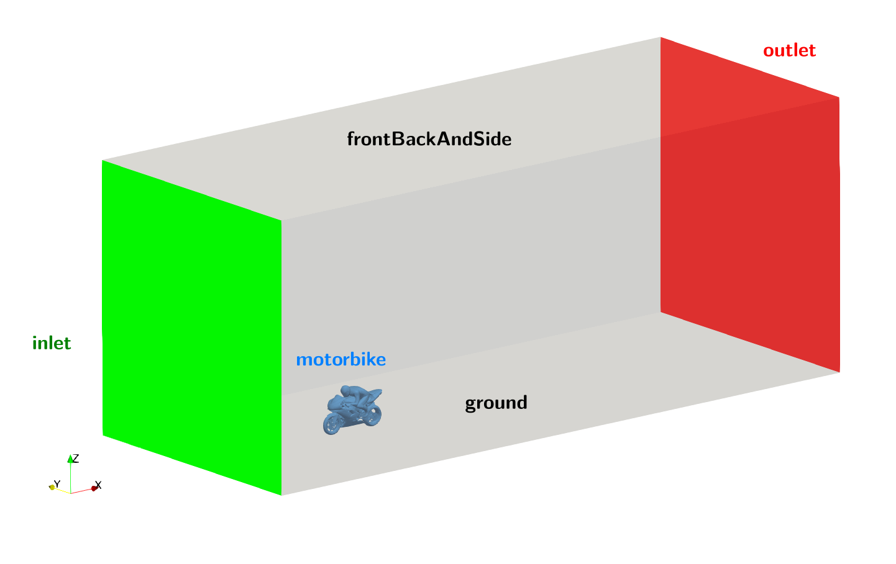
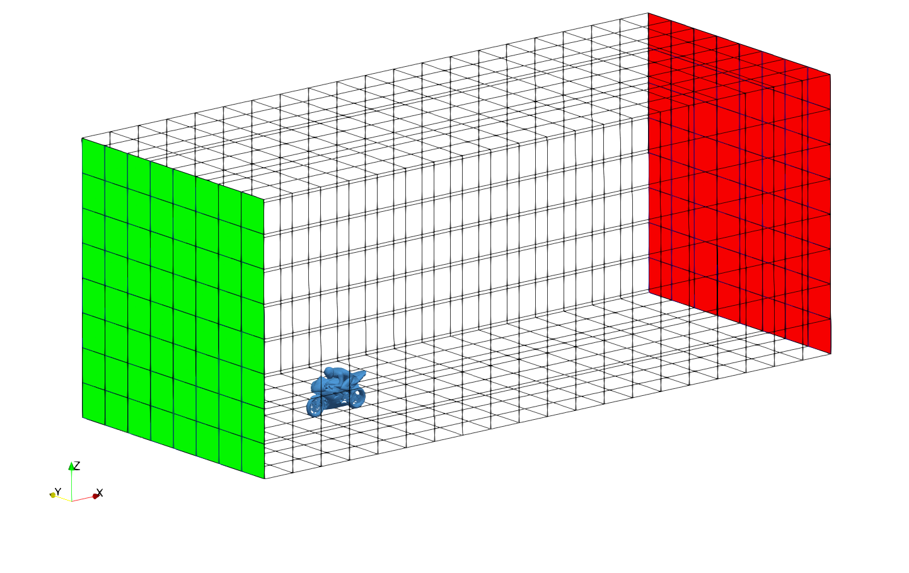
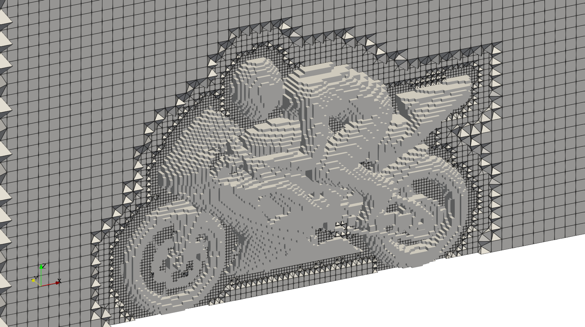
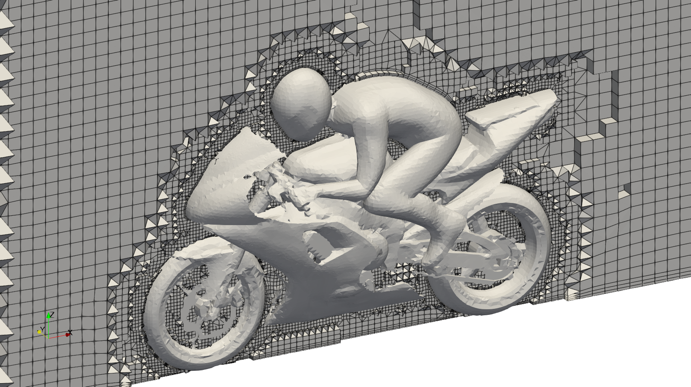
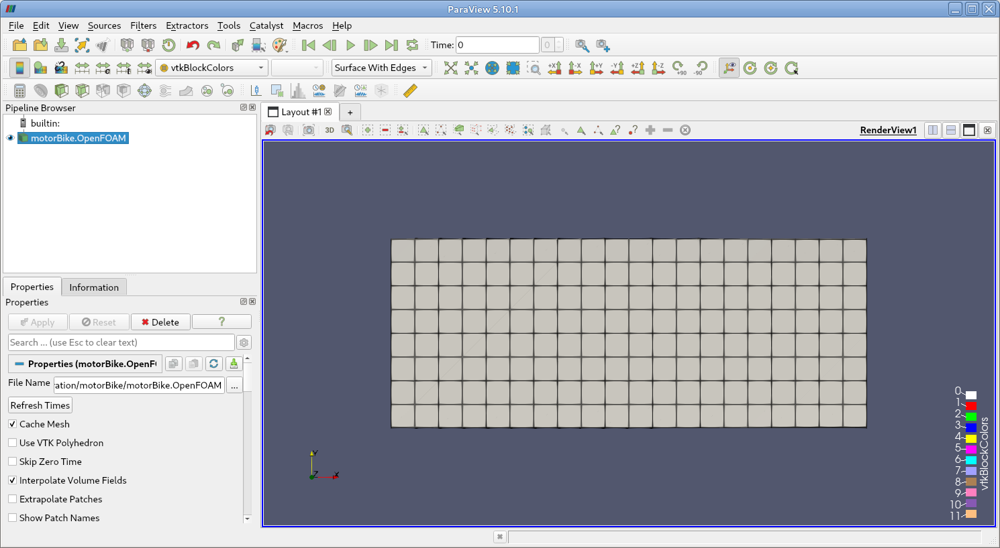
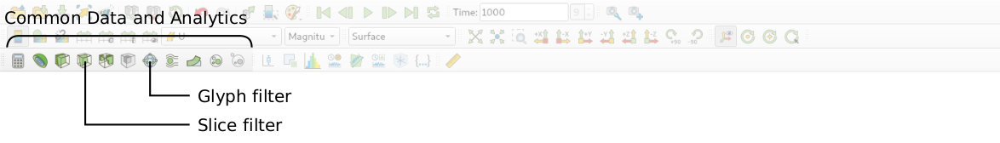
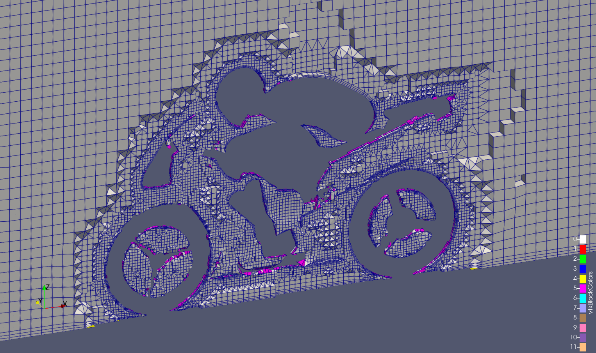

# Unstructured Mesh Generation

## Introduction

This third part explains how the OpenFOAM meshing tool `snappyHexMesh` can be used to create unstructured, hexahedral-dominated mesh of a motorbike. At the end, the mesh will be visualized using ParaView. The geometry of the case with the corresponding patch names looks as follows:



Navigate with your terminal to the extracted sub-directory `motorbike` within the `1_mesh_generation` directory.


## OpenFOAM case structure

The folder structure for the motorbike case looks similar to the backward-facing step case. In this tutorial case, the motorbike folder contains the following subfolders and files:

```
backward-step
├── 0
│   ├── p
│   └── U
├── constant
│   └── momentumProperties
│   └── physicalProperties
└── system
    ├── blockMeshDict
    ├── controlDict
    ├── fvSchemes
    ├── fvSolution
    ├── meshQualityDict
    └── snappyHexMeshDict
                
3 directories, 10 files
```

Compared to the backward-facing step case, there are two additional files called `snappyHexMeshDict` and `meshQualityDict` in the `system` folder.


## Mesh generation of the background mesh

The mesh for this case will be created using the OpenFOAM utility `snappyHexMesh`, which automatically creates unstructured hexahedral-dominated meshes. However, `snappyHexMesh` relies on a structured background mesh, on which the surface and region-base refinement is performed. Therefore, the utility `blockMesh` has to be used first to create this background mesh.

### blockMesh

The creation of the structured background mesh via `blockMesh` is configured through `blockMeshDict` inside the `system` directory. Since the modelled wind tunnel is just a rectangular box, the background mesh consists only of a single block and is thus easy to configure. At first, the coordinates of the 8 vertices of the block are defined in `blockMeshDict`:

```
18  vertices
19  (
20      (-5 -4 0)
21      (15 -4 0)
22      (15  4 0)
23      (-5  4 0)
24      (-5 -4 8)
25      (15 -4 8)
26      (15  4 8)
27      (-5  4 8)
28  );
```

Based on the coordinates of the vertices, the overall dimensions of the wind tunnel can be derived: it spans from $-5\,\text{m}$ to $15\,\text{m}$ in $x$-direction (length), $-4\,\text{m}$ to $4\,\text{m}$ in $y$-direction (width), and $0\,\text{m}$ to $8\,\text{m}$ in $z$-direction (height). These vertices form a single block defined in the blocks sub-dictionary:

```
30  blocks
31  (
32      hex (0 1 2 3 4 5 6 7) (20 8 8) simpleGrading (1 1 1)
33  );
```

The first bracket indicates which vertices to use for the corresponding block (here, all vertices with index 0 to 7 are used). The second bracket sets the cell count in $x$-, $y$-, and $z$-direction. So the background mesh of the wind tunnel will be meshed with 40 cells in $x$-direction, 10 cells in $y$-direction, and 8 cells in $z$-direction. Dividing the length of the wind tunnel with the number of cells gives a uniform cell size of $1\,\text{m}$ of the background mesh. All cells are equal in size as the `simpleGrading` setting is set to `(1 1 1)`.

The remaining entries in the `boundary` sub-dictionary in the `blockMeshDict` specify the individual boundary patches for the background mesh. Here, this consists of an inlet patch, a ground patch, a patch for the top and side patches called `frontBackAndSide` and an outlet patch. The background mesh can now be created with the following command:

```bash
blockMesh
```

The resulting background mesh can be visualized with **ParaView**:




## Mesh generation of the unstructured mesh

The `snappyHexMesh` utility generates 3-dimensional meshes containing hexahedra (hex) and split-hexahedra (split-hex) automatically from triangulated surface geometries, or tri-surfaces, in Stereolithography (STL) or Wavefront Object (OBJ) format. The mesh approximately conforms to the surface by iteratively refining a starting mesh and morphing the resulting split-hex mesh to the surface. An optional phase will shrink back the resulting mesh and insert cell layers. The specification of mesh refinement level is very flexible and the surface handling is robust with a pre-specified final mesh quality. It runs in parallel with a load balancing step every iteration.

Before going through the individual configuration of `snappyHexMesh`, the unstructured hexahedral-dominated mesh can be generated once the background mesh has been created:

```bash
snappyHexMesh
```


### Configuration of snappyHexMesh

The meshing tool `snappyHexMesh` is solely controlled via the `snappyHexMeshDict` configuration file in the `system` directory. In this case, the file has the following structure:

```
/*--------------------------------*- C++ -*----------------------------------*\
 =========                 |
 \\      /  F ield         | OpenFOAM: The Open Source CFD Toolbox
  \\    /   O peration     | Website:  https://openfoam.org
   \\  /    A nd           | Version:  13
    \\/     M anipulation  |
\*---------------------------------------------------------------------------*/
FoamFile
{
    format      ascii;
    class       dictionary;
    object      snappyHexMeshDict;
}
// * * * * * * * * * * * * * * * * * * * * * * * * * * * * * * * * * * * * * //

// Include default parameters
#includeEtc "caseDicts/mesh/generation/snappyHexMeshDict.cfg"

// Which of the steps to run
castellatedMesh on;
snap            on;
addLayers       on;


// Geometry definition of all surfaces
geometry
{
    ...
}


// Settings for the castellatedMesh generation
castellatedMeshControls
{
    ...
}


// Settings for the snapping.
snapControls
{
    ...
}


// Settings for the layer addition.
addLayersControls
{
    ...
}

...

// ************************************************************************* //
```

This structure follows the overall meshing process of `snappyHexMesh`:

1. The geometry of the object of interest has to be provided.
2. The background mesh is refined at user-defined surfaces and refinement regions. Afterwards, unused cells are removed from the mesh. The result is a castellated mesh not smoothly following the surfaces.
3. The cells at the surfaces are snapped onto the geometry surface in order to create a smooth and representative mesh of the initial geometry.
4. Inflation layers are created at user-defined surfaces in order to accurately resolve the boundary layer.

Each of the steps castellation, snapping, and inflation layer addition can individually be turned on or off at the top of the `snappyHexMeshDict`. In this tutorial, all three steps will be performed.

{: .note }
> At the very top below the header, a file with default settings is included. This significantly reduces the complexity of the setup, as it takes care of many smaller settings.


### Geometry

The second entry called `geometry` in `snappyHexMeshDict` determines which geometries are actually considered for meshing and refining. Each geometry file has to be provided in STL or OBJ file format and stored in the `constant/geometry` directory. Within the keyword `geometry` are the following settings for this tutorial case:

```
// Geometry definition of all surfaces
geometry
{
    motorbike
    {
        type triSurfaceMesh;
        file "motorbike.obj";
    }

    wakeRegion
    {
        type searchableBox;
        min (-1.0 -0.7 0.0);
        max ( 8.0  0.7 2.5);
    }
};
```

Two entities are defined in the `geometry` section:

- First, the actual motorbike geometry with the file name `motorbike.obj` is provided. Since it is a triangulated surface mesh, it is of type `triSurfaceMesh`. It is located under `constant/geometry/motorbike.obj`.
- Second, a refinement box with the name `wakeRegion` in the wake of the motorbike of type `searchableBox` is provided for region-based refinement. Its dimensions in $x$-, $y$-, and $z$-direction is directly defined. Later, all cells within this box will be selected for refinement.


### Castellated mesh controls

Once the geometries have been defined, the first meshing step is the local refinement of the castellated mesh and the removal of unneeded cells. This can be configured in the entry `castellatedMeshControls` in the `snappyHexMeshDict`. It can either be refined as follows:

- surface of the geometry with the keyword `refinementSurfaces{}`, and
- regions within the solution domain using the keyword `refinementRegions{}`

The corresponding settings in the `snappyHexMeshDict` are:

```
// Settings for the castellatedMesh generation
castellatedMeshControls
{
    // Surface based refinement
    refinementSurfaces
    {
        motorbike
        {
            level (5 6);
        }
    }

    // Region-wise refinement
    refinementRegions
    {
        wakeRegion
        {
            mode    inside;
            level   4;
        }
    }

    // Mesh selection
    insidePoint (3.0001 3.0001 0.43);
}
```

In this tutorial case, the mesh is refined at the **surface of the motorbike** as specified in the `refinementSurfaces{}` entry. Here, the patch to be refined has to be named (in this example `motorbike` according to the name in the geometry entry) and the minimum and maximum level of refinement has to be specified (here: `level (5 6)` indicates a minimum refinement level of 5 and a maximum refinement level of 6). Furthermore, the **wake region is refined** in the `refinementRegions{}` entry. Here, the name of the region is specified (in this case the refinement box named `wakeRegion` as specified in the geometry section of `snappyHexMesh`). For this refinement region, all cells within the region are refined (entry `mode` is set to `inside`) up to a refinement level of 4.

{: .note }
> The **refinement level** (entry `level` in `snappyHexMeshDict`) specifies, how often a given hexahedral cell is split into 8 smaller hexahedral cells. Based on a cell size of the background mesh of $1\,\text{m}$ as specified in the `blockMeshDict`, the resulting cell size at the motorbike surface at a refinement level of 6 would be $\Delta x = 1\,\text{m} / 2^6 = 0.0156\,\text{m}$.

Finally, a point (keyword `insidePoint`) has to defined, which specifies the fluid region of the solution domain. If this point is placed within the motorbike, then the interior of the vehicle would be meshed. If it is placed outside of the motorbike (but within the background mesh), then its surroundings will be meshed. The latter is of course required for an aerodynamical simulation of the flow around the motorbike.

The castellated mesh after the first meshing step looks like follows:




### Snapping mesh controls

In the second step of the meshing process involves moving cell vertex points onto surface geometry to remove the jagged castellated surface from the mesh. The settings for this step are defined in the entry called `snapControls`. In this tutorial case, the default values are sufficient. Therefore, this entry is empty.

After the snapping step, the mesh looks like follows:




### Layer Addition Controls

This last and optional step introduces layers of hexahedral cells aligned to the boundary surface of the geometry. The `addLayersControls` dictionary contains entries for each patch on which the layers are to be applied, the number of surface layers required, growth rate among others. In this tutorial case, this looks as follows:

```
// Settings for the layer addition.
addLayersControls
{
    // Per patch the layer information
    layers
    {
        motorbike
        {
            nSurfaceLayers 3;
        }
        ground
        {
            nSurfaceLayers 3;
        }
    }
    
    // Are the thickness parameters below relative to the undistorted
    // size of the refined cell outside layer (true) or absolute sizes (false).
    relativeSizes true;

    // Expansion factor for layer mesh
    expansionRatio 1.2;

    // Wanted thickness of final added cell layer.
    finalLayerThickness 0.3;

    // Minimum thickness of cell layer.
    minThickness 0.1;
}
```

The `layers` entry specifies, how many layers should be applied to which patch. In this tutorial, three additional layers are added to both the `motorbike` and the `ground` patch. The following additional settings are applied for the inflation layer size:

- The growth ratio between two layers is set to 1.2 using the keyword `expansionRatio`.
- The final layer thickness and the minimum thickness of the first cell layer using `finalLayerThickness` and `minThickness`. Both settings are defined relative to the refined cell size at the patch, as the entry `relativeSizes` is set to `true`. If this entry would be `false`, then inflation layer size could be specified in meters.

After the layer addition step, the final mesh looks like follows:


## Mesh quality

Once the mesh has been created with `blockMesh`, it is once again recommended to check the mesh statistics and quality criteria. This can easily be done using the utility `checkMesh` from within the `backward-step` folder:

```bash
checkMesh
```

The most relevant output is as follows:

```
// * * * * * * * * * * * * * * * * * * * * * * * * * * * * * * * * * * * * * //
Create time

Create polyMesh for time = 0

Time = 0s

Mesh stats
    points:           442955
    faces:            1201831
    internal faces:   1155124
    cells:            382398
    faces per cell:   6.16362
    boundary patches: 5
    point zones:      0
    face zones:       0
    cell zones:       0

Overall number of cells of each type:
    hexahedra:     329830
    prisms:        4848
    wedges:        0
    pyramids:      0
    tet wedges:    326
    tetrahedra:    19
    polyhedra:     47375


...

Checking geometry...
    Overall domain bounding box (-5 -4 -1.66533e-16) (15 4 8.0402)
    Mesh has 3 geometric (non-empty/wedge) directions (1 1 1)
    Mesh has 3 solution (non-empty) directions (1 1 1)
    Boundary openness (4.88222e-18 1.41537e-18 -1.30388e-16) OK.
    Max cell openness = 7.32062e-16 OK.
    Max aspect ratio = 24.0921 OK.
    Minimum face area = 1.30428e-06. Maximum face area = 1.0491.  Face area magnitudes OK.
    Min volume = 2.27488e-08. Max volume = 1.04374.  Total volume = 1279.63.  Cell volumes OK.
    Mesh non-orthogonality Max: 64.9817 average: 10.7148
    Non-orthogonality check OK.
    Face pyramids OK.
 ***Max skewness = 7.34803, 22 highly skew faces detected which may impair the quality of the results
  <<Writing 22 skew faces to set skewFaces
    Coupled point location match (average 0) OK.


Mesh OK.
    
End
```

This gives us all relevant mesh statistics and quality criteria of the mesh:
- The mesh consists of 382398 cells,
- has 5 different boundary patches,
- the overall majority of cells are hexahedrals with polyhedral cells being second.

As this is an unstructured hexahedral-dominated hybrid mesh, the mesh quality is not as good:
- max cell aspect ratio of 24.1,
- a maximum mesh non-orthogonality of 64.98, and
- a max cell skewness of 7.35.

The last entry even throws out an error due to 22 highly skewed faces. This needs further investigation later. Nevertheless, the final output `Mesh OK.` indicates that no critical problems or errors were found during `checkMesh`. Therefore, we can continue with this mesh and proceed with the simulation.


## Viewing the mesh

Once the mesh has been created and its quality checked, it is time to visualize the mesh and check for any errors. For that, we use the post-processing software **ParaView** as a background process, which allows the shell to accept additional commands while it is still running. Since it is convenient to keep **ParaView** open while running other commands from the terminal, we will launch it in the background using the `&` operator by typing:

```bash
paraFoam &
```

In the **Pipeline Browser** on the left, the user can see that ParaView has opened `motorbike.OpenFOAM`, the module for the motorbike case. Clicking on the green **Apply** button in the **Properties** panel displays the computational domain. Selecting **Surface with Edges** in the top center menu bar shows the computational mesh as follows:



Since this is a three-dimensional mesh, we can only see the solution domain from the outside not revealing information about the mesh at the motorbike. Therefore, we have to use a cutting plane, or *slice*. With the `motorbike.OpenFOAM` module highlighted in the **Pipeline Browser**, the user should select the **Slice** filter from **Common Data and Analytics** in the top menu of ParaView:



The cutting plane should be centred at $(0, 0, 0)$ and its normal should be set to $(0, 1, 0)$ (click the **Y Normal** button). The **Show Plane** in the **Properties** panel should be disabled as otherwise rotating the image with the mouse might change the plane orientation and the **Crinkle slice** should be checked, so that whole cells will be shown. After rotating the mesh and focusing on the motorbike, the mesh can be viewed as follows:




## Conclusion

This concludes the third case in the **Meshing Tutorial**. We have:
- Created a block-structured background mesh mimicking the wind tunnel around a motorbike using `blockMesh`,
- Created an unstructured hexahedral-dominant hybrid mesh of the motorbike with `snappyHexMesh`,
- Checked the mesh quality with `checkMesh`, and
- Visualized the mesh with **ParaView**.