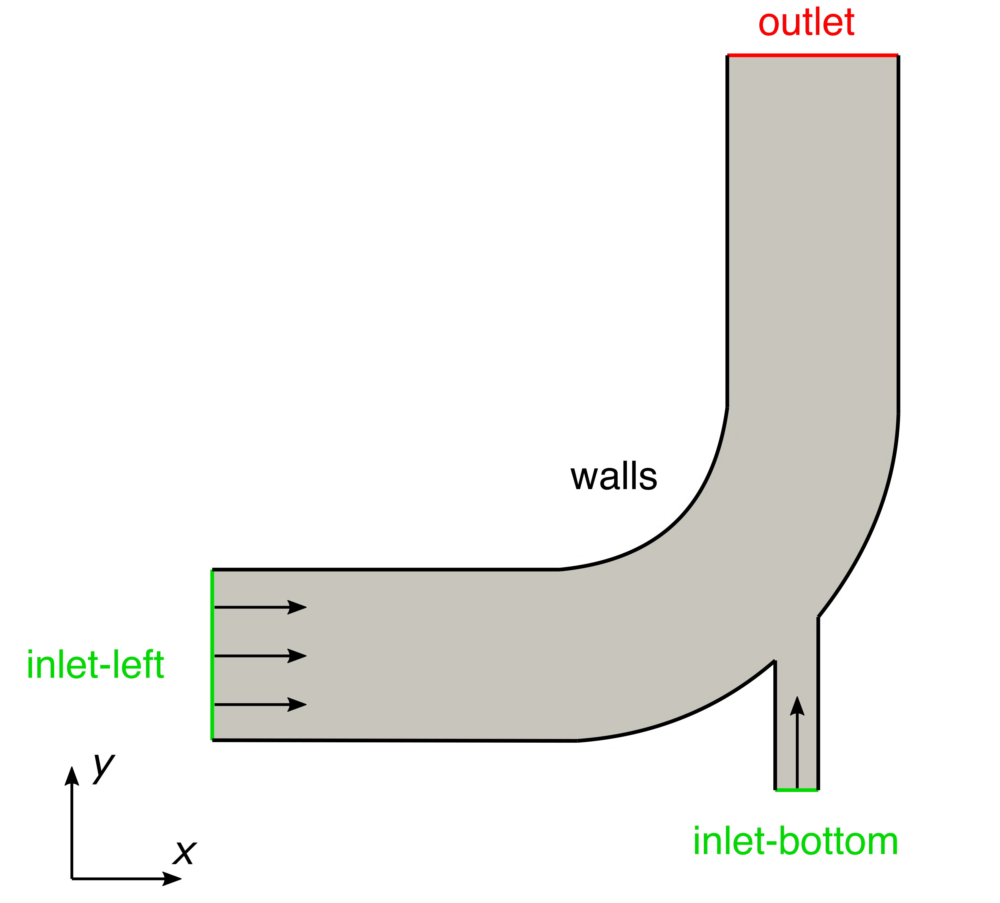

# Mesh Import

## Introduction

This first part explains the general OpenFOAM case structure, where the mesh information is stored and how to import a two-dimensional mesh created with an external software. At the end, the mesh will be visualized using ParaView. The geometry of the case looks as follows:



Navigate with your terminal to the extracted sub-directory `elbow` within the `1_mesh_generation` directory.

## OpenFOAM case structure

A case being simulated involves data for mesh, fields, properties, control parameters, etc. In OpenFOAM this data is stored in a set of files within a case directory rather than in a single case file, as in many other CFD packages. The case directory is given a suitably descriptive name, here `elbow`. This folder contains the following subfolders and files:

```
elbow
├── 0
├── constant
└── system
    ├── controlDict
    ├── fvSchemes
    └── fvSolution
 
3 directories, 4 files
```

 - `0`: This folder is a special time directory that contains the initial conditions and boundary conditions for starting the simulation. 
 - `constant`: This directory contains files that are related to the physics of the problem, including the mesh and any physical properties that are required for the solver.
 - `system`: This folder contains files related to how the simulation is to be solved:
    - `controlDict` for setting control parameters including start/end time, time step size and parameters for data output.
    - `fvSchemes` holds the discretisation schemes used in the solution selected during runtime.
    - `fvSolution` for setting the equation solvers, tolerances, relaxation factors and other algorithm controls for the run.

## Mesh import

The mesh for this case has been created using an external software and is stored in the ANSYS Fluent mesh format `*.msh`. OpenFOAM offers a tool to import a mesh like this into the OpenFOAM format. In this case, when the terminal's working directory is the `elbow` case folder, the mesh can be imported using the following command:

```bash
fluentMeshToFoam elbow.msh
```

Here, `fluentMeshToFoam` is the executable for importing the mesh and `elbow.msh` is the argument pointing towards the mesh file inside the `elbow` case folder. The utlitity sucessfully imports the mesh and confirms this with the output:

```
...
Writing mesh... to "constant/polyMesh"  done.
 
End
```

The mesh has been successfully imported into the OpenFOAM format and stored within the `constant/polyMesh` folder.


## Mesh quality

After importing or generating a computational grid it is always recommended to check the mesh statistics and quality criteria. This can easily be done using the utility `checkMesh` from within the `elbow` folder. Just type in the terminal:

```bash
checkMesh
```

This will produce the following output to the terminal:

```
// * * * * * * * * * * * * * * * * * * * * * * * * * * * * * * * * * * * * * //
Create time
 
Create polyMesh for time = 0
    
Time = 0s
    
Mesh stats
    points:           1074
    internal points:  0
    faces:            3290
    internal faces:   1300
    cells:            918
    faces per cell:   5
    boundary patches: 6
    point zones:      0
    face zones:       0
    cell zones:       0
    
Overall number of cells of each type:
    hexahedra:     0
    prisms:        918
    wedges:        0
    pyramids:      0
    tet wedges:    0
    tetrahedra:    0
    polyhedra:     0
    
Checking topology...
    Boundary definition OK.
    Cell to face addressing OK.
    Point usage OK.
    Upper triangular ordering OK.
    Face vertices OK.
    Number of regions: 1 (OK).
    
Checking patch topology for multiply connected surfaces...
    Patch               Faces    Points   Surface topology                  
    wall-left           100      206      ok (non-closed singly connected)  
    inlet-left          8        18       ok (non-closed singly connected)  
    inlet-bottom        4        10       ok (non-closed singly connected)  
    outlet              8        18       ok (non-closed singly connected)  
    wall-right          34       70       ok (non-closed singly connected)  
     frontAndBackPlanes  1836     1074     ok (non-closed singly connected)  
    
Checking geometry...
    Overall domain bounding box (0 -4.53853 -0.937738) (64 64 0.937738)
    Mesh has 2 geometric (non-empty/wedge) directions (1 1 0)
    Mesh has 2 solution (non-empty) directions (1 1 0)
    All edges aligned with or perpendicular to non-empty directions.
    Boundary openness (-1.03633e-18 2.59082e-18 1.15147e-19) OK.
    Max cell openness = 1.87187e-16 OK.
    Max aspect ratio = 2.40135 OK.
    Minimum face area = 0.278218. Maximum face area = 7.72369.  Face area magnitudes OK.
    Min volume = 0.521792. Max volume = 7.36354.  Total volume = 3156.3.  Cell volumes OK.
    Mesh non-orthogonality Max: 36.302 average: 11.1868
    Non-orthogonality check OK.
    Face pyramids OK.
    Max skewness = 0.500248 OK.
    Coupled point location match (average 0) OK.
    
 Mesh OK.
    
End
```

This gives us all relevant mesh statistics and quality criteria of the mesh. Among others, this includes starting from top:

- The mesh consists of 1074 points,
- has 3290 faces in total,
- has 918 cells with a prism shape,
- has the six boundary patches named `wall-left`, `inlet-left`, `inlet-bottom`, `outlet`, `wall-right`, and `frontAndBackPlanes`
- with 100, 8, 4, 8, 34, and 1836 faces, respectively.

Below follow various relevant mesh quality criteria, such as:

- Overall domain bounding box of `(0 -4.53853 -0.937738) (64 64 0.937738)`,
- number of non-empty solution directions of 2 (e.g. a 2-dimensional case),
- max cell aspect ratio of 2.40135,
- a minimum and maximum cell volume of 0.521792 and 7.36354, respectively,
- a maximum mesh non-orthogonality of 36.302, and
- a max cell skewness of 0.500248.

The final output `Mesh OK.` indicates that no critical problems or errors were found during `checkMesh`. Therefore, we can continue with this mesh and proceed with the simulation.

{: .note }
> OpenFOAM always uses SI-units. Therefore, geometric dimensions shown here are in meter.


## Viewing the mesh

Before the case is run it is a good idea to view the mesh to check for any errors. The mesh is viewed in ParaView, the post-processing tool supplied with OpenFOAM. The ParaView post-processing is conveniently launched on OpenFOAM case data by executing the `paraFoam` executable from within the case directory.

Any UNIX/Linux executable can be run in two ways: as a foreground process, i.e. one in which the shell waits until the command has finished before giving a command prompt; or as a background process, which allows the shell to accept additional commands while it is still running. Since it is convenient to keep ParaView open while running other commands from the terminal, we will launch it in the background using the `&` operator by typing:

```bash
paraFoam &
```

This launches the ParaView window and opens the elbow case as shown in the following figure:


In the **Pipeline Browser** on the left, the user can see that ParaView has opened `elbow.OpenFOAM`, the module for the elbow case. Clicking on the green **Apply** button in the **Properties** panel displays the computational domain. Selecting **Surface with Edges** in the top center menu bar shows the computational mesh as follows:


{: .note }
> Many advanced parameters in the Properties panel are only available by clicking the Advanced Properties gearwheel button at the top of the Properties window, next to the search box.

## Conclusion

This concludes the first case in the **Meshing Tutorial**. We have:
- Successfully import a **ANSYS Fluent** mesh file `*.msh` into the OpenFOAM case structure using the command `fluentMeshToFoam`,
- Checked the mesh quality with `checkMesh`, and
- Visualized the mesh with **ParaView**.