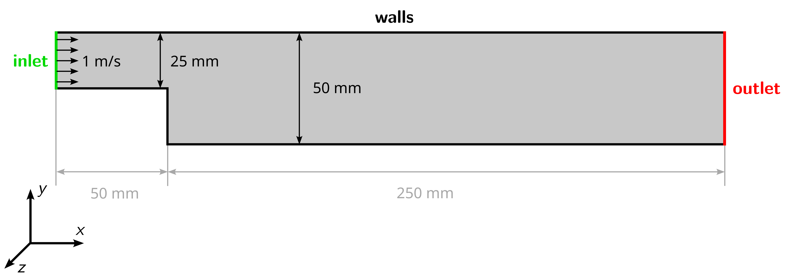

# Backward-facing Step

## Objectives

The objectives for this tutorial are as follows:

- Create a two-dimensional mesh in OpenFOAM with `blockMesh` and check its quality,
- Set material properties based on Reynolds-number,
- Estimate the correct time step size based on Courant number,
- Run a transient, incompressible simulation with the solver `incompressibleFluid`,
- Perform a mesh dependency study,
- Adapt the discretization schemes, and
- Visualize the velocity field in ParaView.

## Overview

This tutorial will describe how to pre-process, run and post-process a case involving a transient, isothermal, incompressible flow over a two-dimensional backward-facing step. The geometry is shown in the following figure with an inlet on the left, stationary walls on the top and bottom, and an outlet at the right. Based on the step height, the Reynolds-number of the flow should be 1250. The flow will be solved using the OpenFOAM module `incompressibleFluid` the suitable for laminar and turbulent, isothermal, incompressible, transient or steady-state flows.

## Preparation

Before starting, perform the following steps for preparation:

 1. Download the archive file [3_backward-step.zip](https://github.com/user-attachments/files/27590154/3_backward-step.zip) containing the case folders.
 2. Extract the archive and move its content to the `OpenFOAM_Projects` folder, which has been created in the first tutorial. 
 3. Open a terminal, navigate to the newly created folder, and source OpenFOAM using the `of13`.