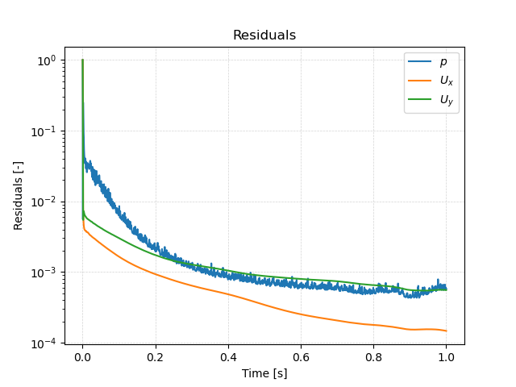
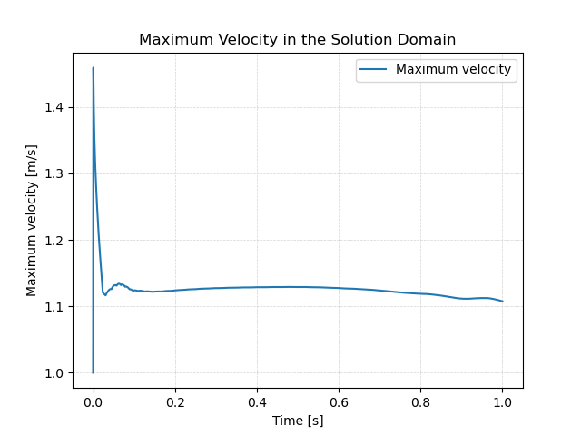

# Solving


## Starting the Solver

In order to start the simulation, we have to execute corresponding the OpenFOAM application. As defined in the `controlDict`, the solver `incompressibleFluid` will be used, suitable for steady-state or transient, incompressible, laminar or turbulent flows. In order to start the solution process, the application `foamRun` has to be executed in the terminal from within the case directory:

```bash
foamRun
```

The progress of the job is written to the terminal window. It tells the user the current time step, the equations being solved, initial and final residuals for all fields and should look like follows:

```
Courant Number mean: 0.157044 max: 0.312361
Time = 0.53875s

smoothSolver:  Solving for Ux, Initial residual = 0.000300825, Final residual = 5.41827e-07, No Iterations 1
smoothSolver:  Solving for Uy, Initial residual = 0.000840604, Final residual = 2.24687e-06, No Iterations 1
GAMG:  Solving for p, Initial residual = 0.000708791, Final residual = 1.70292e-06, No Iterations 3
time step continuity errors : sum local = 5.90895e-10, global = 7.3668e-11
GAMG:  Solving for p, Initial residual = 7.39134e-05, Final residual = 4.01323e-08, No Iterations 4
time step continuity errors : sum local = 1.39255e-11, global = 5.83864e-12, cumulative = 1.66941e-09
ExecutionTime = 2.81196 s  ClockTime = 3 s
```

This output at time step 0.53875s seconds tells us in summary:
- The maximum Courant number of the simulation is 0.312361 with an average value of 0.157044. While being larger than the initially estimated value of 0.25, it, is still smaller than 1.0 indicating a stable and accurate simulation.
- The `smoothSolver` (e.g., a Gauss-Seidel solver) is used to solve the velocity components `Ux` and `Uy` in *x*- and *y*-direction. In this time step, it takes one iteration to reach the specified residual criteria.
- The `GAMG` multigrid solver is used for solving the pressure poisson equation in the pressure-velocity coupling algorithm. For better stability and convergence, the pressure equation is solved twice per time step. It takes 3 and 4 iterations to reach convergence, respectively.
- The error of the conservation of mass is denoted as `continuity error`. Since its value is very small, conservation of mass is maintained.
- The execution time for the simulation up until this time step is 2.81 seconds as indicated by the `ExecutionTime`.


## Monitoring the Simulation

In order to track and monitor the simulation during its run, two function objects are added to the simulation in the `functions` file in the `system` folder. Function objects in general are typically used to write out the residuals over the course of the simulation, perform certain post-processing tasks such as calculating the flow rate over a patch, compute maximum and average values of the flow field, compute forces and force coefficients on objects, compute derived fields such as heat transfer or shear stress rates, and generate images through cutPlanes or iso-surfaces. In this case, the `functions` file looks as follows:

```
#includeFunc residuals
(
    name    = residuals,
    fields  = (p U)
)

#includeFunc cellMaxMag
(
    name    = Umax,
    field   = U
)
```

By default, the residuals are only printed to the terminal window. In order to visualize the residuals to help judge convergence, a function object has been added to the `functions` file. This function object saves the initial residuals of the fields `(p U)`, so pressure and velocity, during runtime. Therefore, a new folder called `postProcessing` is automatically created inside the case folder. So in this example, the residuals are stored under the following path: `postProcessing/residuals/0/residuals.dat`.

Residuals are just one criteria for a converged simulation. Therefore, other physical variables should be consulted as well. In this tutorial, the maximum velocity in the solution domain will also be tracked and written into a separate folder inside `postProcessing`. This is done by including the `cellMaxMag` function object as shown above. It computes the magnitude of the velocity vector and stores the maximum under the following path: `postProcessing/Umax/0/volFieldValue.dat`.

Once the simulation has finished and all the time directories are written out, the data written by the function objects can be analyzed. This data can typically be plotted in a diagram using Microsoft Excel, Python, Gnuplot or any other tool. In order to quickly evaluate the monitored results from the function objects, a script is added to the backward-step case directory called `create_plots.py`. Executing it will automatically create the diagrams for residuals and maximum flow velcoity after the run. By typing the following command in the terminal, the diagrams are created using Python and stored as png file:

```bash
python3 create_plots.py
```

This creates the following diagram of the residuals on the *y*-axis plotted against the simulation time on the *x*-axis in the case folder:



The plot shows that the residuals fall throughout the simulation to the range of $$10^{-3} - 10^{-4}$$ for pressure and velocity. The maximum velocity plot looks as follows:



As the maximum velocity is still slightly falling, the case cannot be considered fully converged, yet.