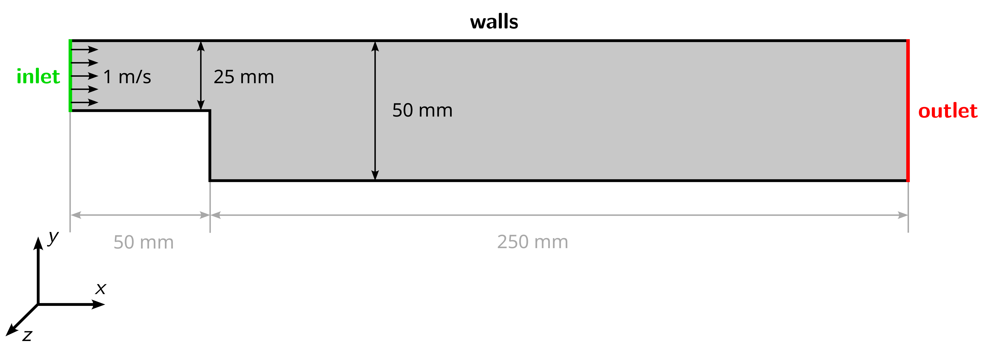

# Meshing in OpenFOAM

## Objectives

The objectives for this tutorial are as follows:

- Recap of the the OpenFOAM case structure,
- Create a two-dimensional mesh in OpenFOAM with `cartesian2DMesh` and check its quality,
- Set material properties based on Reynolds-number,
- Estimate the correct time step size based on Courant number,
- Perform a transient, incompressible simulation with `pimpleFoam`,
- Adapt the discretization schemes,
- Visualize the velocity field in ParaView.

## Overview

This tutorial will describe how to pre-process, run and post-process a case involving a transient, isothermal, incompressible flow over a two-dimensional backward-facing step. The geometry is shown in the following figure with an inlet on the left, stationary walls on the top and bottom, and an outlet at the right. The flow will be solved using the OpenFOAM solver `pimpleFoam` the suitable for laminar and turbulent, isothermal, incompressible flows.

## Preparation

Before starting, perform the following steps for preparation:
 1. Download the archive `3_discretization.zip` from the Downloads folder on the [OPAL course page](https://bildungsportal.sachsen.de/opal/auth/RepositoryEntry/19816513539).
 2. Extract the archive.
 3. Open a terminal, navigate to the newly created folder, and source OpenFOAM.
