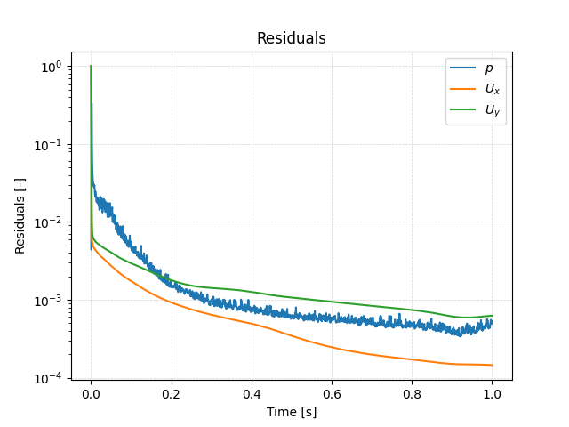

## Starting the Solver

In order to start the simulation, we have to execute corresponding the OpenFOAM application. As defined in the `controlDict`, the solver `pimpleFoam` will be used suitable for transient, incompressible, laminar or turbulent flows. This application can be started by typing the appropriate command while the terminal is located inside the case directory:

```bash
pimpleFoam
```

The progress of the job is written to the terminal window. It tells the user the current time step, the equations beeing solved, initial and final residuals for all fields and should look like follows:

```bash
Courant Number mean: 0.287074 max: 0.730372
Time = 0.029

PIMPLE: iteration 1
smoothSolver:  Solving for Ux, Initial residual = 0.00387855, Final residual = 1.23907e-06, No Iterations 2
smoothSolver:  Solving for Uy, Initial residual = 0.00579144, Final residual = 2.81116e-06, No Iterations 2
GAMG:  Solving for p, Initial residual = 0.0195106, Final residual = 0.000124988, No Iterations 3
time step continuity errors : sum local = 2.85115e-08, global = 4.10384e-09, cumulative = 1.06477e-06
GAMG:  Solving for p, Initial residual = 0.00419421, Final residual = 8.98766e-08, No Iterations 8
time step continuity errors : sum local = 2.03893e-11, global = 1.79978e-12, cumulative = 1.06477e-06
ExecutionTime = 0.72 s  ClockTime = 1 s
```

This output at time step 0.029 seconds tells us in summary:
- The maximum Courant number of the simulation is 0.732 with an average value of 0.287. Although larger than the initially estimated value of 0.5, it is smaller than 1.0 indicating a stable simulation.
- The `smoothSolver` (e.g., a Gauss Seidel solver) is used to solve the velocity components `Ux` and `Uy` in $$x$$- and $$y$$-direction. In this time step, it takes 2 iterations to reach the specified residual criteria.
- The `GAMG` multigrid solver is used for solving the pressure poisson equation in the pressure-velocity coupling algorithm. For better stability and convergence, the pressure equation is solved twice per time step.
The error of the conservation of mass is denoted as `continuity error`. Since its value is very small, conservation of mass is maintained.


## Monitoring the Simulation

In order to track and monitor the simulation during its run, a function object is added at the bottom of the `controlDict`. These are used for e.g. writing out the residuals over the course of the simulation, perform certain post-processing tasks such as calculating the flow rate over a patch, compute maximum and average values of the flow field, compute forces and force coefficients on objects, compute derived fields such as heat transfer or shear stress rates, and generate images through cutPlanes or iso-surfaces. In this case, the `controlDict` looks as follows:

```bash
functions
{
    solverInfo
    {
        type            solverInfo;
        libs            (utilityFunctionObjects);
        fields          (p U);
    }
}
```

### Plotting the Residuals

By default, the residuals are only printed to the terminal window. In order to visualize the residuals to help judge convergence, a function object has been added to the `controlDict`. This function object of type `solverInfo` saves the initial residuals of the fields `(p U)`, so pressure and velocity, during runtime. Therefore, a new folder called `postProcessing` is automatically created inside the case folder. So in this example, the residuals are stored under the following path: `postProcessing/solverInfo/0/solverInfo.dat`.

Once the simulation has finished and all the time directories are written out, the data written by the function objects can be analyzed. This data can typically be plotted in a diagram using Microsoft Excel, Python, Gnuplot or any other tool. In order to quickly evaluate the monitored results from the function objects, a script is added to the backward-step case directory called `create_plots.py`. Executing it will automatically create the diagramms for residuals and average inlet pressure after the run. By typing the following command in the terminal, the diagrams are created using Python and stored as png file:

```bash
python create_plots.py
```

This creates the following diagram in the case folder:



The plot shows that the residuals fall throughout the simulation to the range of $$10^{-4}$$ for pressure and velocity. Running the simulation for longer would probably reduce the residuals even further.
