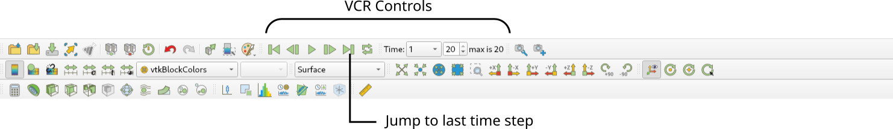
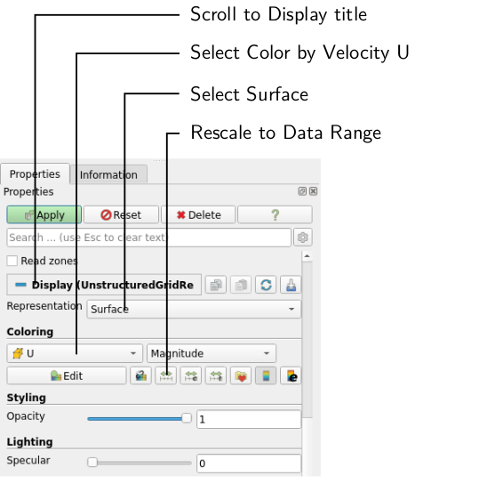

# Post-Processing

## Visualizing the Results

As soon as results are written to time directories, they can be viewed using ParaView. Start ParaView in the background with the following command:

```bash
paraview &
```
To prepare ParaView to display the data of interest, the data at the required time step of 1 second must be loaded. If the case was run while ParaView was open, the output data in time directories will not be automatically loaded within ParaView. To load the data the user should click **Refresh** at the top **Properties** window (scroll up the panel if necessary).

The solution at the last time step of $$t = 1\,\text{s}$$ can be viewed by using the **VCR Controls** at the very top of the ParaView window and click the button for **Last Frame**

:

## Coloring Surfaces by Flow Property

To color the mesh by velocity magnitude (i.e. the velocity contour) of the flow, the following settings must be selected in the **Properties** panel, as descriped in the following figure:
1. Select **Surface** from the **Representation** menu,
2. Select **Coloring** by velocity magnitude U at the cell centers, and
3. Select **Rescale to Data Range**, if necessary.

:

The velocity field looks like expected: The velocity magnitude at the inlet is about  $$1\,\text{m/s}$$. The flow detaches as it goes over the backwards-facing step and reattached further downstream. Due to the increase in cross-sectional area, the flow decelerates slightly.

