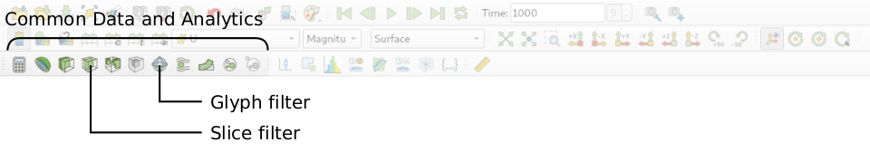
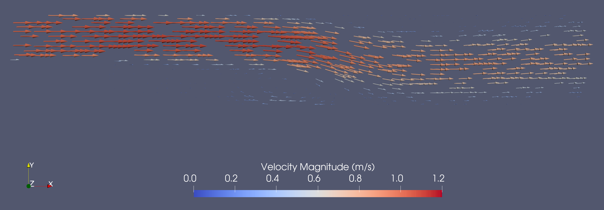

# Post-Processing

## Visualizing the Results

As soon as results are written to time directories, they can be viewed using ParaView. Start ParaView in the background with the following command:

```bash
paraFoam &
```
To prepare ParaView to display the data of interest, the data at the required time step of 1 second must be loaded. If the case was run while ParaView was open, the output data in time directories will not be automatically loaded within ParaView. To load the data the user should click **Refresh** at the top **Properties** window (scroll up the panel if necessary).

The solution at the last time step of $$t = 1\,\text{s}$$ can be viewed by using the **VCR Controls** at the very top of the ParaView window and click the button for **Last Frame**


## Coloring Surfaces by Flow Property

To color the mesh by velocity magnitude (i.e. the velocity contour) of the flow, the following settings must be selected in the **Properties** panel, as descriped in the following figure:
1. Select **Surface** from the **Representation** menu,
2. Select **Coloring** by velocity magnitude U at the cell centers, and
3. Select **Rescale to Data Range**, if necessary.


The velocity field looks like expected: The velocity magnitude at the inlet is about  $$1\,\text{m/s}$$. The flow detaches as it goes over the backwards-facing step and reattached further downstream. Due to the increase in cross-sectional area, the flow decelerates slightly.


A colour legend can be added by clicking the **Toggle Color Legend Visibility** button in the **Active Variable Controls** toolbar. The legend can be located in the image window by drag and drop with the mouse.


The **Edit Color Map** button in the **Active Variable Controls** toolbar opens the **Color Map Editor** window, where the user can set a range of attributes of the colour scale and the color bar.


In particular, ParaView defaults to using a colour scale of blue to white to red rather than the more common blue to green to red (rainbow). Therefore the first time that the user executes ParaView, they may wish to change the colour scale. This can be done by selecting the **Choose Preset** button (with the heart icon) in the **Color Map Editor**. The conventional color scale for CFD is Blue to Red Rainbow can be found when the user types the name in the **Search** bar.

After selecting Blue to Red Rainbow and clicking **Apply** and **Close**, the user can click the **Save as Default** button at the absolute bottom of the panel (file save symbol) so that ParaView will always adopt this type of colour bar. The user can also edit the color legend properties, such as text size, font selection and numbering format for the scale, by clicking the **Edit Color Legend Properties** to the far right of the search bar, as shown in the figure above.


## Cutting Plane (Slice)

If the user rotates the image, by holding down the left mouse button in the image window and moving the cursor, they can see that they have now coloured the complete geometry surface by the velocity. In order to produce a genuine 2-dimensional contour plot the user should first create a cutting plane, or *slice*. With the `backward-step.foam` module highlighted in the **Pipeline Browser**, the user should select the **Slice** filter from **Common Data and Analytics** in the top menu of ParaView:




The cutting plane should be centred at $$(0, 0, 0)$$ and its normal should be set to $$(0, 0, 1)$$ (click the **Z Normal** button). By default, the pressure field will now be shown. The **Show Plane** in the **Properties** panel should be disabled as otherwise rotating the image with the mouse might change the plane orientation.


## Vector Plot (Glyph)

We now wish to generate a vector glyph for velocity at the cutting plane. With the `slice1` module highlighted in the **Pipeline Browser**, the user should select the **Glyph** filter from the **Common Data and Analytics** menu. The roperties window panel should appear as shown in the following figure:


In the resulting **Properties** panel, make sure the **Glyph Type** is set to **Arrow**, and the **Orientation Array** is the velocity field `U`. Then, set the **Scale Array** to `U` and **Vector Scale Mode** to **Scale by Magnitude**. This way, the size of the vectors will be scaled by the velocity magnitude and with a **Scaling Factor** of 0.01 and the vectors will be clearly visible. At this point you can click **Apply** to show the vector plot on top of the Cutting plane defined previously.

The resulting vectors will be color coded by pressure, whereas a velocity color code would make much more sense. Therefore, the user should colour the glyphs by velocity magnitude which, as usual, is controlled by setting **Color by** `U` in the **Properties** panel. The user can also select **Show Color Legend** in **Edit Color Map**. Additionaly, the `slice1` module in the **Pipeline Browser** can be made invisible by clicking the **Eye** symbol next to the module name. The resulting output is shown in the following figure:




## Velocity Animation

A good way to visualize the transient flow behaviour is an animation created with ParaView. For this, hide the vector plot and show the cut plane of the velocity magnitude. Then display the velocity magnitude in a range from $$(0 - 1.2) \, \text{m/s}$$. By clicking the **Play** button at the **VCR Controls** at the very top, it is possible to automatically go through every time step and get a quick glance of how the transient flow field looks like:


Before creating an animation, it is recommended to add more information to the view. First of all, a title could be added by clicking on the top menu: **Sources** $$\rightarrow$$ **Annotations** $$\rightarrow$$ **Text**. You can type any text in the text field inside the **Properties** panel, adjust font size and location of the text field. Secondly, you could add the current time step to the view, again by using the top menu: **Sources** $$\rightarrow$$ **Annotations** $$\rightarrow$$ **Annotate Time**. Choose a suitable time **Format**, such as `Time: {time:1.2f} s` to display the time with two digits and the unit in seconds. All in all, this could look like follows:


At this point, the animation can easily be created by clicking the top menu: **File** $$\rightarrow$$ **Save Animation...**, and choosing a suitable file name and format (preferably mp4 or avi). At the following **Animation Menu**, you can specify video resolution, compression, and frame rate. It is recommended to change the frame rate to a higher value, such as 10 - 15. Clicking **Okay** will create the animation for you.


## Conclusion


This concludes the second seminar on the simulation of incompressible, laminar flow over a backward-facing step. A two-dimensional mesh was generated using `cartesian2DMesh` based on a geometry file. The fluid properties were adjusted to match a specified Reynolds number, and the time step size was chosen to maintain an appropriate Courant number. The simulation was then run, and the residuals were plotted. Finally, the flow field was visualized in ParaView.