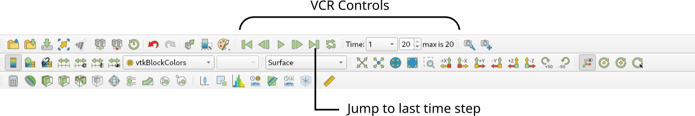
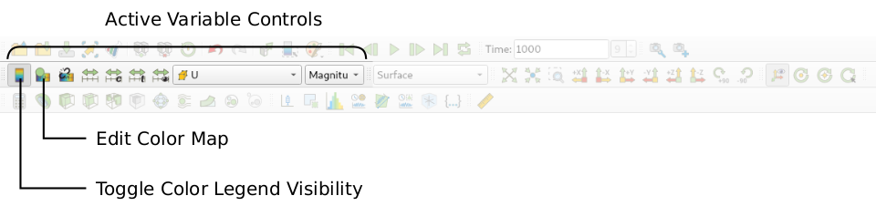

# Post-Processing

## Visualizing the Results

As soon as results are written to time directories, they can be viewed using ParaView. Start ParaView in the background with the following command:

```bash
paraview &
```
To prepare ParaView to display the data of interest, the data at the required time step of 1 second must be loaded. If the case was run while ParaView was open, the output data in time directories will not be automatically loaded within ParaView. To load the data the user should click **Refresh** at the top **Properties** window (scroll up the panel if necessary).

The solution at the last time step of $$t = 1\,\text{s}$$ can be viewed by using the **VCR Controls** at the very top of the ParaView window and click the button for **Last Frame**



## Coloring Surfaces by Flow Property

To color the mesh by velocity magnitude (i.e. the velocity contour) of the flow, the following settings must be selected in the **Properties** panel, as descriped in the following figure:
1. Select **Surface** from the **Representation** menu,
2. Select **Coloring** by velocity magnitude U at the cell centers, and
3. Select **Rescale to Data Range**, if necessary.


The velocity field looks like expected: The velocity magnitude at the inlet is about  $$1\,\text{m/s}$$. The flow detaches as it goes over the backwards-facing step and reattached further downstream. Due to the increase in cross-sectional area, the flow decelerates slightly.

A colour legend can be added by clicking the **Toggle Color Legend Visibility** button in the **Active Variable Controls** toolbar. The legend can be located in the image window by drag and drop with the mouse.



The **Edit Color Map** button in the **Active Variable Controls** toolbar opens the **Color Map Editor** window, where the user can set a range of attributes of the colour scale and the color bar.


In particular, ParaView defaults to using a colour scale of blue to white to red rather than the more common blue to green to red (rainbow). Therefore the first time that the user executes ParaView, they may wish to change the colour scale. This can be done by selecting the **Choose Preset** button (with the heart icon) in the **Color Map Editor**. The conventional color scale for CFD is Blue to Red Rainbow can be found when the user types the name in the **Search** bar.

After selecting Blue to Red Rainbow and clicking **Apply** and **Close**, the user can click the **Save as Default** button at the absolute bottom of the panel (file save symbol) so that ParaView will always adopt this type of colour bar. The user can also edit the color legend properties, such as text size, font selection and numbering format for the scale, by clicking the **Edit Color Legend Properties** to the far right of the search bar, as shown in the figure above.