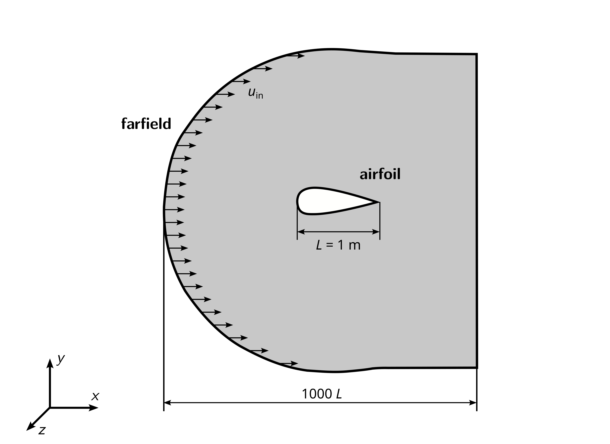

# Airfoil

## Objectives

The objectives for this tutorial are as follows:

- Import the two-dimensional mesh of an airfoil into OpenFOAM and check its quality,
- Set boundary conditions and material properties based on Reynolds-number and Mach-number,
- Run a steady-state, incompressible simulation with the solver `incompressibleFluid`,
- Check convergence and compute drag and lift coefficients, and
- Visualize the flow field and pressure coefficient in ParaView.

## Overview

This tutorial will describe how to pre-process, run, and post-process a case of a steady-state, isothermal, incompressible flow over a NACA 0012 airfoil. The flow can be characterized by a Reynolds-number of $$\text{Re} = 6 \times 10^6$$ at a Mach number of $$\text{Ma} = 0.15$$. The geometry is shown in the following figure with the airfoil of length $$L = 1\,\text{m}$$ in the center and a farfield boundary condition both upstream and downstream. The flow will be solved using the OpenFOAM solver `incompressibleFluid` suitable for laminar and turbulent, isothermal, incompressible flows.

The NACA0012 airfoil has been [studied extensively by NASA](https://tmbwg.github.io/turbmodels//naca0012_val.html). Experimental data for various Reynolds-numbers has been published for validation ([Ladson, NASA Technical Memorandum 4074, 1988](https://ntrs.nasa.gov/citations/19880019495)).

## Preparation

Before starting, perform the following steps for preparation:

 1. Download the archive file [4_airfoil.zip](https://github.com/user-attachments/files/28613461/4_airfoil.zip) containing the case folders.
 2. Extract the archive and move its content to the `OpenFOAM_Projects` folder, which has been created in the first tutorial. 
 3. Open a terminal, navigate to the newly created folder, and source OpenFOAM using the `of13` alias.