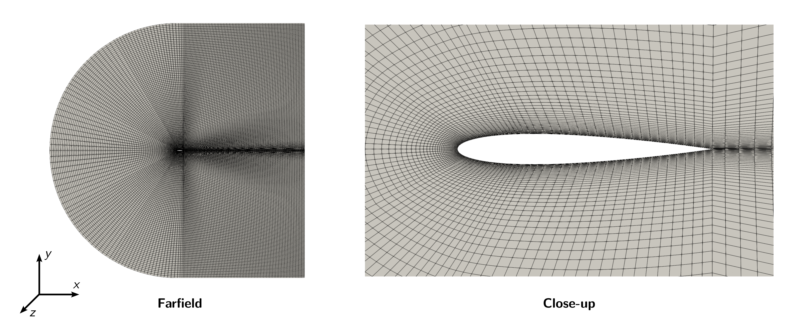

# Pre-Processing

## OpenFOAM Case Structure

A case being simulated involves data for mesh, fields, properties, control parameters, etc. In OpenFOAM this data is stored in a set of files within a case directory rather than in a single case file, as in many other CFD packages. The case directory is given a suitably descriptive name, here `airfoil`. This folder contains the following subfolders and files:

```
airfoil
├── 0
│   ├── p
│   └── U
├── constant
│   ├── turbulenceProperties
│   └── transportProperties
├── geometries
│   ├── airfoil_0deg.stl
│   ├── airfoil_2deg.stl
│   ├── airfoil_4deg.stl
│   ├── airfoil_6deg.stl
│   ├── airfoil_8deg.stl
│   └── airfoil_10deg.stl
└── system
    ├── controlDict
    ├── fvSchemes
    ├── fvSolution
    └── meshDict

4 directories, 12 files
```

The *relevant* files for this tutorial case are:
- `0` - This directory stores the initial values and boundary condition for each variables solved.
- `geometries` - This directory contains all geometry files required for the tutorial.
- `system` - This folder contains files related to how the simulation is to be solved:
    - `controlDict` for setting control parameters including start/end time, time step size and parameters for data output.
    - `fvSolution` for the solver settings used in the Finite Volume Method.
    - `meshDict` contains the configuration for the automated meshing process.


## Mesh Generation

The hexahedral-dominant, two-dimensional mesh is created automatically with the meshing utility `cartesian2DMesh` from a surface geometry file inside the `geometries` directory. Different geometries are provided for varying angle of attack of the airfoil.

The airfoil has an overall length of $$1\,\text{m}$$. Therefore, the mesh has a maximum cell size of $$0.25\,\text{m}$$ and is refined towards the airfoil with a total of 5 circular, refinement regions around the airfoil with radius of $$1\,\text{m}$$ for the highest mesh refinement up to $$5\,\text{m}$$ for the lowest mesh refinement. This adds 5 additional refinment levels resulting in a smallest cell size of about $$8\,\text{mm}$$. These refinement regions are used to create a more homogeneous transition between the coarse mesh in the farfield and the strongly refined mesh at the airfoil.

```
// * * * * * * * * * * * * * * * * * * * * * * * * * * * * * * * * * * * * * //

surfaceFile     "geometries/airfoil_0deg.stl";

maxCellSize     0.25;

objectRefinements
{
    refinement_5
    {
        type        cone;
        p0          (0 0 -1);
        p1          (0 0 1);
        radius0     1;
        radius1     1;
        additionalRefinementLevels    5;
    }
    refinement_4
    {
        type        cone;
        p0          (0 0 -1);
        p1          (0 0 1);
        radius0     2;
        radius1     2;
        additionalRefinementLevels    4;
    }
    refinement_3
    {
        type        cone;
        p0          (0 0 -1);
        p1          (0 0 1);
        radius0     3;
        radius1     3;
        additionalRefinementLevels    3;
    }
    refinement_2
    {
        type        cone;
        p0          (0 0 -1);
        p1          (0 0 1);
        radius0     4;
        radius1     4;
        additionalRefinementLevels    2;
    }
    refinement_1
    {
        type        cone;
        p0          (0 0 -1);
        p1          (0 0 1);
        radius0     5;
        radius1     5;
        additionalRefinementLevels    1;
    }
}
```

Additionally, the airfoil has a total of 18 inflation layers with a thickness ratio of 1.2. 

```
boundaryLayers
{
    patchBoundaryLayers
    {
        "(airfoil|trailing_edge)"
        {
            nLayers             18;

            thicknessRatio      1.2;
        }
    }
}
```

Finally, all corresponding patches are grouped together correctly using a suitable patch type. In order to create the mesh, the `cartesian2DMesh` utility has to be executed:

```bash
cartesian2DMesh
```

The resulting mesh should look like follows:




At this point the mesh generation is complete. The mesh consists of:
 - Background mesh with a cell size of $$0.25 \text{m}$$
 - A circular refinement around the airfoil with a smallest cell size of about $$8\,\text{mm}$$.
 - Correct patch types for inlet, outlet, walls and front and back planes.

{: .note }
> OpenFOAM always operates in a 3 dimensional Cartesian coordinate system and all geometries are generated in 3 dimensions. OpenFOAM solves the case in 3 dimensions by default but can be instructed to solve in 2 dimensions by specifying a special `empty` boundary condition on boundaries normal to the 3rd dimension for which no solution is required. Since the created mesh is two-dimensional, it will have a single cell layer in $$z$$-direction with the patch `frontAndBackPlanes` of type `empty`.


## Mesh Quality

Once the mesh has been created, it is always recommended to check the mesh statistics and quality. This can easily be done using the utility `checkMesh` from within the `airfoil` folder:

```
checkMesh
```

The most relevant output is as follows:

```
// * * * * * * * * * * * * * * * * * * * * * * * * * * * * * * * * * * * * * //
Create time

Create polyMesh for time = 0

Time = 0s

Mesh stats
    points:           247780
    internal points:  0
    faces:            491906
    internal faces:   245950
    cells:            122672
    faces per cell:   6.01487
    boundary patches: 5
    point zones:      0
    face zones:       0
    cell zones:       0

...

Checking geometry...
    Overall domain bounding box (-10 -10 -0.5) (10 10 0.5)
    Mesh has 2 geometric (non-empty/wedge) directions (1 1 0)
    Mesh has 2 solution (non-empty) directions (1 1 0)
    All edges aligned with or perpendicular to non-empty directions.
    Boundary openness (5.92486e-18 -2.01429e-18 -3.98592e-14) OK.
    Max cell openness = 4.42828e-15 OK.
    Max aspect ratio = 160.597 OK.
    Minimum face area = 4.49227e-08. Maximum face area = 0.27446.  Face area magnitudes OK.
    Min volume = 4.49227e-08. Max volume = 0.0739181.  Total volume = 399.917.  Cell volumes OK.
    Mesh non-orthogonality Max: 31.8675 average: 1.87581
    Non-orthogonality check OK.
    Face pyramids OK.
    Max skewness = 1.32345 OK.
    Coupled point location match (average 0) OK.

Mesh OK.
    
End
```

This gives us all relevant mesh statistics and quality criteria of the mesh:

- The mesh consists of 122672 cells,
- has 6 different boundary patches.

As this is a hexa-dominant, unstructured mesh with inflation layers on the airfoil surface, the aspect ratio is relatively high, but other mesh quality metrics are very good:

- max cell aspect ratio of 160.6,
- a maximum mesh non-orthogonality of 31.9, and
- a max cell skewness of 1.32.

The final output `Mesh OK.` indicates that no critical problems or errors were found during `checkMesh`. Therefore, we can continue with this mesh and proceed with the simulation.


## Physical Properties

The physical properties for the fluid, such as kinematic viscosity, are stored in the `transportProperties` file in the `constant` directory. In this tutorial, air is considered as fluid, which as a kinematic viscosity of $$\nu = 10^{-5}\,\text{m}^2/\text{s}$$. Thus, the `transportProperties` dictionary reads:

```
viscosityModel  Newtonian;

nu              1e-5;

// ************************************************************************* //
```


## Boundary Conditions

Once the mesh generation is complete, the initial and boundary conditions for the fields are set up for this case. The case is set up to start at time $$t=0$$, so the initial field data is stored in a `0` sub-directory. This folder contains 2 files, `p` and `U`, one for each of the pressure and velocity fields whose initial values and boundary conditions must be set.

Each file has three primitive entries for a given variable: (1) Specification of the dimensions, (2) the internal field, and (3) the boundary field.

### Dimensions

Specifies the dimensions of the field. In general, algebraic operations must be performed on properties using consistent units of measurement; in particular, addition, subtraction and equality are only physically meaningful for properties of the same dimensional units. The dimension set in OpenFOAM consists of 7 scalars delimited by square backets, e.g. for kinematic pressure:

```
[0 2 -2 0 0 0 0]
```
where each of the values corresponds to the power of each of the base units of measurement listed in the following table:

| **No.**   | Property              | SI unit   |
| --------- | --------------------- | --------- |
| 1         | Mass                  | kilogram  |
| 2         | Length                | meter     |
| 3         | Time                  | second    |
| 4         | Temperature           | kelvin    |
| 5         | Quantity              | mole      |
| 6         | Current               | ampere    |
| 7         | Luminous intensity    | candela   |

So for the example of kinematic pressure, the unit is $$\text{Length}^2 \times \text{Time}^{-2}$$.

### Internal Field

The internal field stores all the cell center values for the complete mesh. At the beginning of a simulation, this often corresponds to a uniform field as initialization. As teh simulation is running, the internal field will become a non-uniform field with individual field values for each cell.

### Boundary Field

The boundary field data consists of a list of all patch names, each with an associated patch type and the corresponding entries.


## Pressure and Velocity Boundaries

We want to investigate the flow around the airfoil at a Reynolds-number of $$10^5$$. Therefore, we have to use a pressure-velocity boundary setup, where velocity is defined at the inlet while pressure is set at the outlet.

### Velocity Field

The velocity field as a unit of $$\text{meter} \times \text{second}^{-1}$$ with an internal field of $$(0 \, 0 \, 0)$$, indicating a fluid at rest. The velocity at the inlet has to be determined using the Reynolds-number with an airfoil length of $$L = 1\,\text{m}$$ and a kinematic viscosity of $$\nu = 10^{-5}\,\text{m}^2\text{/s}$$:

$$ \text{Re} = \frac{U_\text{in} L}{\nu} \quad \rightarrow \quad U_\text{in} = \frac{\text{Re} \, \nu}{L} = 1\,\text{m/s} $$

Since a uniform velocity profile is assumed at the inlet, a `fixedValue` boundary condition is employed with a uniform velocity of $$1\,\text{m/s}$$ in $$x$$-direction. The outlet is considered a zero-gradient boundary condition for velocity, which is named `zeroGradient` in OpenFOAM. The flow is considered viscous, which results in a `noSlip` condition for velocity at the airfoil, e.g. the velocity directly at the airfoil surface is zero. In order to minimize the effect of the `topAndbottom` patch, it is considered a `slip` wall, where the velocity gradient normal to the wall is zero and thus no boundary layer forms. Finally, front and back of the computational domain are `empty` indicating a two-dimensional setup.

The concrete file for velocity in the `0` directory looks as follows:

```
dimensions      [0 1 -1 0 0 0 0];

internalField   uniform (0 0 0);

boundaryField
{
    inlet
    {
        type            fixedValue;
        value           uniform (1 0 0);
    }
    outlet
    {
        type            zeroGradient;
    }
    airfoil
    {
        type            noSlip;
    }
    topAndBottom
    {
        type            slip;
    }
    frontAndBack
    {
        type            empty;
    }
}
```


### Pressure Field

The kinematic pressure field has a unit of $$\text{meter}^2 \times \text{second}^{-2}$$ with a uniform internal field of 0. Since this is a pressure-velocity configuration, the pressure at the inlet is defined as zero-gradient boundary condition called `zeroGradient` and the static kinematic pressure at the outlet is specified uniformly as zero using a `fixedValue` boundary condition. On wall patches, pressure is always set to `zeroGradient` and front and back of the computational domain are `empty` consistent with the velocity boundary.

{: .note }
> OpenFOAM often uses a relative kinematic pressure of zero as initial value and at the outlet boundary as the absolute value of pressure is not of relevance for incompressible simulations.

The concrete file for pressure in the `0` directory looks as follows:

```
dimensions      [0 2 -2 0 0 0 0];

internalField   uniform 0;

boundaryField
{
    inlet
    {
        type            zeroGradient;
    }

    outlet
    {
        type            fixedValue;
        value           uniform 0;
    }

    airfoil
    {
        type            zeroGradient;
    }

    topAndBottom
    {
        type            zeroGradient;
    }

    frontAndBack
    {
        type            empty;
    }
}
```


## Simulation Control

Settings related to the control of time (for transient simulations) or iterations (for steady-state simulations) and reading and writing of the solution data are read in from the `controlDict` file in the `system` folder.


### Flow Solver

The file starts with the corresponding solver to be used:
```
application     simpleFoam;
```
In this tutorial case, we are using the solver `simpleFoam`, a pressure-based solver for incompressible, steady-state, laminar or turbulent single-phase flows.


### Start and End Times

In this tutorial the run starts at time 0, which means that OpenFOAM needs to read field data from a directory named 0. Therefore we set the `startFrom` keyword to `startTime` and then specify the `startTime` keyword to be `0`. The simulation should run until a steady state solution is reached. Since it is unknown how many iterations are needed for this, it is assumed that 1000 iterations are sufficient. Therefore, the `stopAt` entry is set to `endTime` and the `endTime` entry to `1000`.

The corresponding lines in the `controlDict` look as follows:

```
startFrom       startTime;

startTime       0;

stopAt          endTime;

endTime         1000;
```


### Time step size

The time step size is defined via the keyword `deltaT`. Since we are performing a steady-state simulation, the time step size has no physical meaning and is simply set to `1`. This way it acts as a iteration counter. The corresponding settings in `controlDict` look as follows:

```
deltaT          1;
```

{: .note }
> Regardless of whether steady-state or transient simulations are performed, OpenFOAM always referes to `startTime`, `endTime` and `deltaT`. In transient simulations, these entries possess the physical meaning of time. However, in steady state simulations time is not considered. Therefore, these entries will simply correspond to the start and end of the simulation in terms of iterations.


### Writing out results

As the simulation progresses, results are written out at certain intervals of iterations that can later be analysed and visualized. The `writeControl` keyword presents several options for setting the iteration interval at which the results are written. Here, the `timeStep` option is selected which specifies that results are written every 100-th iteration where the value is specified under the `writeInterval` keyword. For this case, the entries in the `controlDict` are shown below:

```
writeControl    timeStep;

writeInterval   100;
```


## Discretization

The user specifies the choice of finite volume discretisation schemes in the `fvSchemes` dictionary in the `system` directory. Here, we will only cover the most relevant settings.

### Temporal derivatives

The discretization of the temporal derivatives $$(\partial / \partial t)$$ is defined within the `ddtSchemes` keyword. Since this is a steady-state simulation, the entry here is set to `steadyState`, e.g. the temporal derivative is set to zero.

```
ddtSchemes
{
    default         steadyState;
}
```

### Gradient terms

The discretization of the gradient terms is defined within the `gradSchemes` keyword. All gradient schemes are discretized equally with a second order **central differencing scheme**. Hence, the `default` discretization is set to `Gauss linear`.

```
gradSchemes
{
    default         Gauss linear;
}
```

### Convective terms

The discretization of the convective terms, e.g., convective fluxes, is defined within the `divSchemes` keyword. Here, `div(phi,U)` referes to the discretization of the convective flux $$\partial(u_i u_j)/\partial x_j$$ with `phi` being the (volumetric) flux and `U` the variable transported by the flux. In this case, the **second order upwind scheme** is employed called `Gauss linearUpwindV` combined with a non-limited Gauss linear gradient scheme.

Additionaly, `div((nuEff*dev2(T(grad(U)))))` denotes the divergence of the shear stress tensor in the momentum equation. Since this term is diffusive in nature, it is recommended to discretize it with a central differencing scheme, here `Gauss linear`.

```
divSchemes
{
    div(phi,U)      bounded Gauss linearUpwindV Gauss linear;

    div((nuEff*dev2(T(grad(U))))) Gauss linear;
}
```

{: .note }
> The keyword `bounded` in front of the discretization scheme for the convective terms is only required in steady-state simulations. It helps to maintain boundedness of the solution variable and promotes a better convergence.


## Linear Solver Settings

The specification of the linear equation solvers, tolerances and other algorithm controls is made in the `fvSolution` dictionary in the `system` directory. These settings are as follows for the airfoil tutorial case.

### Solver settings

The pressure field in the pressure-velocity coupling is solved using a **Geometric agglomerated Algebraic MultiGrid** (short: GAMG) solver with a Gauss-Seidel solver for smoothing during the multi-grid steps. The absolute solver tolerance for each iteration is set to $$10^{-6}$$ with a relative tolerance of $$0.1$$: 


```
solvers
{
    p
    {
        solver          GAMG;
        smoother        GaussSeidel;
        tolerance       1e-06;
        relTol          0.1;
    }
... 
}
```

The momentum equation is solved using a Gauss Seidel solver **Preconditioned bi-Conjugate Gradient** solver with an simplified **Diagonal-based Incomplete LU** preconditioner (PBiCG solver with DILU preconditioner). The absolute tolerance for solving is $$10^{-6}$$ with a relative tolerance of $$0.1$$:

```
solvers
{
...

    U
    {
        solver          PBiCG;
        preconditioner  DILU;
        tolerance       1e-06;
        relTol          0.1;
    }
}
```


### Pressure-velocity coupling

Pressure-based, steady-state simulations in OpenFOAM rely on the SIMPLE pressure-velocity coupling algorithm. Additional options for this algorithm are available within the `SIMPLE` entry in `fvSolutions`. In this tutorial, we will specify the final residual, at which the simulation should be stopped. This can be done in the `residualControl` entry for each variable solved separately. In this case, the simulation will automatically be stopped once the residual for pressure drops below $$10^{-4}$$ and for velocity below $$10^{-5}$$.

```
SIMPLE
{
    residualControl
    {
        p               1e-4;
        U               1e-5;
    }
}
```

### Relaxation factors

Steady state simultions are highly unstable, if no relaxation factors are used. Here, the pressure is relaxed with a factor of $$0.3$$ utilizing field relaxation and velocity with a factor of $$0.7$$ using equation relaxation.

```
relaxationFactors
{
    fields
    {
        p               0.3;
    }
    equations
    {
        U               0.7;
    }
}
```