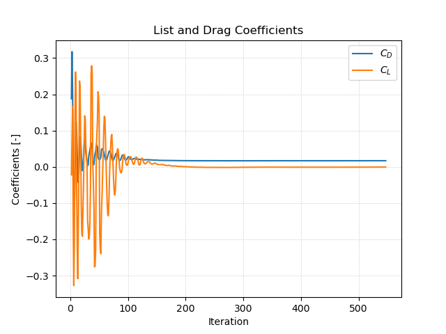

# Solving


## Starting the Solver

In order to start the simulation, we have to execute corresponding the OpenFOAM application. As defined in the `controlDict`, the solver `simpleFoam` will be used, suitable for steady-state, incompressible, laminar or turbulent flows. This application can be started by typing the appropriate command in the terminal from within the case directory:

```bash
simpleFoam
```

The progress of the job is written to the terminal window. It tells the user the current time step, the equations being solved, initial and final residuals for all fields and should look like follows:

```
Time = 218

DILUPBiCG:  Solving for Ux, Initial residual = 0.00130313, Final residual = 5.98664e-05, No Iterations 2
DILUPBiCG:  Solving for Uy, Initial residual = 0.00429584, Final residual = 0.000170743, No Iterations 2
GAMG:  Solving for p, Initial residual = 0.0238437, Final residual = 0.00151205, No Iterations 2
time step continuity errors : sum local = 2.52054e-06, global = 1.77325e-08, cumulative = 0.00111653
ExecutionTime = 25.47 s  ClockTime = 26 s
```

This output at iteration 218 tells us in summary:
- The `DILUPBiCG` solver (short for bi-Conjugate Gradient solver with an simplified Diagonal-based Incomplete LU preconditioner) is used to solve the velocity components `Ux` and `Uy` in $$x$$- and $$y$$-direction. In this time step, it takes 2 iterations to reach the specified residual criteria.
- The `GAMG` multigrid solver is used for solving the pressure poisson equation in the pressure-velocity coupling algorithm.
- The error of the conservation of mass is denoted as `continuity error`. Since its value is very small, conservation of mass is maintained.
- The execution time for the simulation up until this time step is roughly 4 seconds as indicated by the `ExecutionTime`.

After around 550 iterations, the simulation automatically stops with the following output:

```
SIMPLE solution converged in 547 iterations

End
```

The reason is that the specified residual criteria for pressure and velocity specified in `fvSolution` is met.


## Monitoring the Simulation

In order to track and monitor the simulation during its run, two function objects are added at the bottom of the `controlDict`. These are used for e.g. writing out the residuals over the course of the simulation, perform certain post-processing tasks such as calculating the flow rate over a patch, compute maximum and average values of the flow field, compute forces and force coefficients on objects, compute derived fields such as heat transfer or shear stress rates, and generate images through cutPlanes or iso-surfaces.

### Residuals

By default, the residuals are only printed to the terminal window. In order to visualize the residuals to help judge convergence, a function object has been added to the `controlDict`. This function object of type `solverInfo` saves the initial residuals of the fields `(p U)`, so pressure and velocity, during runtime. Therefore, a new folder called `postProcessing` is automatically created inside the case folder. So in this example, the residuals are stored under the following path: `postProcessing/solverInfo/0/solverInfo.dat`.

```
functions
{
    solverInfo
    {
        type            solverInfo;
        libs            (utilityFunctionObjects);
        fields          (p U);
    }
...
}
```

Once the simulation has finished and all the time directories are written out, the data written by the function objects can be analyzed. This data can typically be plotted in a diagram using Microsoft Excel, Python, Gnuplot or any other tool. In order to quickly evaluate the monitored results from the function objects, a script is added to the backward-step case directory called `create_plots.py`. Executing it will automatically create the diagrams for residuals and average inlet pressure after the run. By typing the following command in the terminal, the diagrams are created using Python and stored as png file:

```bash
python3 create_plots.py
```

This creates the following diagram of the residuals on the $$y$$-axis plotted against the iteration on the $$x$$-axis in the case folder:


The plot shows that the residuals fall throughout the simulation to below $$10^{-4}$$ for pressure and $$10^{-5}$$ for velocity. Since this is the specified residual criteria, the simulation stops automatically. We can assume this is a converged steady-state simulation.


### Force coefficients

Additionally, a second function object named `forceCoeffs` in the `controlDict` evaluates the drag and lift coefficients acting on the airfoil. Since this computation is done during runtime and stored in the `postProcessing` directory, it is just perfectly suited for checking convergence. The function object itself is configured as follows:

```
functions
{
...

    forceCoeffs
    {
        type            forceCoeffs;
        libs            (forces);

        patches         (airfoil);
        rho             rhoInf;
        log             false;
        rhoInf          1;
        liftDir         (0 1 0);
        dragDir         (1 0 0);
        CofR            (0.5 0 0);
        pitchAxis       (0 0 1);
        magUInf         1;
        lRef            1;
        Aref            1;
    }
}
```

The most important settings here are the boundaries, on which the forces are evaluated (keyword `patches`), here set to `airfoil`, and the reference values for velocity $$u_\text{inf}$$ (`magUInf`), cross-sectional area of the airfoil $$A_\text{ref}$$ (`Aref`), and reference length $$l_\text{ref}$$ required for computing the momentum coefficient. The drag coefficient is then calculated as follows:

$$
C_D = \frac{F_D}{0.5 \, A_\text{ref} \, u_\text{inf}^2}
$$
with the drag force on the specified boundaries $F_D$.

Furthermore, the axis direction for drag (keyword `dragDir` with direction along the $$x$$-axis) and lift (keyword `liftDir` with direction along the $$y$$-axis) have to match the orientation of the airfoil. Using this function object, OpenFOAM automatically computes the drag forces acting on the airfoil and normalizes the result using the drag coefficient equation.

Similar to the residual plot, a diagram for drag and lift coefficient over the number of iterations is automatically created when executing the `create_plots.py` script. The resulting plot looks as follows:



Drag and lift coefficient converge nicely and are roughly constant after 200 iterations. This supports the claim of a converged solution together with the residuals.