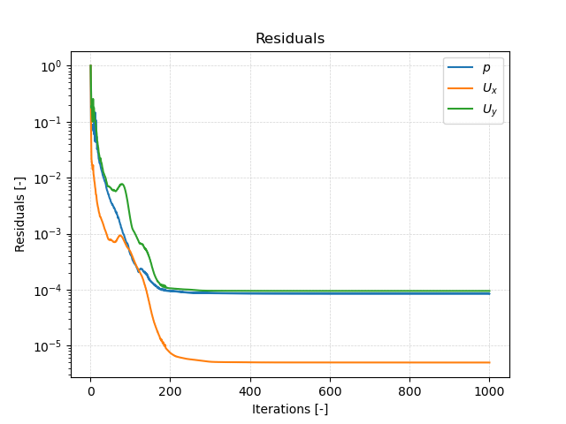
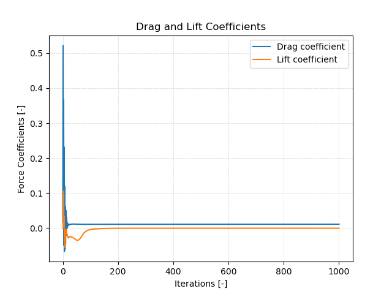

# Solving


## Starting the Solver

In order to start the simulation, we have to execute the corresponding OpenFOAM application. As defined in the `controlDict`, the solver `incompressibleFluid` will be used, suitable for steady-state and transient, incompressible, laminar or turbulent flows. To start the solution process, execute the application `foamRun` in the terminal from within the case directory:

```bash
foamRun
```

The progress of the job is written to the terminal window. It displays the current time step, the equations being solved, initial and final residuals for all fields and should look like follows:

```
Time = 601s

smoothSolver:  Solving for Ux, Initial residual = 5.96114e-06, Final residual = 2.46361e-07, No Iterations 1
smoothSolver:  Solving for Uy, Initial residual = 9.78093e-05, Final residual = 9.24054e-06, No Iterations 1
GAMG:  Solving for p, Initial residual = 9.04108e-05, Final residual = 8.58762e-06, No Iterations 2
time step continuity errors : sum local = 1.37525e-06, global = 3.85856e-07, cumulative = -0.00130387
smoothSolver:  Solving for omega, Initial residual = 3.2139e-05, Final residual = 1.63898e-07, No Iterations 1
smoothSolver:  Solving for k, Initial residual = 2.16839e-06, Final residual = 2.10727e-07, No Iterations 1
bounding k, min: -0.00245442 max: 18.7981 average: 0.295356
ExecutionTime = 23.5851 s  ClockTime = 25 s
```

This output at iteration 601 tells us in summary:
- The `smoothSolver` solver is used to solve the velocity components `Ux` and `Uy` in $$x$$- and $$y$$-direction, the turbulent kinetic energy $$k$$, and specific dissipation rate $$\omega$$. In this iteration, the smoothSolver requires 1 inner iteration to reach the specified residual criteria. The solver automatically detects and reports unphysical negative turbulent kinetic energy values and bounds them.
- The `GAMG` multigrid solver is used for solving the pressure Poisson equation in the pressure-velocity coupling algorithm.
- The error of the conservation of mass is denoted as `continuity error`. Since its value is very small, conservation of mass is maintained.
- The execution time for the simulation up until this iteration is roughly 24 seconds as indicated by the `ExecutionTime`.

The simulation does not converge within the 1000 iterations as residuals do not fall below the specified residual criteria in `fvSolution`.


## Monitoring the Simulation

In order to track and monitor the simulation during its run, two function objects are added to the simulation in the `functions` file in the `system` folder. These are used for e.g. writing out the residuals over the course of the simulation, perform certain post-processing tasks such as calculating the flow rate over a patch, compute maximum and average values of the flow field, compute forces and force coefficients on objects, compute derived fields such as heat transfer or shear stress rates, and generate images through cutPlanes or iso-surfaces. In this case, the `functions` file looks as follows:

```
#includeFunc residuals
(
    name    = residuals,
    fields  = (p U)
)

#includeFunc forceCoeffsIncompressible
(
    name    = forceCoeffs,
    patches = (airfoil),
    magUInf = 51.48,
    lRef    = 1,
    Aref    = 1,
    CofR    = (0 0 0),
    liftDir = (0 1 0),
    dragDir = (1 0 0),
    pitchAxis = (0 0 1)
)
```

By default, the residuals are only printed to the terminal window. In order to visualize the residuals to help judge convergence, a function object called `residuals` is employed, which saves the initial residuals of the fields `(p U)`, so pressure and velocity, during runtime. Therefore, a new folder called `postProcessing` is automatically created inside the case folder. So in this example, the residuals are stored under the following path: `postProcessing/residuals/0/residuals.dat`.

Additionally, a second function object named `forceCoeffs` evaluates the drag and lift coefficients acting on the airfoil. Since this computation is done during runtime and stored in the `postProcessing` directory, it is well suited for checking convergence. The most important settings here are the boundaries, on which the forces are evaluated (keyword `patches`), here set to `airfoil`, and the reference values for velocity $$U_\text{inf}$$ (`magUInf`), cross-sectional area of the airfoil $$A_\text{ref}$$ (`Aref`), and reference length $$l_\text{ref}$$ required for computing the moment coefficient. The drag coefficient is then calculated as follows:

$$
C_D = \frac{F_D}{0.5 \, A_\text{ref} \, U_\text{inf}^2}
$$
with the drag force on the specified boundaries $$F_D$$.

Furthermore, the axis direction for drag (keyword `dragDir` with direction along the $$x$$-axis) and lift (keyword `liftDir` with direction along the $$y$$-axis) have to match the orientation of the airfoil. Using this function object, OpenFOAM automatically computes the drag forces acting on the airfoil and normalizes the result using the drag coefficient equation.

Once the simulation has finished, or even during runtime, the data written by the function objects can be analyzed. This data can typically be plotted in a diagram using Microsoft Excel, Python, Gnuplot or any other tool. In order to quickly evaluate the monitored results from the function objects, a script is added to the airfoil case directory called `create_plots.py`. Executing it will automatically create the diagrams for residuals and force coefficients. By typing the following command in the terminal, the diagrams are created using Python and stored as png file:

```bash
python3 create_plots.py
```

This creates the following diagram of the residuals on the $$y$$-axis plotted against the iteration on the $$x$$-axis in the case folder:



The plot shows that the residuals fall throughout the simulation to $$10^{-4}$$ for pressure and $$y$$-velocity, and below $$10^{-5}$$ for $$x$$-velocity. This is above the specified residual criteria, so the simulation stops after 1000 iterations.

Similar to the residual plot, a diagram for drag and lift coefficient over the number of iterations is automatically created when executing the `create_plots.py` script. The resulting plot looks as follows:



Drag and lift coefficient are essentially constant throughout the simulation. This is to be expected as lift force should be zero for a symmetric airfoil at an angle of attack of 0 degrees and the drag coefficient is expected to be small due to the streamlined shape of the airfoil.