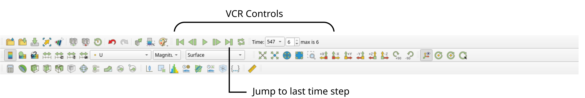
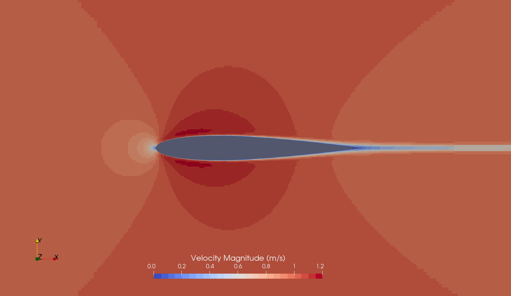

# Post-Processing

## Visualizing the Results

As soon as results are written to time directories, they can be viewed using ParaView. Start ParaView in the background with the following command:

```bash
paraFoam &
```
To prepare ParaView to display the data of interest, the data at the required time step of 1 second must be loaded. If the case was run while ParaView was open, the output data in time directories will not be automatically loaded within ParaView. To load the data the user should click **Refresh** at the top **Properties** window (scroll up the panel if necessary).

The solution at the iteration 547 can be viewed by using the **VCR Controls** at the very top of the ParaView window and click the button for **Last Frame**.



## Coloring Surfaces by Flow Property

To color the mesh by velocity magnitude (i.e. the velocity contour) of the flow, the following settings must be selected in the **Properties** panel, as descriped in the following figure:
1. Select **Surface** from the **Representation** menu,
2. Select **Coloring** by velocity magnitude U at the cell centers, and
3. Select **Rescale to Data Range**, if necessary.


We can clearly see the flow around the airfoil with the stagnation point at the leading edge (on the left), the regions of higher flow velocity at the upper and lower airfoil surface, and the small region of lower flow velocity in the wake.

