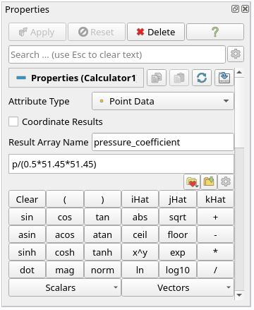
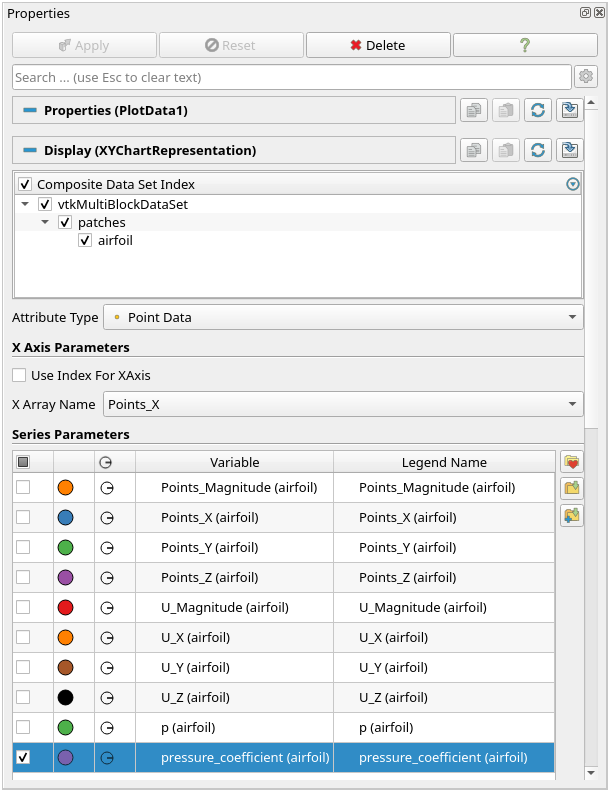
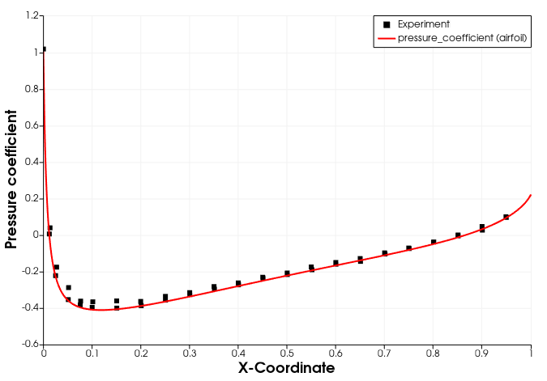

# Post-Processing

## Visualizing the Results

As soon as results are written to time directories, they can be viewed using ParaView. Start ParaView in the background with the following command:

```bash
paraFoam &
```
To prepare ParaView to display the data of interest, the data at the required iteration of 547 must be loaded. If the case was run while ParaView was open, the output data in time directories will not be automatically loaded within ParaView. To load the data the user should click **Refresh** at the top **Properties** window (scroll up the panel if necessary).

The solution at the iteration 547 can be viewed by using the **VCR Controls** at the very top of the ParaView window and click the button for **Last Frame**.


To color the mesh by velocity magnitude (i.e. the velocity contour) of the flow, the following settings must be selected in the **Properties** panel, as descriped in the following figure:
1. Select **Surface** from the **Representation** menu,
2. Select **Coloring** by velocity magnitude U at the cell centers, and
3. Select **Rescale to Data Range**, if necessary.


We can clearly see the flow around the airfoil the following key flow features: (1) Stagnation point at the airfoil leading edge, (2) fluid acceleration at the upper and lower surface (symmetric), (3) a thin, symmetric wake downstream, and (4) a symmetric pressure distribution about the chord line.


## Pressure Coefficient

In order to plot the surface pressure coefficient, we first select only the `airfoil` surface in the **Properties** panel and confirm with **Apply**. Next, we use the **Calculator** filter to compute the pressure coefficient as follows. With the `4_airfoil.OpenFOAM` module highlighted in the **Pipeline Browser**, select the **Calculator** filter from the **Common Data and Analytics** in the top menu of Paraview. The equation for pressure coefficient $$C_p$$ should be implemented as follows:

$$C_p = \frac{p}{\frac{1}{2}U_\text{inf}^2}$$

with kinematic pressure $$p$$ and reference velocity $$U_\text{inf} = 51.48\,\text{m/s}$$, which is equal to the inflow velocity. Variables in the calculator can either be found via the **Scalar** and **Vector** dropdown menu or directly adressed via their name. The resulting array name should be `pressure_coefficient`. The final calculator should look as follows:



The pressure coefficient can now be plotted along the airfoil using the **Plot Data** filter under **Filters** $$\rightarrow$$ **Data Analysis** with the following settings:
 1. Uncheck the **Use Index for XAxis** and select **Points_X** instead in the then available dropdown menu. This way the variables are plotted against the $$x$$-coordinate.
 2. Only select the variable `pressure_coefficient` for plotting.
 3. Label the $$x$$- and $$y$$-axis with $$x$$-Coordinate and Pressure Coefficient accordingly.

The resulting **Properties** panel should look as follows:



Reference data for pressure coefficient is provided in the `experimental_data` folder for different angle of attacks. The files are formatted in CSV file format and can be imported to ParaView for visualization. Click on **File** $$\rightarrow$$ **Open...** to open the files and click **Apply**. With the following steps, we can add the reference data to the diagram:
 1. Click in the diagram.
 2. Select the **Show** button for the just opened reference data in the **Pipeline Browser**.
 3. Uncheck the **Use Index for XAxis** and select **x/c** instead in the then available dropdown menu.
 4. Only select the variable `c_p` for plotting.
 5. Optionally change the **Legend Name** of the data added and adjust the line and marker style to distinguish from the numerical data plotted.

The resulting diagram could look like follows:




## Force Coefficients

We have used the force coefficients to judge convergence. However, we can also use the values for validation. However, the force coefficients plot is not suited for that since we cannot get exact values from it:


Instead, we can open the file `postProcessing/forceCoeffs/0/coefficient.dat` and get the raw coefficients and compare it with experimental or analytical values. Compared to the XFoil airfoil database, the results look like follows:


| Coefficient   | Simulation    | XFoil     |
| ------------- | --------------| --------- |
| Drag          | 0.0169        | 0.0169    |
| Lift          | -0.0007       | 0.0000    |

The results reveal a very good agreement for the NACA 0012 airfoil simulation at zero angle of attack.


## Conclusion

This concludes the third seminar on the simulation of incompressible, laminar flow over around an airfoil. A two-dimensional mesh was generated using `cartesian2DMesh` based on a geometry file. The inlet boundary condition for velocity was adjusted to match a specified Reynolds number. The simulation was then run using `simpleFoam`, and residuals and force coefficients were plotted. Finally, the flow field was visualized in ParaView.