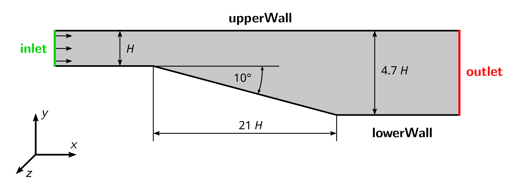

# Buice-Eaton 2D Diffuser

## Objectives

The objectives for this tutorial are as follows:

- Create a two-dimensional mesh in OpenFOAM with `cartesian2DMesh` and check its quality,
- Set boundary conditions for turbulent quantities,
- Run a steady-state, incompressible simulation with `simpleFoam`,
- Plot the velocity profile in the wake and compare it with experimental data,
- Visualize the velocity field in ParaView, and
- Repeat the simulation with the $$k$$-$$\omega$$ turbulence model,

## Overview

This tutorial will describe how to pre-process, run, and post-process a case involving a steady-state, isothermal, incompressible flow through the Buice-Eaton 2D diffuser. The geometry is shown in the following figure with an inlet on the left, the top and bottom no-slip walls, and an outlet at the right. The flow will be solved using the OpenFOAM solver `simpleFoam` the suitable for laminar and turbulent, isothermal, incompressible, steady-state flows.

The channel hight is defined to be $$H = 1\,\text{m}$$. Inlet and outlet are extended upstream and downstream, respectively, to reduce the influence of the boundary condition onto the solution. Air is considered as fluid with a kinematic viscosity of $$\nu = 15 \times 10^{-6}\,\text{m}^2\text{/s}$$. Based on a Reynolds-number of $$2 \times 10^4$$, the velocity at the inlet is:

$$ \text{Re} = \frac{U_\text{in} \, H}{\nu} \quad \rightarrow \quad U_\text{in} = \frac{\text{Re} \, \nu }{H} = 0.3 \text{m/s} $$

The case is used for validating the ability of turbulence models to predict separation and simulate flows under adverse pressure gradients correctly. It was published by Buice and Eaton in 2000:

> Buice, C. U. and Eaton, J. K., 
> "Experimental Investigation of Flow Through an Asymmetric Plane Diffuser", 
> Journal of Fluids Engineering, Vol. 122, No. June, 2000, pp. 433-435.

Furthermore, a numerical study from NASA can be found [here](https://www.grc.nasa.gov/www/wind/valid/buice/buice01/buice01.html).

## Preparation

Before starting, perform the following steps for preparation:
 1. Download the archive `5_diffuser.zip` from the Downloads folder on the [OPAL course page](https://bildungsportal.sachsen.de/opal/auth/RepositoryEntry/19816513539).
 2. Extract the archive.
 3. Open a terminal, navigate to the newly created folder, and source OpenFOAM.
