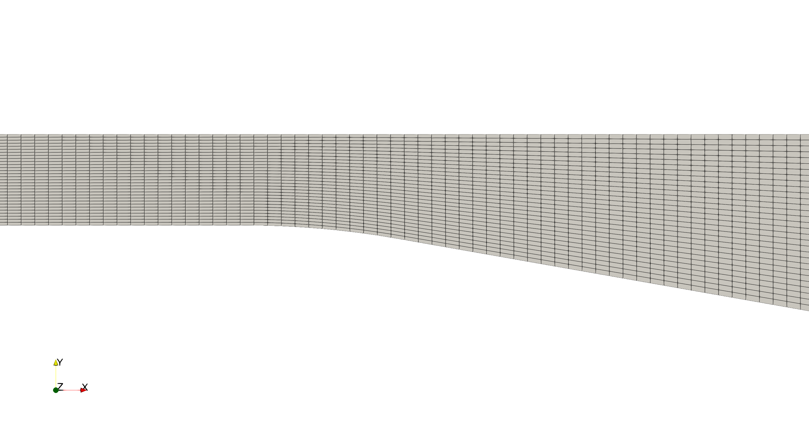

# Pre-Processing

## OpenFOAM Case Structure

A case being simulated involves data for mesh, fields, properties, control parameters, etc. In OpenFOAM this data is stored in a set of files within a case directory rather than in a single case file, as in many other CFD packages. The case directory is given a suitably descriptive name, here `diffuser`. This folder contains the following subfolders and files:

```
diffuser
├── 0
│   ├── epsilon
│   ├── k
│   ├── nut
│   ├── p
│   └── U
├── constant
│   ├── momentumTransport
│   └── physicalProperties
├── experimental_data
│   ├── friction_coefficient.csv
│   └── velocity_profile.csv
├── system
│   ├── controlDict
│   ├── functions
│   ├── fvSchemes
│   └── fvSolution
├── buice_diffuser.msh
└── create_plots.py

4 directories, 15 files
```

The *relevant* files for this tutorial case are:
- `0` - This directory stores the initial values and boundary condition for each variable solved.
- `constant` - This directory contains files that are related to the physics of the problem, including the mesh and any physical properties that are required for the solver. In this case:
    - `momentumTransport` defines which turbulence model to use for the simulation.
    - `physicalProperties` has the physical properties of the fluid, e.g. viscosity.
- `experimental_data` - This folder contains raw data from experimental measurements for validation.
- `system` - This folder contains files related to how the simulation is to be solved:
    - `controlDict` for setting control parameters including start/end time, time step size and parameters for data output.
    - `fvSchemes` for the discretization schemes used in the Finite Volume Method.
    - `fvSolution` for the solver settings used in the Finite Volume Method.


## Mesh Import

The block-structured mesh for this case has been created using an external software and is stored in the ANSYS Fluent mesh format *.msh. It can be imported into OpenFOAM using the built-in tool `fluentMeshToFoam`:

```bash
fluentMeshToFoam buice_diffuser.msh
```

The resulting mesh should look as follows:



OpenFOAM automatically detects a two-dimensional mesh and creates an additional patch `frontAndBackPlanes` of type empty. By default, this patch does not have to be explicitly specified in the boundary conditions in the `0` directory.


## Mesh Quality

After import, the mesh statistics and quality are checked with `checkMesh`, run from within the case directory:

```
checkMesh
```

The relevant part of the output is:

```
Mesh stats
    points:           62496
    faces:            121877
    cells:            30210
    boundary patches: 5

...

Checking geometry...
    Overall domain bounding box (-90 0 -1.51073) (61 4.7 1.51073)
    Max aspect ratio = 4.50225 OK.
    Mesh non-orthogonality Max: 10.0804 average: 2.10704
    Max skewness = 0.167862 OK.

Mesh OK.
```

The mesh has 30210 cells across 5 boundary patches, and all quality metrics are well within their limits: a maximum aspect ratio of 4.50, a maximum non-orthogonality of 10.08, and a maximum skewness of 0.17. The closing `Mesh OK`. confirms that no critical issues were found, so we can proceed to the simulation.


## Physical Properties

The physical properties for the fluid, such as kinematic viscosity, are stored in the `physicalProperties` file in the `constant` directory.

Since the flow is solely governed by the Reynolds-number, the actual medium is not relevant. Therefore, we set the kinematic viscosity to $$15 \times 10^{-6}\,\text{m}^2\text{/s}$$ as follows:

```
viscosityModel  constant;

nu              15e-6;
```


## Turbulence Modelling

The turbulence model is set in the `momentumTransport` file in the `constant` directory. Here, we change the entry `simulationType` from `laminar` to `RAS`, which stands for **R**eynolds-**A**veraged **S**imulation. Within the sub-dictionary `RAS`, we set the specific turbulence model. In our case, this is the standard $$k-\epsilon$$ turbulence model:

```
simulationType RAS;

RAS
{
    model           kEpsilon;
}
```


## Boundary Conditions

Since the simulation starts at time $$t=0$$, the boundary and initial field data is stored in the `0` sub-directory. This must be done for all variables solved for, such as pressure `p` and velocity `U`. Furthermore, the $$k-\epsilon$$ model solves two additional transport equations for turbulent kinetic energy $$k$$ and turbulent dissipation rate $$\epsilon$$. Therefore, initial and boundary conditions have to be provided for these variables as well. Finally, the treatment of the turbulent viscosity $$\nu_\text{t}$$ at the walls has to be specified as well.

### Pressure and Velocity

Since the Reynolds-number is set to $$\text{Re} = 2 \times 10^4$$, a pressure-velocity boundary setup will be employed, where velocity is defined at the inlet while pressure is set at the outlet.

Based on Reynolds-number, the inlet velocity can be estimated as follows:

$$ \text{Re} = \frac{U_\text{in} H}{\nu} \quad \rightarrow \quad U_\text{in} = \frac{\text{Re} \, \nu}{H} = 0.3\,\text{m/s}$$

Therefore, the velocity at the inlet is set to a uniform fixed value of $$U_\text{in} = 0.3\,\text{m/s}$$ and at the outlet to zero gradient using a `fixedValue` and `zeroGradient` boundary condition, respectively. Walls are considered no-slip and thus set to the `noSlip` boundary condition.

The kinematic pressure at the outlet is set to a uniform value of $$p_\text{out} = 0\,\text{m}^2\text{/s}^2$$ using a `fixedValue` boundary condition, while walls and the inlet are treated as zero gradient, thus set to `zeroGradient`.

### Turbulent Kinetic Energy

The turbulent kinetic energy has units of $$\text{m}^2\text{/s}^2$$ and its initial value is set to $$0.1\,\text{m}^2\text{/s}^2$$. It can be estimated at inlet boundaries based on turbulent intensity $$I_t$$ and inlet velocity $$U_\text{in}$$ with the following equation: 

$$ k = 1.5 (I_t |U_\text{in}|)^2$$

Using a turbulent intensity of $$1\,\%$$, this results in a turbulent kinetic energy of $$k = 1.35 \times 10^{-5}\,\text{m}^2\text{/s}^2$$. This value can directly be specified as a fixed value at the inlet. Alternatively, the boundary condition `turbulentIntensityKineticEnergyInlet` can be used, which estimates $$k$$ automatically using the provided equation. For this, the additional parameter `intensity` has to be specified.

At the walls, a high-Reynolds wall function approach is used, which essentially results in a zero-gradient condition for $$k$$. The corresponding boundary condition is called `kqRWallFunction`. Finally, at the outlet a zero gradient boundary condition is used.

The complete `boundaryField` entry for the turbulent kinetic energy looks as follows:

```
boundaryField
{
    inlet
    {
        type            turbulentIntensityKineticEnergyInlet;
        intensity       0.01;
        value           uniform 0.1;
    }

    outlet
    {
        type            zeroGradient;
    }

    lowerWall
    {
        type            kqRWallFunction;
    }

    upperWall
    {
        type            kqRWallFunction;
    }
}
```


### Turbulent Dissipation Rate

The turbulent dissipation rate has units of $$\text{m}^2\text{/s}^3$$ and its initial value is set to $$100\,\text{m}^2\text{/s}^3$$. Similar to the turbulent kinetic energy, it can be estimated at an inlet based on the turbulent kinetic energy $$k$$, a modelling coefficient $$C_\mu = 0.09$$, and the turbulent mixing length scale $$L_t$$:

$$ \epsilon = \frac{C_\mu^{0.75} \, k^{1.5}}{L_\text{t}} $$

With a mixing length of $$L_\text{t} = 1.5 \times 10^{-3}\,\text{m}$$, this results in a turbulent dissipation rate at the inlet of $$\epsilon = 5.43 \times 10^{-6}\,\text{m}^2\text{/s}^3$$. Alternatively, the boundary condition `turbulentMixingLengthDissipationRateInlet` can be used, which estimates $$\epsilon$$ automatically using the provided equation. For this, the additional parameter `mixingLength` has to be specified. At the walls, a high-Reynolds wall function approach is used, which computes the effect of the turbulent boundary layer on the turbulent dissipation rate. The boundary type is therefore set to `epsilonWallFunction`. Finally, at the outlet a zero gradient boundary condition is used.

The complete `boundaryField` entry for the turbulent dissipation rate looks as follows:

```
boundaryField
{
    inlet
    {
        type            turbulentMixingLengthDissipationRateInlet;
        mixingLength    0.0015;
        value           uniform 100;
    }

    outlet
    {
        type            zeroGradient;
    }

    lowerWall
    {
        type            epsilonWallFunction;
    }

    upperWall
    {
        type            epsilonWallFunction;
    }
}
```

### Turbulent Viscosity

Finally, the turbulent viscosity $$\nu_\text{t}$$ with unit $$\text{m}^2\text{/s}$$ has to be specified. Since the turbulent viscosity will be calculated based on the turbulent quantities $$k$$ and $$\epsilon$$ as part of the turbulence model, the initial field values and the boundary conditions at anything other than walls are not relevant. Therefore, the internal field is simply set to $$0\,\text{m}^2\text{/s}$$ and the boundary conditions for inlet and outlet are set to `calculated`.

{: .note }
> The `calculated` boundary type in OpenFOAM is always used when the corresponding variable is calculated by the CFD model itself and does not have to be specified. In case of turbulent viscosity, $$\nu_\text{t}$$ will be calculated by the turbulence model and thus does not have to be specified.

The specification of the boundary condition at walls for $$\nu_\text{t}$$ is critical, though, as this defines the wall treatment approach. In this case, a high-Reynolds approach wall function of type `nutUWallFunction` is used, which is designed to work within the log-law region with $$y^+ > 30$$.

The complete `boundaryField` entry for the turbulent viscosity looks as follows:

```
boundaryField
{
    inlet
    {
        type            calculated;
        value           uniform 0;
    }

    outlet
    {
        type            calculated;
        value           uniform 0;
    }

    lowerWall
    {
        type            nutUWallFunction;
        value           uniform 0;
    }

    upperWall
    {
        type            nutUWallFunction;
        value           uniform 0;
    }
}
```


## Simulation Control

Time control, solver selection and output settings are read from the `controlDict` in the `system` directory:

```
solver          incompressibleFluid;

startFrom       startTime;

startTime       0;

stopAt          endTime;

endTime         1500;

deltaT          1;

writeControl    timeStep;

writeInterval   250;
```

As in the previous tutorials, this is a steady-state run with the `incompressibleFluid` solver, so `deltaT` acts purely as an iteration counter. The case starts at time 0 (`startTime`), advances for 1500 iterations (`endTime`), and writes a result every 250 (`writeInterval`).


## Discretization

The finite-volume discretisation schemes are set in the `fvSchemes` dictionary in the `system` directory. Since this is a steady-state run, the temporal term is switched off (`steadyState`), gradients use a cell-limited central scheme to suppress overshoots, and the convective terms for momentum and turbulent scalars use a bounded second-order upwind scheme:

```
ddtSchemes
{
    default             steadyState;
}

gradSchemes
{
    default             cellLimited Gauss linear 1.0;
}

divSchemes
{
    div(phi,U)          bounded Gauss linearUpwindV grad(U);

    div(phi,k)          bounded Gauss linearUpwind grad(k);
    div(phi,epsilon)    bounded Gauss linearUpwind grad(epsilon);
}
```

{: .note }
> The keyword `bounded` in front of the discretization scheme for the convective terms is only required in steady-state simulations. It helps to maintain boundedness of the solution variable and promotes a better convergence.


## Linear Solver Settings

The linear equation solvers, tolerances and coupling controls are set in the `fvSolution` dictionary in the `system` directory.

The pressure equation uses a **Geometric agglomerated Algebraic MultiGrid** (short: GAMG) solver with a Gauss-Seidel smoother. The momentum and turbulence equations have asymmetric matrices and are solved with a **Preconditioned bi-Conjugate Gradient** solver with a simplified **Diagonal-based Incomplete LU** preconditioner (PBiCG solver with DILU preconditioner). All solvers use an absolute tolerance of $$10^{-6}$$ and a relative tolerance of $$0.1$$:

```
solvers
{
    p
    {
        solver          GAMG;
        smoother        GaussSeidel;
        tolerance       1e-06;
        relTol          0.1;
    }

    "(U|k|epsilon)"
    {
        solver          PBiCG;
        preconditioner  DILU;
        tolerance       1e-06;
        relTol          0.1;
        minIter         1;
    }
}
```


### Pressure-velocity coupling

As a pressure-based steady-state case, the SIMPLE pressure-velocity coupling is used in its consistent (SIMPLEC) variant via `consistent yes`. The run stops once the residuals fall below $$10^{-5}$$ for pressure and velocity (`residualControl`). Because SIMPLEC is used, pressure needs no relaxation; velocity and the turbulent quantities are relaxed by a factor of 0.8 (equation under-relaxation):

```
SIMPLE
{
    consistent          yes;

    residualControl
    {
        p               1e-5;
        U               1e-5;
    }
}

relaxationFactors
{
    equations
    {
        U               0.8;
        k               0.8;
        epsilon         0.8;
    }
}
```