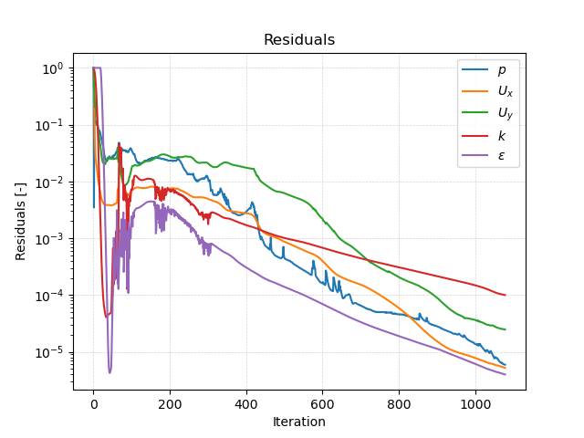

# Solving


## Starting the Solver

In order to start the simulation, we have to execute corresponding the OpenFOAM application. As defined in the `controlDict`, the solver `simpleFoam` will be used, suitable for steady-state, incompressible, laminar or turbulent flows. This application can be started by typing the appropriate command in the terminal from within the case directory:

```bash
simpleFoam
```

The progress of the job is written to the terminal window. It tells the user the current iteration, the equations being solved, initial and final residuals for all fields and should look like follows:

```
Time = 1023

DILUPBiCG:  Solving for Ux, Initial residual = 6.82879e-06, Final residual = 2.36201e-08, No Iterations 3
DILUPBiCG:  Solving for Uy, Initial residual = 3.19232e-05, Final residual = 2.11249e-06, No Iterations 2
GAMG:  Solving for p, Initial residual = 1.09381e-05, Final residual = 8.00707e-07, No Iterations 2
GAMG:  Solving for p, Initial residual = 8.18999e-07, Final residual = 8.18999e-07, No Iterations 0
time step continuity errors : sum local = 1.09993e-08, global = -3.43088e-10, cumulative = 6.57178e-05
DILUPBiCG:  Solving for epsilon, Initial residual = 5.30319e-06, Final residual = 2.07877e-07, No Iterations 1
DILUPBiCG:  Solving for k, Initial residual = 0.000133256, Final residual = 7.49579e-06, No Iterations 1
ExecutionTime = 56.32 s  ClockTime = 57 s
```

This output at iteration 1023 tells us in summary:
- The `DILUPBiCG` solver (short for bi-Conjugate Gradient solver with a simplified Diagonal-based Incomplete LU preconditioner) is used to solve the velocity components `Ux` and `Uy` in $$x$$- and $$y$$-direction. In this iteration, it takes 3 and 2 iterations to reach the specified residual criteria.
- The `GAMG` multigrid solver is used for solving the pressure correction equation *twice* in the pressure-velocity coupling algorithm.
- The error of the conservation of mass is denoted as `continuity error`. Since its value is very small, conservation of mass is maintained.
- The `DILUPBiCG` solver (short for bi-Conjugate Gradient solver with a simplified Diagonal-based Incomplete LU preconditioner) is finally used to solve the turbulence model transport equations for turbulent kinetic energy and dissipation rate.
- The execution time for the simulation up until this iteration is roughly 57 seconds as indicated by the `ExecutionTime`.

After 1078 iterations, the simulation automatically stops as the residuals fall below the specified residual criteria in `fvSolution`.


## Monitoring the Simulation

In order to monitor the simulation during its run and for postprocessing, two function objects are added at the bottom of the `controlDict`. These are used for e.g. writing out the residuals over the course of the simulation, perform certain post-processing tasks such as calculating the flow rate over a patch, compute maximum and average values of the flow field, compute forces and force coefficients on objects, compute derived fields such as heat transfer or shear stress rates, and generate images through cutPlanes or iso-surfaces.

### Residuals

By default, the residuals are only printed to the terminal window. In order to visualize the residuals to help judge convergence, a function object has been added to the `controlDict`. This function object of type `solverInfo` saves the initial residuals of the fields `(p U k epsilon)`, so pressure, velocity, turbulent kinetic energy, and turbulent dissipation rate, during runtime. Therefore, a new folder called `postProcessing` is automatically created inside the case folder. So in this example, the residuals are stored under the following path: `postProcessing/solverInfo/0/solverInfo.dat`.

```
functions
{
    solverInfo
    {
        type            solverInfo;
        libs            (utilityFunctionObjects);
        fields          (p U k epsilon);
    }

...
}
```

Once the simulation has finished and all the time directories are written out, the data written by the function objects can be analyzed. This data can typically be plotted in a diagram using Microsoft Excel, Python, Gnuplot or any other tool. In order to quickly evaluate the monitored results from the function objects, a script is added to the airfoil case directory called `create_plots.py`. Executing it will automatically create the diagrams for residuals and average inlet pressure after the run. By typing the following command in the terminal, the diagrams are created using Python and stored as png file:

```bash
python3 create_plots.py
```

This creates the following diagram of the residuals on the $$y$$-axis plotted against the iteration on the $$x$$-axis in the case folder:



The plot shows that the residuals fall throughout the simulation to below $$10^{-4}$$ for all monitored variables. Since this is the specified residual criteria, the simulation stops automatically. We can assume this is a converged steady-state simulation.


### Dimensionless Wall Distance

Additionally, a second function object named `yPlus` in the `controlDict` evaluates the dimensionless wall distance $$y^+$$ in order to assess the mesh resolution within the turbulent boundary layer. It writes out the minimum, maximum, and average $$y^+$$ value for wall patches of type `wall` in the `postProcessing` directory and also create a new field in the results folders called `yPlus` with the dimensionless wall distance for every boundary face for visualization. The computation is performed whenever a new results folder is written out (e.g., every 250 iterations as defined in `controlDict`) as the entry `writeControl` is set to `writeTime`.

The function object itself is configured as follows:

```
functions
{
...
    
    yPlus
    {
        type                yPlus;
        libs                (fieldFunctionObjects);

        writeControl        writeTime;
    }
}
```

When analysing the the results it is revealed that the average dimensionless wall distance for the final time step is in the range of 20 with a maximum value of 51. This indicates that the mesh is slightly to fine for using standard wall functions, which require a dimensionless wall distance of at least 30. Therefore, the first cell is located in the buffer region of the turbulent boundary layer leading to an incresed numerical error. Nevertheless, for now this mesh is sufficient for this seminar.