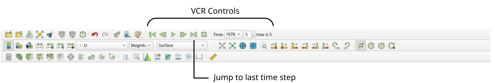
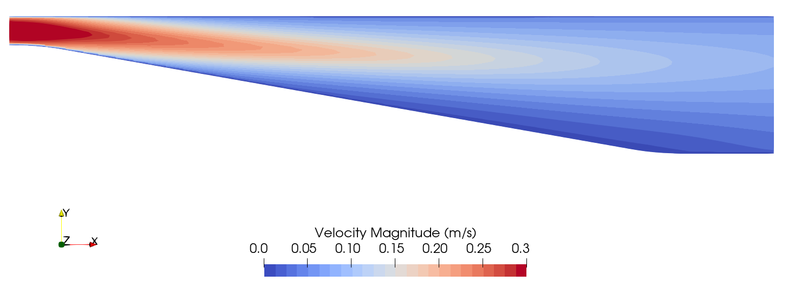
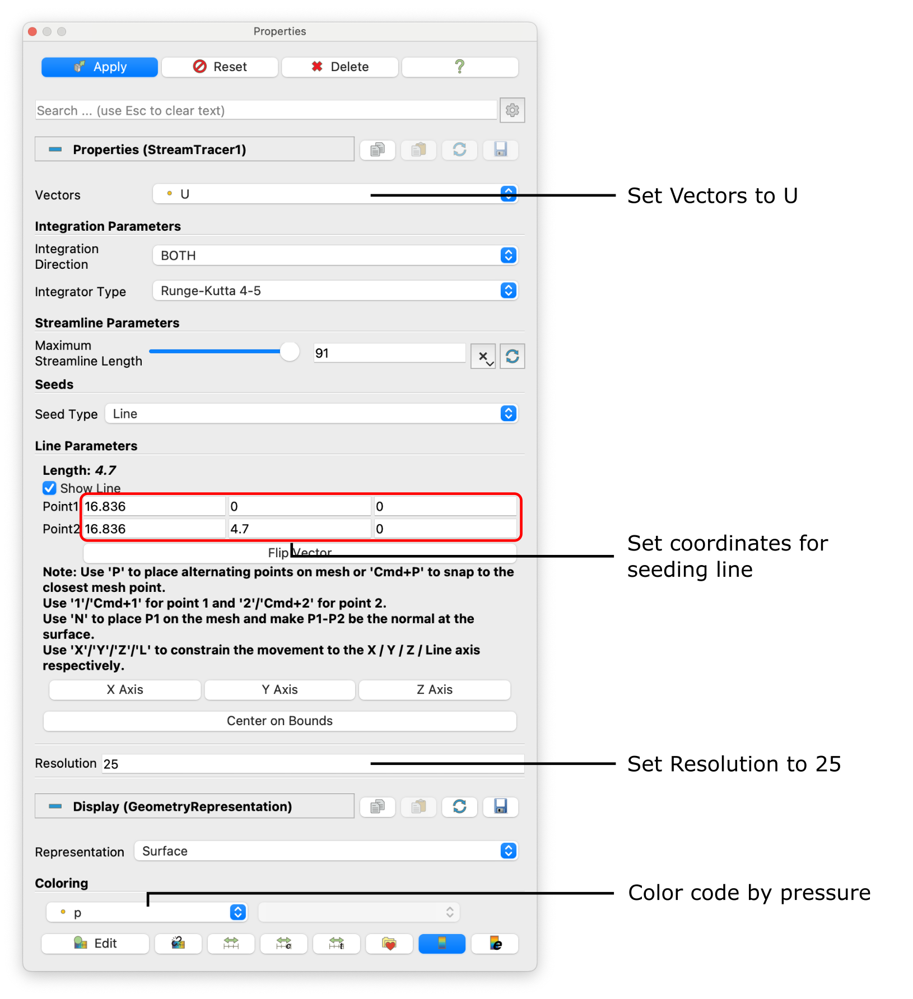
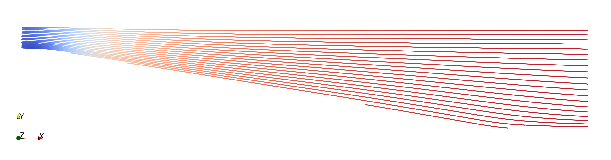
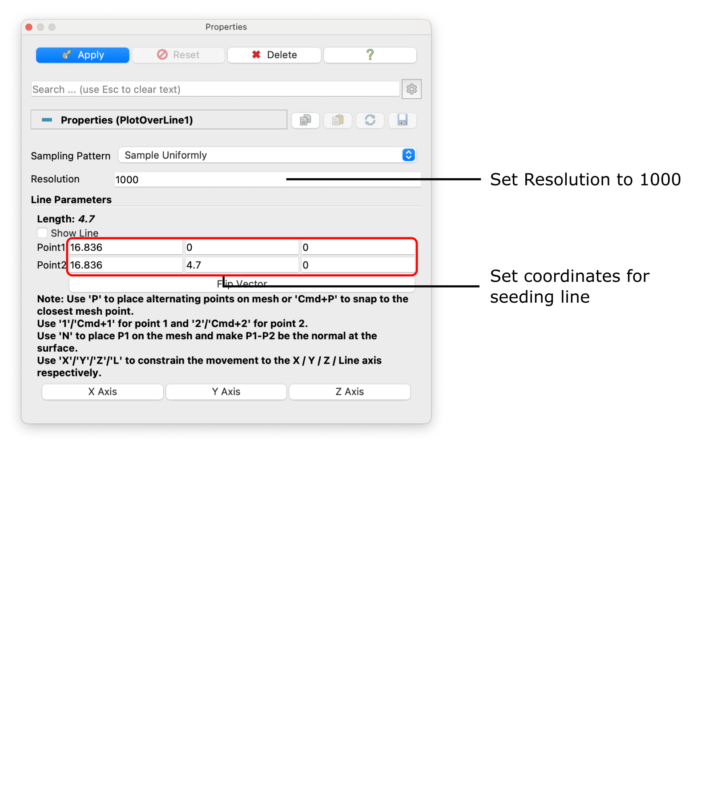
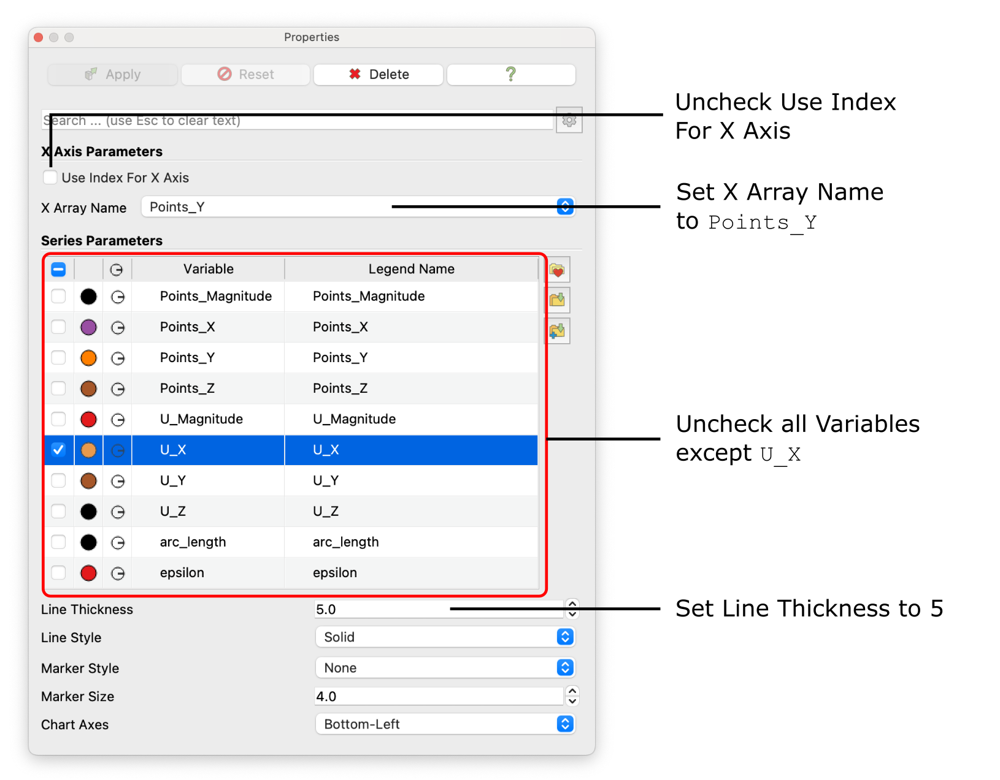
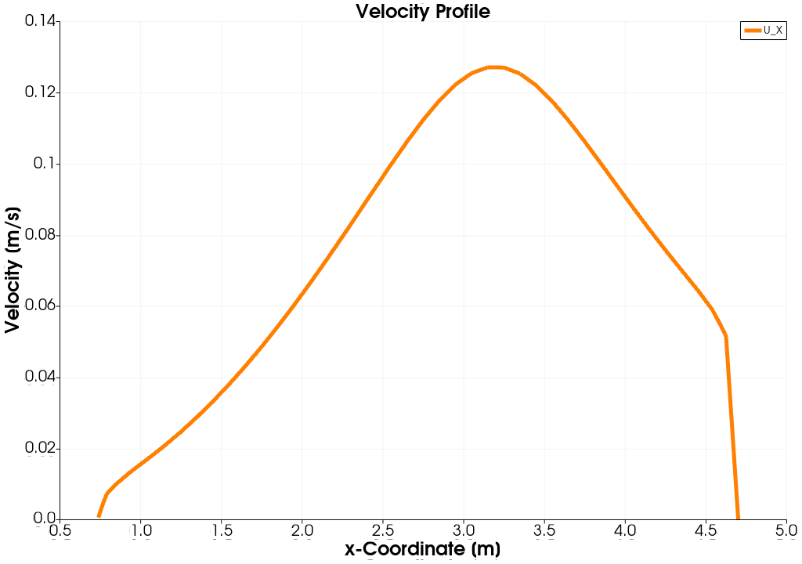

# Post-Processing


## Visualizing the Velocity Contour

As soon as results are written to time directories, they can be viewed using ParaView. Start ParaView in the background with the following command:

```bash
paraFoam &
```
To prepare ParaView to display the data of interest, the data at the required iteration of 547 must be loaded. If the case was run while ParaView was open, the output data in time directories will not be automatically loaded within ParaView. To load the data the user should click **Refresh** at the top **Properties** window (scroll up the panel if necessary).

The solution at the iteration 1078 can be viewed by using the **VCR Controls** at the very top of the ParaView window and click the button for **Last Frame**.



To color the mesh by velocity magnitude (i.e. the velocity contour) of the flow, the following settings must be selected in the **Properties** panel, as descriped in the following figure:
1. Select **Surface** from the **Representation** menu,
2. Select **Coloring** by velocity magnitude U at the cell centers, and
3. Select **Rescale to Data Range**, if necessary.


When inspecting the velocity field through the diffuser, the reduction in flow velocity due to the incresed cross-sectional area is apparent. Furthermore, no recirculation is noticable at the lower end of the diffuser, something which would be expected due to the large opening angle of the diffuser.ine.




## Visualizing Flow Streamlines

Streamlines of the flow field are a great way of visualizing any possible recirculation. With the `para.foam` module highlighted in the **Pipeline Browser**, select the **Stream Tracer** filter from the **Common Data and Analytics** menu. The **Properties** window panel should appear as shown in the following figure:



In the resulting **Properties** panel, make sure the stream lines are plotted according to the velocity vector field `U`. Streamlines are seeded along a straight line with the starting point $$(16.836 \,\, 0\,\, 0)$$ and end point $$(16.836 \,\, 4.7\,\, 0)$$ with a **Seeding Resolution** of 25 streamlines along this straight line. Finally, color code the streamlines by pressure `p`. Click **Apply** to show the streamlines through the diffuser as follows:



The adverse pressure gradient with an increase in pressure along the streamlines is clearly visible and there is no flow separation and recirculation at the lower wall. However, adverse pressure gradients and flow separation are the weakpoints of the standard $$k-\epsilon$$ turbulence model. 


## Plotting the Velocity Profile

For a better comparison with experimental data, a vertical velocity profile of the $$x$$-velocity component is recommended. For this, hide the `StreamTracer` filter in the **Pipeline Browser** by clicking the eye icon next to it and only show the original case named `para.foam` (the name originates from the name of the file, which was used to open the OpenFOAM case). Now, select the **Plot over Line** filter from the **Domain** $$\rightarrow$$ **Data Analysis**. The **Properties** window panel should appear as shown in the following figure:



Similar to the streamlines, the coordinates of the start and end point of the sampling line should be $$(16.836 \,\, 0\,\, 0)$$ and $$(16.836 \,\, 4.7\,\, 0)$$, respectively, with a spatial **Resolution** of 1000 points along this line. Clicking **Apply** will open a separate window plotting all variables solved over the length of the line. This resulting diagram is very cluttered. Therefore, in the **Properties** window deselect all variables except the $$x$$-velocity component labelled `U_X`. In order to plot over the $$y$$-coordiantes of the line, uncheck **Use Index for X Axis** and set **X Array Name** to `Points_Y`. Finally, thile the $$x$$-velocity component is selected in the **Properties** window, change the **Line Thickness** to 5 for better readability. Optionally, line color can be changed and chart title as well as axis can be specified. The **Properties** window should now look like follows:



The resulting diagram should look like follows:

