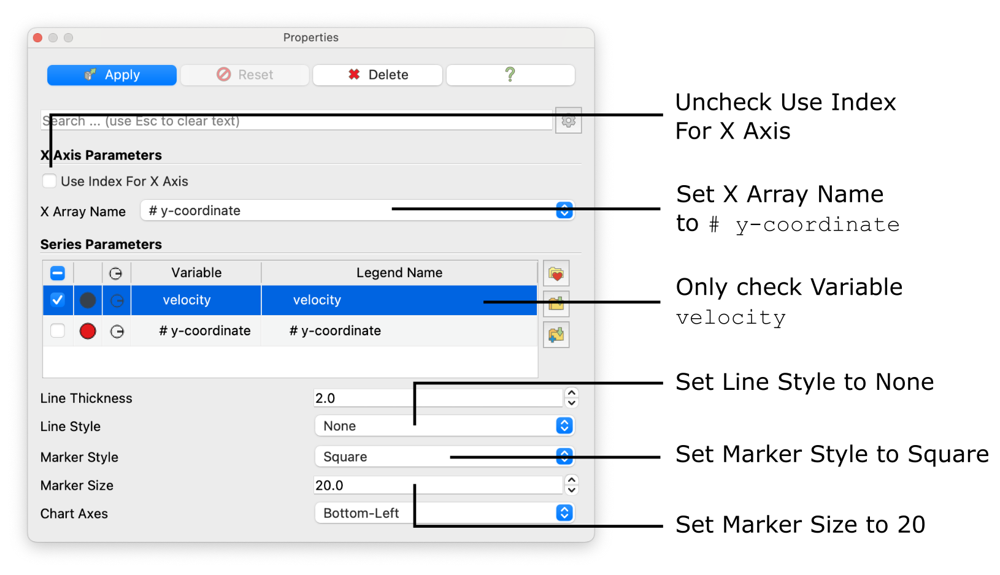
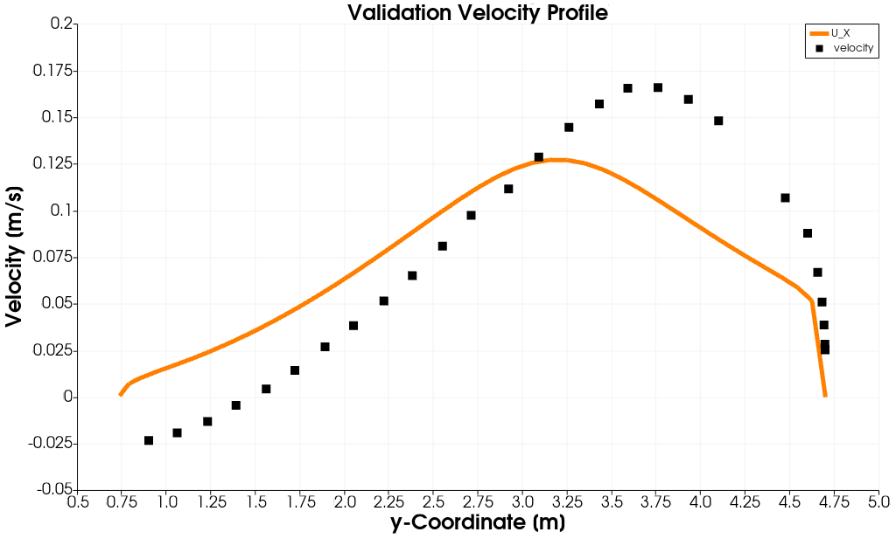
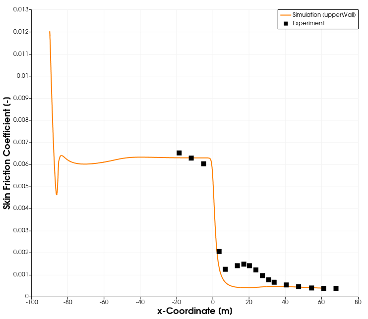
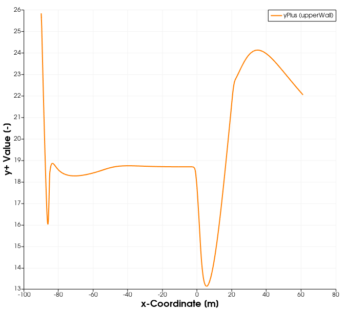

# Post-Processing


## Visualizing the Velocity Contour

As soon as results are written to time directories, they can be viewed using ParaView. Start ParaView in the background with the following command:

```bash
paraFoam &
```

Colour the surface by velocity magnitude `U` (Representation $$\rightarrow$$ **Surface**, Coloring $$\rightarrow$$ **U**, **Rescale to Data Range**). When inspecting the velocity field through the diffuser, the reduction in flow velocity due to the increased cross-sectional area is apparent. Notably, no recirculation appears at the lower wall even though the large opening angle of the diffuser would lead one to expect flow separation there.


## Visualizing Flow Streamlines

Streamlines are a convenient way to reveal any recirculation. With the `diffuser.OpenFOAM` module highlighted in the **Pipeline Browser**, select the **Stream Tracer** filter from the **Common Data and Analytics** menu:


In the **Properties** panel, trace the streamlines along the velocity field `U`, seeded on a straight line from $$(16.836 \,\, 0\,\, 0)$$ to $$(16.836 \,\, 4.7\,\, 0)$$ with a **Seeding Resolution** of 25, and colour them by pressure `p`. Click **Apply** to show the streamlines through the diffuser as follows:


The adverse pressure gradient (an increase in pressure along the streamlines) is clearly visible, and there is no flow separation or recirculation at the lower wall. Resolving adverse pressure gradients and separation, however, is precisely the known weakness of the standard $$k-\epsilon$$ turbulence model.


## Plotting the Velocity Profile

For a quantitative comparison with experiment, plot the $$x$$-velocity along a vertical line through the diffuser. Hide the **Stream Tracer**, select the original `diffuser.OpenFOAM` module, and apply the **Plot Over Line filter** (**Filters** $$\rightarrow$$ **Data Analysis**). Use the same line as the streamline seed from $$(16.836 \,\, 0\,\, 0)$$ to $$(16.836 \,\, 4.7\,\, 0)$$ with a **Resolution** of 1000 points. In the plot, deselect every series except the $$x$$-velocity `U_X`, uncheck **Use Index for X Axis**, and set **X Array Name** to `Points_Y` so velocity is plotted over the $$y$$-coordinate. Increasing the **Line Thickness** (e.g. to 5) improves readability; line colour, title and axis labels can be adjusted as desired.


The resulting diagram should look as follows:


Experimental measurements for this case are provided in `velocity_profile.csv` in the `experimental_data` directory, containing three columns: row ID, velocity in m/s, and $$y$$-coordinate. Load it via **File** $$\rightarrow$$ **Open**, confirm the **CSV Reader**, and click **Apply**.

In order to add the experimental data to the existing plot, show the `velocity_profile.csv` entry in the diagram, set its **X Array Name** to the $$y$$-coordinate column, select only `velocity`, and display it as discrete points (**Line Style** $$\rightarrow$$ `None`, **Marker Style** $$\rightarrow$$ `Square`, **Marker Size** $$\rightarrow$$ 20).



The resulting diagram should look as follows:



These results confirm the large discrepancy between the experimentally measured velocity profile and the numerically simulated one. First, no flow separation and thus no recirculation is predicted by the numerical model. Second, the maximum flow velocity in $$x$$-direction is significantly underpredicted. This confirms the previous statement that the standard $$k-\epsilon$$ turbulence model is a poor choice for this flow problem.


## Skin Friction Coefficient

The `wallShearStress` function object lets us evaluate the skin friction coefficient along the upper wall and validate it against experimental data. The skin friction coefficient is defined as

$$
C_f = \frac{-\tau_{w,x}}{0.5 U_\text{in}^2}
$$

where $$\tau_{w,x}$$ is the $$x$$-component of the wall shear stress and $$U_\text{in} = 0.3\,\text{m/s}$$ the inlet reference velocity. Since `incompressibleFluid` works with kinematic variables, the `wallShearStress` field is already divided by density (units $$\text{m}^2\text{/s}^2$$).

First, restrict the view to the upper wall: in the **Properties panel** of the `diffuser.OpenFOAM` reader, deselect every mesh region except the `upperWall` patch and confirm with **Apply**. Make sure the `wallShearStress` field is ticked in the reader's **Fields** list for further usage. Next, compute $$C_f$$ with the **Calculator** filter (from **Common Data and Analytics**). Enter the expression

```
-wallShearStress_X/(0.5*0.3^2)
```

and set the result array name to `Simulation`.

The leading minus sign is necessary as it is OpenFOAM's convention that wall shear stress is reported as the traction acting on the fluid, which is negative for attached flow in the streamwise direction. This way it becomes positive just like the conventional skin friction coefficient $$C_f$$: positive where the flow is attached and negative only in regions of reversed flow.

Finally, plot it with the **Plot Data** filter (**Filters** $$\rightarrow$$ **Data Analysis**). Since the upper wall runs in the streamwise direction, uncheck **Use Index for X Axis**, set **X Array Name** to `Points_X`, and select only `Simulation` as the series.

The experimental skin friction data is provided in `friction_coefficient.csv` in the `experimental_data` directory. Load it via **File** $$\rightarrow$$ **Open**, confirm the **CSV Reader**, and click **Apply**. Overlaying it follows the same procedure as the velocity profile: show the `friction_coefficient.csv` entry in the diagram, set its **X Array Name** to the $$x$$-coordinate column, select only the friction-coefficient series, and display it as discrete points (**Line Style** $$\rightarrow$$ `None`, **Marker Style** $$\rightarrow$$ `Square`, **Marker Size** $$\rightarrow$$ 20).



As with the velocity profile, the simulated skin friction coefficient deviates from the experimental measurements. The discrepancy is a direct consequence of the standard $$k-\epsilon$$ model failing to capture the separation on the opposite wall, which governs the pressure recovery and therefore the wall friction throughout the diffuser.


## Dimensionless Wall Distance

The **yPlus** function object stored a `yPlus` field on the wall patches at every write time, which lets us confirm that the near-wall mesh resolution is compatible with the wall-function approach. Recall that the high-Reynolds wall functions used in this case (`nutUWallFunction`, `kqRWallFunction`, `epsilonWallFunction`) assume the first cell centre lies in the logarithmic region, i.e. roughly $$30 < y^+ < 300$$. A quick check is the minimum, maximum and average $$y^+$$ written by the function object to the `postProcessing/yPlus` directory; the field itself shows how $$y^+$$ varies along the wall.

To plot it, select the `diffuser.OpenFOAM` reader in the **Pipeline Browser** (with the wall patches `lowerWall` and `upperWall` selected) and apply the **Plot Data** filter (**Filters** $$\rightarrow$$ **Data Analysis**). Select only the `yPlus` series, uncheck **Use Index for X Axis**, and set **X Array Name** to `Points_X` so $$y^+$$ is plotted along the streamwise direction:



The plot shows that $$y^+$$ lies in the buffer layer throughout, between roughly 13 and 26, so the first cell centres sit below the $$y^+ > 30$$ range the high-Reynolds wall functions assume. Two solutions are possible: coarsen the near-wall cells so the first centre moves up into the logarithmic region, or switch to a wall function that is valid across the buffer layer, such as one based on Spalding's law. The latter is preferable here, since coarsening the wall cells would further degrade the resolution of the separation region that this case already struggles to predict.


## Conclusion

This concludes the fifth seminar on the simulation of an incompressible, turbulent flow through a diffuser. A two-dimensional mesh was imported using `fluentMeshToFoam` and its quality was verified with `checkMesh`. The boundary conditions were adjusted for the standard $$k-\epsilon$$ turbulence model, and the simulation was run with the solver `incompressibleFluid` while monitoring the residuals. The flow field was then visualized in ParaView: the velocity profile and the skin friction coefficient along the upper wall were compared with experimental measurements, and the dimensionless wall distance $$y^+$$ was assessed against the validity range of the wall functions. Two shortcomings emerged. First, the standard $$k-\epsilon$$ model fails to capture the separation expected under the adverse pressure gradient, underpredicting both the peak velocity and the wall friction. Second, the $$y^+$$ analysis showed the first cell centres lying in the buffer layer ($$13 < y^+ < 26$$) rather than the logarithmic region the high-Reynolds wall functions assume. Improving the prediction therefore calls for both a turbulence model better suited to adverse-pressure-gradient flows and a near-wall treatment consistent with the mesh resolution.