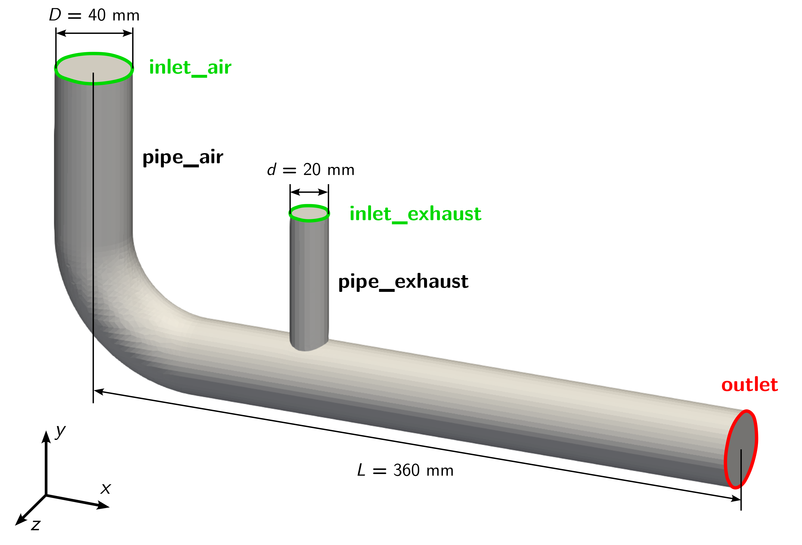

# Exhaust Gas Recirculation

## Motivation

Exhaust Gas Recirculation (EGR) is a nitrogen oxide (NOx) reduction technique used in internal combustion engines. The system works by recirculating a portion of the engine's exhaust gas back into the combustion chamber, where it mixes with the incoming fresh air-fuel mixture. This seemingly counterintuitive approach of mixing "waste" exhaust gases with fresh intake air serves a crucial purpose in modern automotive engineering.

## Objectives

The objectives for this tutorial are as follows:

- Create a three-dimensional mesh in OpenFOAM with `snappyHexMesh` and check its quality,
- Set boundary conditions and material properties,
- Run a transient, compressible simulation with the solver `fluid` in parallel using the $$k-\omega$$ SST turbulence model,
- Plot the maximum temperature in the computational domain,
- Analyze the average outlet temperature as well as temperature at three probe locations,
- Visualize the velocity and temperature field in ParaView, and
- Vary flow rate of exhaust gas and analyse impact onto flow field.

## Overview

This tutorial will describe how to pre-process, run, and post-process a case involving a transient, compressible flow of a exhaust gas recirculation. The geometry is shown in the following figure with an inlet for cold air on the left, inlet for the hot exhaust gas in the center, no-slip adiabatic walls for the air and exhaust side, and an outlet at the right. The flow will be solved using the OpenFOAM solver `fluid` the suitable for laminar and turbulent, compressible, steady-state and transient flows.

The boundary conditions for the give problem are as follows:
- Air inlet: Volumetric flow rate of $$Q = 0.005\,\text{m}^3\text{/s}$$ at a temperature of $$300\,\text{K}$$
- Exhaust gas inlet: Volumetric flow rate of $$Q = 0.0025\,\text{m}^3\text{/s}$$ at a temperature of $$900\,\text{K}$$
- Outlet: Pressure of $$10^5\,\text{Pa}$$
- Pipe walls: Adiabatic and no-slip

Due to the high temperature differences between air and exhaust gas, the flow is assumbed to be compressible.

## Preparation

Before starting, perform the following steps for preparation:
 1. Download the archive file [6_exhaust_gas_recirculation.zip]() containing the case folders.
 2. Extract the archive and move its content to the `OpenFOAM_Projects` folder, which has been created in the first tutorial. 
 3. Open a terminal, navigate to the newly created folder, and source OpenFOAM using the `of13` alias.

{: .note }
> This case is provided as a generic template: the configuration files are not yet set up for the diffuser problem. Throughout this chapter you will adapt the case to it exactly as you would when starting from an existing case in practice. Each value is derived as it comes up; apply it to the corresponding file as you go. If your setup is correct, your results should match the reference solutions shown.