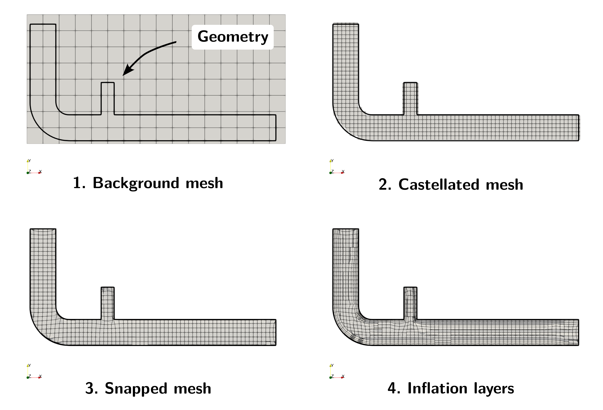

# Pre-Processing

## OpenFOAM Case Structure

A case being simulated involves data for mesh, fields, properties, control parameters, etc. In OpenFOAM this data is stored in a set of files within a case directory rather than in a single case file, as in many other CFD packages. The case directory is given a suitably descriptive name, here `exhaust_gas_recirculation`. This folder contains the following subfolders and files:

```
├── 0
│   ├── alphat
│   ├── k
│   ├── nut
│   ├── omega
│   ├── p
│   ├── T
│   └── U
├── constant
│   ├── geometry
│   │   └── surface.obj
│   ├── momentumTransport
│   └── physicalProperties
├── system
│   ├── blockMeshDict
│   ├── controlDict
│   ├── decomposeParDict
│   ├── functions
│   ├── fvSchemes
│   ├── fvSolution
│   ├── meshQualityDict
│   └── snappyHexMeshDict
└── create_plots.py

4 directories, 19 files
```

The *relevant* files for this tutorial case are:
- `0` - This directory stores the initial values and boundary condition for each variable solved.
- `constant` - This directory contains files that are related to the physics of the problem, including the mesh and any physical properties that are required for the solver. In this case:
    - `geometry` contains the surface geometry needed for the automated mesh generation
    - `momentumTransport` defines which turbulence model to use for the simulation.
    - `physicalProperties` defines the thermophysical properties of the fluid.
- `system` - This folder contains files related to how the simulation is to be solved:
    - `controlDict` for setting control parameters including start/end time, time step size and parameters for data output.
    - `decomposeParDict` for specifying the number of processors in a parallel run.
    - `functions` contains function objects for runtime post-processing.
    - `fvSchemes` for the discretization schemes used in the Finite Volume Method.
    - `fvSolution` for the solver settings used in the Finite Volume Method.
    - `meshQualityDict` sets the mesh quality criteria for the meshing process.
    - `snappyHexMeshDict` configures the automated meshing tool `snappyHexMesh`.


## Mesh Generation

The hexahedral-dominant, three-dimensional mesh is created automatically with the meshing utility `snappyHexMesh` from a user provided surface geometry named `surface.obj`, which is located in the `geometry` sub-folder under `constant`.

Generating a mesh with `snappyHexMesh` is a 4-step process:
 1. A background mesh created with `blockMeshDict` must be generated that fills the entire region of interest.
 2. SnappyHexMesh refines the background mesh towards user-specified surfaces or regions by splitting the hexahedral cells and removing cells which are not within the region of interest.
 3. Cell vertex points are moved onto the surface geometry to remove the castellated surface of the mesh.
 4. Inflation layers are added at appropriate surfaces.

The complete process for this case is visualized in the following figure:



The overall cell size solely depends on the cell size of the background mesh and the number of refinement steps during generation of the castellated mesh.


### Background Mesh

At first, a background mesh must be generated using `blockMesh`. The `blockMeshDict` in the `system` folder creates a structured mesh, which completely spans the provided geometry of the exhaust gas recirculation domain with $$24 \times 12 \times 3$$ cells in $$x$$-, $$y$$-, and $$z$$-direction, respectively. This results in a uniform cell size of $$\Delta = 16.67\,\text{mm}$$. This background mesh can be generated as follows:

```bash
blockMesh
```


### Automated Hex-dominated Mesh

The automated mesh generation can be started using the following command:

```bash
snappyHexMesh
```

The background mesh is refined towards the wall patches `pipe_air` and `pipe_exhaust` by splitting the cells of the background mesh 3 times resulting in a cell size of $$\Delta \approx 2.1\,\text{mm}$$. At the other patches, the background mesh is refined only once for a cell size of $$\Delta \approx 8.33\,\text{mm}$$. Finally, three layers of prism cells are added at the `pipe_air` and `pipe_exhaust` wall patches with a growth ratio of 1.2.

The resulting mesh looks as follows:


## Mesh Quality

After mesh generation, the mesh statistics and quality are checked with `checkMesh`, run from within the case directory:

```
checkMesh
```

The relevant part of the output is:

```
Mesh stats
    points:           88119
    faces:            244816
    cells:            78617
    boundary patches: 5
...

Checking geometry...
    Overall domain bounding box (-20 -20 -20.0002) (360 160 20.0002)
    Max aspect ratio = 5.87141 OK.
    Mesh non-orthogonality Max: 63.1022 average: 8.46125
    Max skewness = 1.57355 OK.

Mesh OK.
```

The mesh has 78617 cells across 5 boundary patches, and all quality metrics are well within their limits: a maximum aspect ratio of 5.87, a maximum non-orthogonality of 63.10, and a maximum skewness of 1.57. The closing `Mesh OK`. confirms that no critical issues were found, so we can proceed to the simulation.


## Mesh Scaling

The overall bounding box of the computational mesh does not match the given dimensions of the geometry, since the latter was created in millimeters. Therefore, the mesh has to be scaled down in all three directions with a scaling factor of $$0.001$$. In order to do so, the mesh manipulation utility `transformPoints` can be used as follows:

```bash
transformPoints "scale=(0.001 0.001 0.001)"
```

{: .warning }
> If this command is executed twice, the mesh will be scaled by $$0.001 \times 0.001 = 10^{-6}$$!


## Physical Properties

Thermophysical models are concerned with:
- Thermodynamics, e.g. relating internal energy $$e$$ to temperature $$T$$
- Transport, e.g. the dependence of properties such as viscosity $$\mu$$ on temperature
- State, e.g. dependence of density on temperature $$T$$ and pressure $$p$$.

These thermophysical properties are stored in the `physicalProperties` file in the `constant` directory.

A thermophysical model requires an entry named `thermoType` which specifies the package of thermophysical modelling used in the simulation. The top-level `type` entry `hePsiThermo` selects an enthalpy-based thermodynamic model (`he`) where compressibility $$\psi = 1/(RT)$$ relates density to pressure and temperature. The remaining entries select sub-models for the mixture type, transport properties, thermodynamics, equation of state, species composition, and the form of energy solved. OpenFOAM assembles these sub-models into a single thermophysical package using C++ templates.

The individual sub-models chosen for this case are as follows:

```
// * * * * * * * * * * * * * * * * * * * * * * * * * * * * * * * * * * * * * //

thermoType
{
    type            hePsiThermo;
    mixture         pureMixture;
    transport       const;
    thermo          hConst;
    equationOfState perfectGas;
    specie          specie;
    energy          sensibleEnthalpy;
}
```

Depending on these submodels, specific fluid properties have to be specified. These settings are within the `mixture` dictionary in the `physicalProperties` file:

```
mixture
{
    specie
    {
        molWeight   28.9;
    }
    thermodynamics
    {
        Cp          1007;
        Hf          0;
    }
    transport
    {
        mu          1.8e-5;
        kappa       0.025;
    }
}
```

#### **Composition of each constituent**

There is currently only one option for the specie model which specifies the composition of each constituent. That model is itself named `specie`, which is specified by the entry `molWeight`, which specifies the grams per mole of the given species. Here, air is considered with a mol weight of $$28.9\,\text{g/mol}$$.


#### **Thermodynamics model**

The thermodynamic models are concerned with evaluating the specific heat $$c_p$$ from which other properties are derived. The thermodynamics model selected here is of type `hConst`, which assumes a constant $$c_p$$ and heat of formation $$H_f$$, which is simply specified by two keywords, `Cp` set to $$1007\,\text{J/(kg K)}$$ and `Hf` set to $$0$$.


#### **Equation of state**

The equation of state is set to `perfectGas`, which computes density from the ideal gas law:

$$ \rho = \frac{p}{R\,T} $$

The specific gas constant $$R$$ is not specified directly but is automatically computed from the molecular weight $$M$$ via $$R = R_u / M$$, where $$R_u = 8.314\,\text{J/(mol·K)}$$ is the universal gas constant. With air at $$M = 28.9\,\text{g/mol}$$, this gives $$R \approx 287.7\,\text{J/(kg·K)}$$. No additional parameters are needed for this equation of state.


#### **Transport model**

The transport modelling concerns evaluating dynamic viscosity $$\mu$$ and thermal conductivity $$\kappa$$. In this case, a `const` transport model is specified, which assumes a constant dynamic viscosity $$\mu$$ and thermal conductivity $$\kappa$$. These two variables are specified by the keywords `mu` set to $$1.8 \times 10^{-5} \,\text{Pa\,s}$$ and `kappa` to $$0.025\,\text{W/(m K)}$$.


## Turbulence Modelling

The turbulence model is set in the `momentumTransport` file in the `constant` directory. The content of the file is as follows:

```
simulationType RAS;

RAS
{
    model       kOmegaSST;
}
```

For this simulation the Reynolds-Averaged Navier-Stokes (RANS) equations should be solved. Therefore, the entry `simulationType` is set to `RAS`, which stands for **R**eynolds-**A**veraged **S**imulation. Within the `RAS` sub-dictionary, the keyword `model` set to `kOmegaSST` selects the SST $$k-\omega$$ turbulence model.


## Boundary Conditions

Since the simulation starts at time $$t=0$$, the boundary and initial field data is stored in the `0` sub-directory. This must be done for all variables solved for, such as pressure `p`, velocity `U` and temperature `T` as this is a compressible case. Furthermore, the SST $$k-\omega$$ model solves two additional transport equations for turbulent kinetic energy $$k$$ and specific dissipation rate $$\omega$$. Therefore, initial and boundary conditions have to be provided for these variables as well. Finally, the treatment of the turbulent viscosity $$\nu_\text{t}$$ and turbulent thermal diffusivity $$\alpha_\text{t}$$ at the walls have to be specified as well.

### Pressure, Velocity and Temperature

For this example case, the volumetric flow rate at the air inlet as well as exhaust gas inlet are given. Instead of manually calculating the inlet velocity based on patch area (e.g., inlet velocity equal to volumetric flow rate divided by patch area), we can use the velocity inlet boundary condition `flowRateInletVelocity` and directly specify the volumetric flow rate. The setup for both inlets looks as follows:

```
inlet_air
{
    type                flowRateInletVelocity;
    volumetricFlowRate  0.005;
    value               uniform (0 0 0);
}

inlet_exhaust
{
    type                flowRateInletVelocity;
    volumetricFlowRate  0.0025;
    value               uniform (0 0 0);
}
```

Temperature is a new solved variable in this compressible case. Its unit is Kelvin and the internal field is initialized to $$300\,\text{K}$$. At the air inlet, temperature is set to a fixed value of $$300\,\text{K}$$, at the exhaust gas inlet to $$900\,\text{K}$$. At the outlet, temperature is treated as zero gradient so that the mixed flow can leave the domain freely. At the walls, temperature is also set to zero gradient, which corresponds to an adiabatic (thermally insulated) wall.

The concrete file for temperature in the `0` directory looks as follows:

```
dimensions      [0 0 0 1 0 0 0];

internalField   uniform 300;

boundaryField
{
    inlet_air
    {
        type            fixedValue;
        value           uniform 300;
    }

    inlet_exhaust
    {
        type            fixedValue;
        value           uniform 900;
    }

    outlet
    {
        type            zeroGradient;
    }

    "(pipe_air|pipe_exhaust)"
    {
        type            zeroGradient;
    }
}
```

Pressure at both inlets is treated as zero gradient. At the outlet, the absolute static pressure is set to $$10^5\,\text{Pa}$$ using a `fixedValue` boundary condition. At the walls, pressure is set to zero gradient.

{: .note }
> In the previous incompressible tutorials, OpenFOAM solved for *kinematic* pressure $$p/\rho$$ with units $$\text{m}^2/\text{s}^2$$ and an arbitrary reference value of zero. In compressible simulations, the solver works with *absolute thermodynamic* pressure in $$\text{Pa}$$. This is why the outlet pressure is set to $$10^5\,\text{Pa}$$ (atmospheric) rather than zero.


### Turbulent Quantities

The turbulent kinetic energy $$k$$ at the inlet is estimated based on turbulent intensity $$I_t$$ using the `turbulentIntensityKineticEnergyInlet` boundary condition with an intensity of 2% at the air inlet and 8% at the exhaust gas inlet. Similarly, specific dissipation rate $$\omega$$ is estimated via turbulent length scale $$L_t$$ and the `turbulentMixingLengthFrequencyInlet` boundary condition. In both cases, the length scale is equal to 25% of the respective pipe diameter of $$40\,\text{mm}$$ for the air inlet and $$20\,\text{mm}$$ for the exhaust inlet. Wall functions are used for the walls with the `kqRWallFunction` for turbulent kinetic energy and the `omegaWallFunction` for the specific dissipation rate. At the outlet, both variables are treated with zero gradient. Turbulent kinetic energy and specific dissipation rate are initialized with $$0.1\,\text{m}^2\text{/s}^2$$ and $$10\,000\,\text{1/s}$$, respectively.


### Turbulent Thermal Diffusivity

In compressible turbulent simulations, the energy equation requires a model for the turbulent heat flux, analogous to how the momentum equations require the turbulent viscosity $$\nu_t$$. This is handled by the turbulent thermal diffusivity $$\alpha_t$$, which relates to the turbulent viscosity via the turbulent Prandtl number:

$$ \alpha_t = \frac{\nu_t}{\text{Pr}_t} $$

Like $$\nu_t$$, the turbulent thermal diffusivity $$\alpha_t$$ is computed by the turbulence model in the interior of the domain. Only at wall patches must a boundary condition be specified explicitly. Here, the `compressible::alphatWallFunction` is used, which evaluates $$\alpha_t$$ at the wall consistently with the velocity wall function. The `compressible::` prefix selects the variant that works with thermodynamic (non-kinematic) variables. At all other patches, the type is set to `calculated` as the value is determined by the turbulence model.

Similarly, the turbulent viscosity `nut` uses the `nutUSpaldingWallFunction` at the walls, which covers the full range from viscous sublayer through the log-law region. All other patches are set to `calculated`.


## Simulation Control

Time control, solver selection and output settings are read from the `controlDict` in the `system` directory:

```
solver          fluid;

startFrom       latestTime;

startTime       0;

stopAt          endTime;

endTime         0.08;

deltaT          1.25e-5;

writeControl    runTime;

writeInterval   0.002;
```

In the previous tutorials, the solver `incompressibleFluid` was used, which assumes constant density and solves only the momentum and pressure equations. Since this case involves large temperature differences (300 K to 900 K), density varies significantly and an energy equation must be solved alongside momentum and pressure. The solver `fluid` handles this: it is a pressure-based solver for compressible, steady-state or transient, laminar or turbulent single-phase flows that additionally solves the energy equation and computes density from the equation of state at each time step.

The simulation starts at time `0` and runs until an end time of $$0.08\,\text{s}$$. Time step size `deltaT` is set to $$1.25 \times 10^{-5}\,\text{s}$$ for stability reasons. Finally, results are written out every $$0.002\,\text{s}$$.

{: .note }
> Previous tutorials used `startFrom startTime`, which always reads from the directory specified in `startTime`. Here, `latestTime` is used instead, which instructs OpenFOAM to start from the most recent time directory present in the case. This is particularly useful when restarting a simulation that was interrupted, as it automatically picks up where the last run ended. For a fresh case with only the `0` directory, `latestTime` behaves identically to `startTime 0`.


## Discretization

The finite-volume discretisation schemes are set in the `fvSchemes` dictionary in the `system` directory. Since this is a transient simulation, the temporal term discretization is first-order Euler implicit, gradients use an unlimited second order scheme `Gauss linear`, and the convective terms for momentum, energy, and turbulent scalars use a second order upwind scheme.

Compared to the incompressible tutorials, two new convective terms appear. The entry `div(phi,h)` discretizes the convective transport of specific enthalpy $$h$$ in the energy equation, while `div(phi,K)` handles the convective transport of kinetic energy $$K = \frac{1}{2} \left| U \right|^2$$. Both arise because the compressible solver `fluid` solves an energy equation in enthalpy form, which was not present in the incompressible cases.

Since the SST $$k-\omega$$ turbulence model is chosen, the distance from cell centers to the nearest wall has to be computed. For this, the `meshWave` method is selected under `wallDist`.


```
ddtSchemes
{
    default         Euler;
}

gradSchemes
{
    default         Gauss linear;
}

divSchemes
{
    div(phi,U)      Gauss linearUpwindV  Gauss linear;

    div(phi,h)      Gauss linearUpwind Gauss linear;
    div(phi,K)      Gauss linearUpwind Gauss linear;

    div(phi,k)      Gauss linearUpwind Gauss linear;
    div(phi,omega)  Gauss linearUpwind Gauss linear;
}

...

wallDist
{
    method          meshWave;
}
```


## Linear Solver Settings

The linear equation solvers, tolerances and coupling controls are set in the `fvSolution` dictionary in the `system` directory.

The pressure field in the pressure-velocity coupling is solved using a **Geometric agglomerated Algebraic MultiGrid** (short: GAMG) solver with a Gauss-Seidel solver for smoothing during the multi-grid steps. The solver is actually set up twice as the pressure-velocity equation is solved more than once. For the intermediate iterations, a relative tolerance of $$0.01$$ is used while for the final iteration a relative tolerance of $$0$$ is used. The momentum and energy equation as well as the transport equations for the turbulent properties are solved using a smooth solver with a symmetric Gauss-Seidel smoother. The absolute tolerance for solving is $$10^{-6}$$ with a relative tolerance of $$0.01$$.

The entry `pFinal` is specific to the PIMPLE algorithm used in transient simulations. Within each time step, PIMPLE performs multiple pressure correction loops (set by `nCorrectors`). For all intermediate corrections, the solver uses the tolerances from the `p` entry with a relative tolerance of 0.01, allowing an approximate solution that speeds up the iteration. For the final correction, `pFinal` overrides the relative tolerance to 0, forcing the solver to converge to the absolute tolerance. The `$p;` syntax copies all settings from the `p` entry, so only the changed `relTol` needs to be specified.

```
solvers
{
    p
    {
        solver          GAMG;
        smoother        GaussSeidel;
        tolerance       1e-6;
        relTol          0.01;
    }

    pFinal
    {
        $p;
        relTol          0;
    }

    "(rho|U|h|k|omega).*"
    {
        solver          smoothSolver;
        smoother        symGaussSeidel;
        tolerance       1e-06;
        relTol          0.01;
    }
}
```


### Pressure-velocity coupling

Transient pressure-based simulations in OpenFOAM rely on the PIMPLE pressure-velocity coupling algorithm. In this tutorial, the pressure correction equation is solved one additional time every iteration for improved convergence and stability with the `nCorrectors` entry set to `2`. Since this is a transient simulation, relaxation factors or residual criteria are not strictly required.

```
PIMPLE
{
    nCorrectors         2;
}
```
