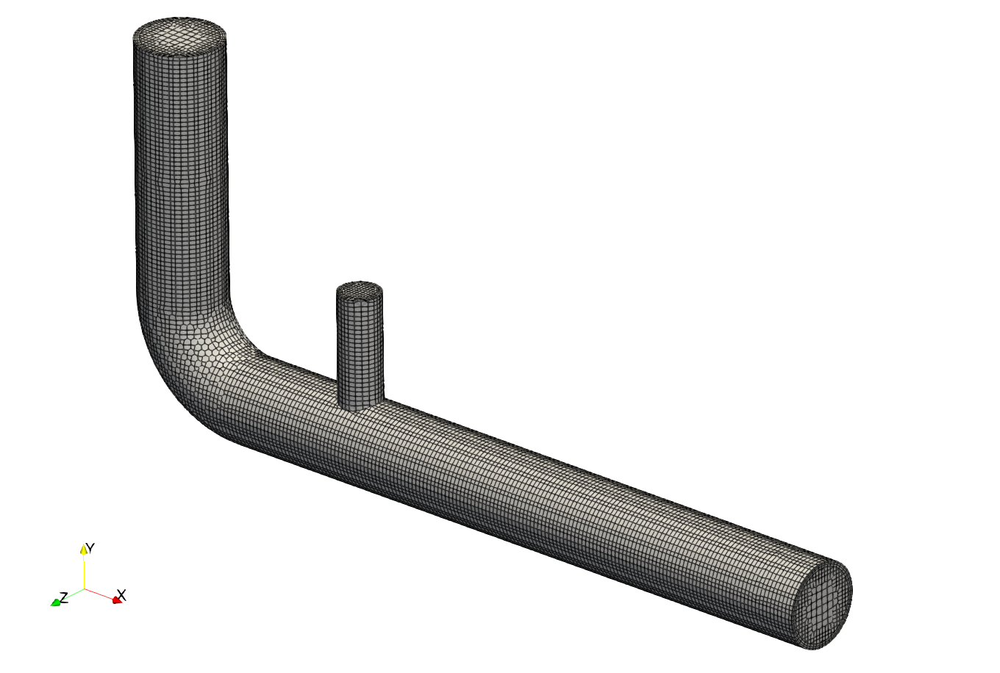

# Pre-Processing

## OpenFOAM Case Structure

A case being simulated involves data for mesh, fields, properties, control parameters, etc. In OpenFOAM this data is stored in a set of files within a case directory rather than in a single case file, as in many other CFD packages. The case directory is given a suitably descriptive name, here `exhaust_gas_recirculation`. This folder contains the following subfolders and files:

```
├── 0
│   ├── alphat
│   ├── k
│   ├── nut
│   ├── omega
│   ├── p
│   ├── T
│   └── U
├── constant
│   ├── thermophysicalProperties
│   └── turbulenceProperties
├── system
│   ├── controlDict
│   ├── decomposeParDict
│   ├── fvSchemes
│   ├── fvSolution
│   └── meshDict
└── exhaust_gas_recirculation.obj

3 directories, 15 files
```

The *relevant* files for this tutorial case are:
- `0` - This directory stores the initial values and boundary condition for each variables solved.
- `constant` - This directory contains files that are related to the physics of the problem, including the mesh and any physical properties that are required for the solver. In this case:
    - `thermophysicalProperties` defines the thermophysical properties of the fluid.
    - `turbulenceProperties` defines, which turbulence model to use for the simulation.
- `system` - This folder contains files related to how the simulation is to be solved:
    - `controlDict` for setting control parameters including start/end time, time step size and parameters for data output.
    - `decomposeParDict` for setting the number of processors in a parallel run.
    - `fvSchemes` for the discretization schemes used in the Finite Volume Method.
    - `fvSolution` for the solver settings used in the Finite Volume Method.
    - `meshDict` contains the configuration for the automated meshing process.


## Mesh Generation

The hexahedral-dominant, three-dimensional mesh is created automatically with the meshing utility `cartesianMesh` from a user provided surface geometry named `exhaust_gas_recirculation.obj, which is located in the case folder.

The exhaust gas recirculation pipe has a total length of $$360\,\text{mm}$$ in $$x$$-direction with an air inlet diameter of $$40\,\text{mm}$$ and an exhaust gas inlet with a diameter of $$20\,\text{mm}$$. an initial channel height of $$H = 1\,\text{m}$$ at the inlet and extends to $$4.7\,\text{m}$$ towards the outlet. The maximum cell size is set to $$3\,\text{mm}$$ resulting in about 13 cells across the large pipe diameter. Additionally, the walls have Five inflation layers with a thickness ratio of 1.3.

The resulting `meshDict` looks as follows:

```
// * * * * * * * * * * * * * * * * * * * * * * * * * * * * * * * * * * * * * //

surfaceFile "exhaust_gas_recirculation.obj";

maxCellSize 3;

boundaryLayers
{
    patchBoundaryLayers
    {
        pipe_exhaust
        {
            nLayers           5;

            thicknessRatio    1.3;
        }
        pipe_air
        {
            nLayers           5;

            thicknessRatio    1.3;
        }
    }
}
```

Finally, all corresponding patches are grouped together correctly using a suitable patch type. In order to create the mesh, the `cartesianMesh` utility has to be executed:

```bash
cartesianMesh
```

The resulting mesh can be visualized with ParaView should look like follows around the exhaust gas recirculation:




At this point the mesh generation is complete. The mesh consists of:
 - Background mesh with a cell size of $$3 \text{mm}$$
 - Five inflation layers at the walls with a thickness ratio of 1.3.
 - Correct patch types for air and exhaust inlet, outlet, and pipe walls.


## Mesh Quality

Once the mesh has been created, it is always recommended to check the mesh statistics and quality. This can easily be done using the utility `checkMesh` from within the `exhaust_gas_recirculation` folder:

```
checkMesh
```

The most relevant output is as follows:

```
// * * * * * * * * * * * * * * * * * * * * * * * * * * * * * * * * * * * * * //
Create time

Create polyMesh for time = 0

Time = 0s

Mesh stats 
    points:           66681
    faces:            190868
    internal faces:   181436
    cells:            62182
    faces per cell:   5.98733
    boundary patches: 5

...

Checking geometry...
    Overall domain bounding box (-20.0004 -170 -19.9912) (360 7.23793e-11 19.9912)
    Mesh has 3 geometric (non-empty/wedge) directions (1 1 1)
    Mesh has 3 solution (non-empty) directions (1 1 1)
    Boundary openness (4.74107e-17 -7.05875e-17 -2.54233e-15) OK.
    Max cell openness = 5.20632e-16 OK.
    Max aspect ratio = 16.3738 OK.
    Minimum face area = 0.206012. Maximum face area = 13.7709.  Face area magnitudes OK.
    Min volume = 0.177828. Max volume = 37.082.  Total volume = 627526.  Cell volumes OK.
    Mesh non-orthogonality Max: 61.6751 average: 6.22186
    Non-orthogonality check OK.
    Face pyramids OK.
    Max skewness = 2.4353 OK.
    Coupled point location match (average 0) OK.


Mesh OK.
    
End
```

This gives us all relevant mesh statistics and quality criteria of the mesh:

- The mesh consists of 62182 cells,
- has 5 different boundary patches,
- the overall boundingbox of $$380\,\text{m}$$ in $$x$$-direction, $$170\,\text{m}$$ in $$y$$-direction and $$40\,\text{m}$$ in $$z$$-direction.

As this is a hexa-dominant, unstructured mesh with five layers of inflation cells on the wall surfaces, the mesh quality in general is good:

- max cell aspect ratio of 16.4,
- a maximum mesh non-orthogonality of 61.7, and
- a max cell skewness of 2.44.

The final output `Mesh OK.` indicates that no critical problems or errors were found during `checkMesh`. Therefore, we can continue with this mesh and proceed with the simulation.


## Mesh Scaling

The overall bounding box of the computational mesh does not match the given dimensions of the geometry, since the latter was created in millimeters. Therefore, the mesh has to be scaled down in all three directions with a scaling factor of $$0.001$$. In order to do so, the mesh manipulation utility `transformPoints` can be used as follows:

```bash
transformPoints -scale "(0.001 0.001 0.001)"
```

{: .warning }
> If this command is executed twice, the mesh will be scaled by $$0.001 \times 0.001 = 10^{-6}$$!


## Physical Properties

Thermophysical models are concerned with: thermodynamics, e.g. relating internal energy $$e$$ to temperature $$T$$; transport, e.g. the dependence of properties such as viscosity $$\mu$$ on temperature; and state, e.g. dependence of density on temperature $$T$$ and pressure $$p$$. Unlike the setup for incompressible flows, these thermophysical properties are stored in the `thermophysicalProperties` file in the `constant` directory.

A thermophysical model required an entry named ´thermoType´ which specifies the package of thermophysical modelling that is used in the simulation. OpenFOAM includes a large set of pre-compiled combinations of modelling, built within the code using C++ templates.

The individual submodels chosen for this case are as follows:

```
// * * * * * * * * * * * * * * * * * * * * * * * * * * * * * * * * * * * * * //

thermoType
{
    type            hePsiThermo;
    mixture         pureMixture;
    transport       const;
    thermo          hConst;
    equationOfState perfectGas;
    specie          specie;
    energy          sensibleEnthalpy;
}
```

Depending on these submodels, specific fluid properties have to be specified. These settings are within the `mixture` dictionary in the `thermophysicalProperties` file:

```
mixture
{
    specie
    {
        molWeight   28.9;
    }
    thermodynamics
    {
        Cp          1007;
        Hf          0;
    }
    transport
    {
        mu          1.8e-5;
        Pr          0.7;
    }
}
```

#### Composition of each constituent

There is currently only one option for the specie model which specifies the composition of each constituent. That model is itself named `specie`, which is specified by the entry `molWeight`, which specifies the grams per mole of the given species. Here, air is considered with a mol weight of $$28.9\,\text{g/mol}$$.

#### Thermodynamics model

The thermodynamic models are concerned with evaluating the specific heat $$c_p$$ from which other properties are derived. The thermodynamics model selected here is of type `hConst`, which assumes a constant $$c_p$$ and heat of fusion $$H_f$$, which is simply specified by two keywords, `cp` set to $$1007\,\text{J/(kg K)}$$ and `Hf` set to $$0$$.

#### Equation of state

The equation of state for the given fluid is set to perfect gas. Therefore, density is calculated based on the following relation without the need of any additional material parameter:

$$ \rho = \frac{p}{R\,T} $$

with the specific gas constant for air $$R$$.

#### Transport model

The transport modelling concerns evaluating dynamic viscosity $$\mu$$, thermal conductivity $$\kappa$$, and thermal diffusivity $$\alpha$$. In this case, a `const` transport model is specified, which assumes a constant dynamic viscosity $$\mu$$ and Prandtl number $$\text{Pr}$$. These two variables are specified by the keywords `mu` set to $$1.8 \times 10^{-5}$$ and `Pr` to $$0.7$$. Since thermal conductivity and thermal diffusivity can be derived from these quantities, they do not have to be specified.


## Turbulence Modelling

The turbulence model is set in the `turbulenceProperties` file in the `constant` directory. The content of the file is as follows:

```
simulationType RAS;

RAS
{
    RASModel        kOmegaSST;
}
```

For this set of simulation the Reynolds-Averaged Navier-Stokes (RANS) equations should be solved. Therefore, the entry `simulationType` is set to `RAS`, which stands for **R**eynolds-**A**veraged **S**imulation. Within the `RAS` sub-dictionary, the keyword `RASModel` set to `kOmegaSST` selects the  $$\text{SST} \, \, k-\omega$$ turbulence model.


## Boundary Conditions

Since the simulation starts at time $$t=0$$, the boundary and initial field data is stored in the `0` sub-directory. This must be done for all variables solved for, such as pressure `p` and velocity `U`. Furthermore, the $$k-\epsilon$$ solves two additional transport equations for turbulent kinetic energy $$k$$ and turbulent dissipation rate $$\epsilon$$. Therefore, initial and boundary conditions have to be provided for these variables as well. Finally, the treatment of the turbulent viscosity $$\nu_\text{t}$$ at the walls has to be specified as well.

### Pressure and Velocity

Since the Reynolds-number is set to $$\text{Re} = 2 \times 10^4$$, a pressure-velocity boundary setup will be employed, where velocity is defined at the inlet while pressure is set at the outlet.

The velocity at the inlet is set to a uniform fixed value of $$U_\text{in} = 0.3\,\text{m/s}$$ and at the outlet to zero gradient using a `fixedValue` and `zeroGradient` boundary condition, respectively. Walls are considered no-slip and thus set to the `noSlip` boundary condition.

The kinematic pressure at the outlet is set to a uniform value of $$p_\text{out} = 0\,\text{m}^2\text{/s}^2$$ using a `fixedValue` boundary condition, while walls and the inlet are treated as zero gradient, thus set to `zeroGradient`.

### Turbulent Kinetic Energy

The turbulent kinetic energy has units of $$\text{m}^2\text{/s}^2$$ and its initial value is set to $$0.1\,\text{m}^2\text{/s}^2$$. Since defining specific values for $$k$$ at the inlet are difficult to predict, the turbulent kinetic energy will be estimated based on the turbulent intensity $$I_\text{t}$$ and the inlet velocity $$U_\text{in}$$ at the patch itself. Therefore, the following formula will be used:

$$ k_\text{in} = 1.5 I_\text{in} |U_\text{in}|^2 $$

This estimate is calculated by the `turbulentIntensityKineticEnergyInlet` boundary condition with one additional entry `intensity`, which sets the turbulent intensity $$I_\text{t}$$ to 0.01, which stands for a low turbulent intensity of 1 %. At the walls, an all-$$y^+$$ wall function approach is used, which computes the effect of the turbulent boundary layer onto the turbulent kinetic energy. The boundary type is therefore set to `kqRWallFunction`. Finally, at the outlet a zero gradient boundary condition is used.

The complete `boundaryField` entry for the turbulent kinetic energy looks as follows:

```
boundaryField
{
    inlet
    {
        type            turbulentIntensityKineticEnergyInlet;
        intensity       0.01;
        value           uniform 0.1;
    }

    outlet
    {
        type            zeroGradient;
    }

    lowerWall
    {
        type            kqRWallFunction;
        value           uniform 0.1;
    }

    upperWall
    {
        type            kqRWallFunction;
        value           uniform 0.1;
    }
}

```

{: .note }
> When using advanced OpenFOAM boundary conditions like `totalPressure`, `turbulentIntensityKineticEnergyInlet` or wall functions for turbulent quantities, the entry `values` with an initial value has to be applied, although this value will be overwritten in the very first time step. Therefore, this `value` entry has no relevance for the course of the simulation.


### Turbulent Dissipation Rate

The turbulent dissipation rate has units of $$\text{m}^2\text{/s}^3$$ and its initial value is set to $$100\,\text{m}^2\text{/s}^3$$. Similar to the turbulent kinetic energy, specifying resonable values for $$\epsilon$$ at the inlet is difficult. Therefore, the following empirical formula will be used instead based on turbulent kinetic energy $$k$$ at the inlet patch, modelling coefficient $$C_\mu$$, and a turbulent length scale $$L_\text{t}$$:

$$ \epsilon_\text{in} = \frac{C_\mu^{0.75} \, k^{1.5}}{L_\text{t}} $$

This estimate is implemented in the `turbulentMixingLengthDissipationRateInlet` boundary condition with one additional entry `mixingLength`, which sets the turbulent length scale to $$L_\text{t} = 1.5 \times 10^{-3}\,\text{m}$$. At the walls, an all-$$y^+$$ wall function approach is used, which computes the effect of the turbulent boundary layer onto the turbulent dissipation rate. The boundary type is therefore set to `epsilonWallFunction`. Finally, at the outlet a zero gradient boundary condition is used.

The complete `boundaryField` entry for the turbulent dissipation rate looks as follows:

```
boundaryField
{
    inlet
    {
        type            turbulentMixingLengthDissipationRateInlet;
        mixingLength    0.0015;
        value           uniform 100;
    }

    outlet
    {
        type            zeroGradient;
    }

    lowerWall
    {
        type            epsilonWallFunction;
        value           uniform 100;
    }

    upperWall
    {
        type            epsilonWallFunction;
        value           uniform 100;
    }
}
```

### Turbulent Viscosity

Finally, the turbulent viscosity $$\nu_\text{t}$$ with unit $$\text{m}^2\text{/s}$$ has to be specified in particular at the walls. Since the turbulent viscosity will be calculated based on the turbulent quantities $$k$$ and $$\epsilon$$, the initial field values and the boundary conditions at anything other than walls is relevant. Therefore, the internal field is simply set to $$0\,\text{m}^2\text{/s}$$ and the boundary conditions for inlet and outlet are set to `calculated`.

{: .note }
> The `calculated` boundary type in OpenFOAM is always used, when the corresponding variable will be calculated by the CFD model itself and does not have to be specified. In case of turbulent viscosity, $$\nu_\text{t}$$ will be calculated by the turbulence model and thus does not have to be specified.

The specification of the boundary condition at walls for $$\nu_\text{t}$$ is critical, though, as this defines the wall treatment approach. In this case, an all-$$y^+$$ wall function of type `nutUSpaldingWallFunction` is, which is designed to work across the entire $$y^+$$ range, making it more versatile, e.g. valid both in the viscous sublayer with $$y^+ \approx 1$$ and within the log-law region with $$y^+ > 30$$. This flexibility allows for mesh refinement without the need to change these boundary condition later.

The complete `boundaryField` entry for the turbulent viscosity looks as follows:

```
boundaryField
{
    inlet
    {
        type            calculated;
        value           uniform 0;
    }

    outlet
    {
        type            calculated;
        value           uniform 0;
    }

    lowerWall
    {
        type            nutUSpaldingWallFunction;
        value           uniform 0;
    }

    upperWall
    {
        type            nutUSpaldingWallFunction;
        value           uniform 0;
    }
}
```


## Simulation Control

Settings related to the control of time (for transient simulations) or iterations (for steady-state simulations) and reading and writing of the solution data are read in from the `controlDict` file in the `system` folder.

The key settings for this steady-state turbulent simulation include:
```
application     simpleFoam;

startFrom       startTime;

startTime       0;

stopAt          endTime;

endTime         2500;

deltaT          1;

writeControl    timeStep;

writeInterval   250;
```

In this tutorial case, the solver `simpleFoam` is used, a pressure-based solver for incompressible, steady-state, laminar or turbulent single-phase flows. The simulation starts at time `0`. Therefore we set the `startFrom` keyword to `startTime` and then specify the `startTime` keyword to be `0`. The simulations runs for 2500 iterations, which is why the `endTime` entry is set to `2500`. Since time step size has no physical meaning in steady-state simulations, the time step size `deltaT` is set to 1, which functions as iteration counter rather than physical time. Finally, results are witten out every 250 iterations configured via the `writeInterval` keyword.


## Discretization

The user specifies the choice of finite volume discretisation schemes in the `fvSchemes` dictionary in the `system` directory. Here, we will only cover the most relevant settings.

### Temporal derivatives

The discretization of the temporal derivatives $$(\partial / \partial t)$$ is defined within the `ddtSchemes` keyword. Since this is a steady-state simulation, the entry here is set to `steadyState`, e.g. the temporal derivative is set to zero.

```
ddtSchemes
{
    default             steadyState;
}
```

### Gradient terms

The discretization of the gradient terms is defined within the `gradSchemes` keyword. All gradient schemes are discretized equally with a second order **central differencing scheme** with a cell-based gradient limiter to avoid exessively large gradients. Hence, the `default` discretization is set to `cellLimited Gauss linear 1.0`.

```
gradSchemes
{
    default             cellLimited Gauss linear 1.0;
}
```

### Convective terms

The discretization of the convective transport terms is defined within the `divSchemes` keyword. Here, `div(phi,U)` referes to the discretization of the convective transport of momentum with `phi` being the (volumetric) flux and `U` the variable transported by the flux. In this case, the **second order upwind scheme** is employed called `Gauss linearUpwindV` combined with the default gradient scheme defined under `gradSchemes`. Since a turbulence model is employed, the convective transport of the turbulent quantities `k` and `epsilon` in their respective transport equations is also discretized with the **second order upwind scheme** combined with the default gradient scheme.

Additionaly, `div((nuEff*dev2(T(grad(U)))))` denotes the divergence of the shear stress tensor in the momentum equation. Since this term is diffusive in nature, it is recommended to discretize it with a central differencing scheme, here `Gauss linear`.

```
divSchemes
{
    div(phi,U)          bounded Gauss linearUpwindV default;

    div(phi,k)          bounded Gauss linearUpwind default;
    div(phi,epsilon)    bounded Gauss linearUpwind default;

    div((nuEff*dev2(T(grad(U))))) Gauss linear;
}
```

{: .note }
> The keyword `bounded` in front of the discretization scheme for the convective terms is only required in steady-state simulations. It helps to maintain boundedness of the solution variable and promotes a better convergence.


## Linear Solver Settings

The specification of the linear equation solvers, tolerances and other algorithm controls is made in the `fvSolution` dictionary in the `system` directory. These settings are as follows for the exhaust gas recirculation case.

### Solver settings

The pressure field in the pressure-velocity coupling is solved using a **Geometric agglomerated Algebraic MultiGrid** (short: GAMG) solver with a Gauss-Seidel solver for smoothing during the multi-grid steps. The absolute solver tolerance for each iteration is set to $$10^{-6}$$ with a relative tolerance of $$0.1$$: 


```
solvers
{
    p
    {
        solver          GAMG;
        smoother        GaussSeidel;
        tolerance       1e-06;
        relTol          0.1;
    }
... 
}
```

The momentum equation and the transport equations for the turbulent properties is solved using a Gauss Seidel solver **Preconditioned bi-Conjugate Gradient** solver with an simplified **Diagonal-based Incomplete LU** preconditioner (PBiCG solver with DILU preconditioner). The absolute tolerance for solving is $$10^{-12}$$ with a relative tolerance of $$0.1$$:

```
solvers
{
...

    "(U|k|epsilon)"
    {
        solver          PBiCG;
        preconditioner  DILU;
        tolerance       1e-12;
        relTol          0.1;
    }
}
```


### Pressure-velocity coupling

Pressure-based, steady-state simulations in OpenFOAM rely on the SIMPLE pressure-velocity coupling algorithm. Additional options for this algorithm are available within the `SIMPLE` entry in `fvSolutions`. In this tutorial, the consistent formulation of the algorithm is used called SIMPLEC with the keyword `consistent`. Additionally, the pressure correction equation is solved one additional time every iteration for improved convergence and stability with the `nNonOrthogonalCorrectors` entry set to `1`.

The simulation will automatically be stopped as soon as the residual criteria are met specified in the `residualControl` sub-dictionary. In this case, these thresholds are set to $$10^{-4}$$ for all variables.

```
SIMPLE
{
    consistent                  yes;
    nNonOrthogonalCorrectors    1;

    residualControl
    {
        p                       1e-4;
        U                       1e-4;
        k                       1e-4;
        epsilon                 1e-4;
    }
}
```

### Relaxation factors

Steady state simultions are highly unstable, if no relaxation factors are used. Since the SIMPLEC algorithm is employed, no relaxation factor for pressure has to be set. However, velocity, turbulent kinetic energy and turbulent dissipation rate are relaxed with 0.8 and 0.5, respectively, using equation underrelaxation.

```
relaxationFactors
{
    equations
    {
        U               0.8;
        k               0.5;
        epsilon         0.5;
    }
}
```