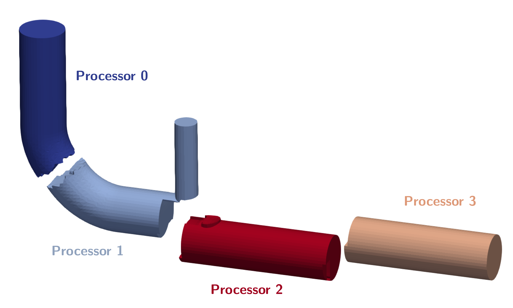
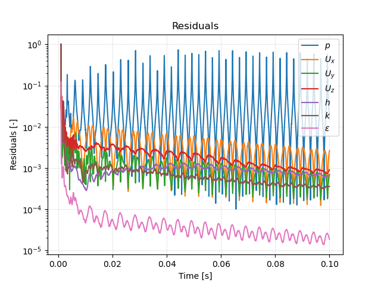
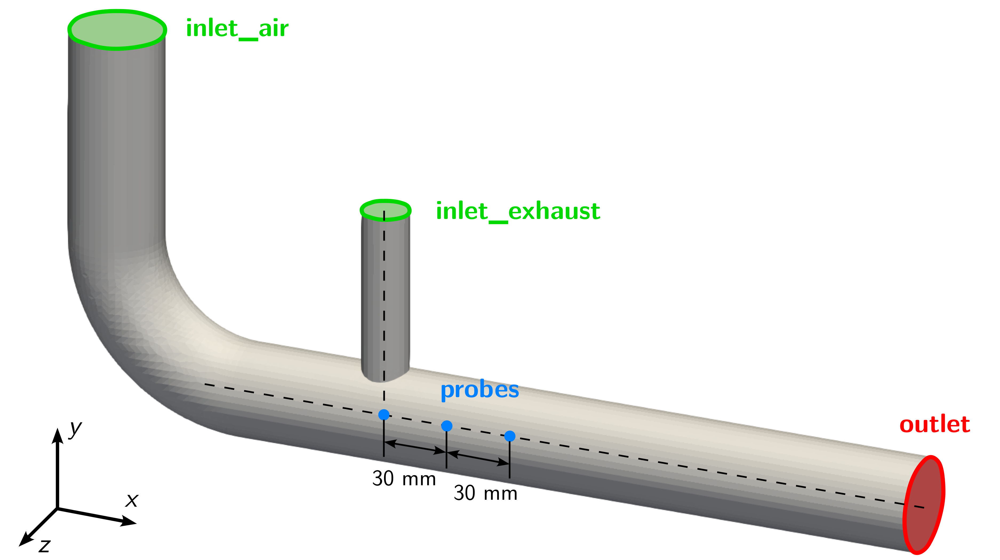

# Solving


## Running in Parallel

By default, OpenFOAM does only run on a single CPU core on a computer (e.g. it runs in serial). Even for smaller cases this might lead to long computational times. For example, the mesh for this simulation consists of about 60.000 cells. A simulation on a single CPU core would take about 24 min to finish. In contrast, most modern workstation computer and laptops come equipped with 8 - 16 CPU cores (not including hyperthreading). So it would just make sense to run OpenFOAM in parallel using several CPU cores at once to speed up the simulation.

Using OpenFOAM in parallel consists of three steps:
 1. Decomposing the mesh and initial/boundary conditions into individual processor folders,
 2. Running the case in parallel,
 3. Reconstructing the results from the individual processor folders.

### 1. Decomposing the case

At first, the computational mesh (e.g. the `constant/polyMesh` directory) and the intial and boundary conditions (typically the `0` folder) have to be decomposed into $$n$$ separate parts or sub-domains, where $$n$$ is the number of CPU cores to be used. This way, each CPU core gets a separate portion of the overall simulation domain. During a parallel run, a CPU core does only solve the governing equation in the assigned computational sub-domain.

The number of sub-domains is configured in the `decomposeParDict` in the `system` folder, which has the following content:

```
// * * * * * * * * * * * * * * * * * * * * * * * * * * * * * * * * * * * * * //

numberOfSubdomains  4;

method              scotch;
```

For this simulation, the number of sub-domains is set to 4 and the decomposition is computed using the `scotch` algorithm, which automatically tries to minimze the processor-processor communication for parallel computation. The decomposition itself can be performed using the following command:

```bash
decomposePar
```

Decomposing the exhaust gas recirculation system case for running in parallel results in the following processor subdomains:




{: .note }
> If the case has already been decomposed with `decomposePar`, running the tool again will result in an error as there are already processor folders present. In order to automatically remove old processor folders and decompse the case once again, an additional option can be sued when decomposing the case: `decomposePar -force`.


### 2. Run in parallel

Once the case has been decomposed, it can be solved in parallel using mpi (Message Passing Interface), which organizes the processor-processor communication. Instead of just typing `rhoPimpleFoam` into the terminal, for a parallel execution the command is as follows:

```bash
mpirun -np 4 rhoPimpleFoam -parallel
```

Here, `mpirun` takes care of the parallel execution, `-np 4` is an additional option specifying the number of processors used (here: 4), `rhoPimpleFoam` is the executable run in parallel and `-parallel` an additional option, so OpenFOAM knows to run the solver in parallel. Results folders created during parallel execution are stored in their respective processor folder. Furthermore, post-processing function objects are stored as normal in the `postProcessing` directory.

The progress of the job is written to the terminal window like normal. It tells the user the current time step (e.g. iteration in steady-state simulations), the equations beeing solved, initial and final residuals for all fields and should look like follows:


In order to start the simulation, we have to execute corresponding the OpenFOAM application. As defined in the `controlDict`, the solver `rhoPimpleFoam` will be used, suitable for transient, compressible, laminar or turbulent flows.


 This application can be started by typing the appropriate command in the terminal from within the case directory:

```bash
rhoPimpleFoam
```

The progress of the job is written to the terminal window. It tells the user the current iteration, the equations being solved, initial and final residuals for all fields and should look like follows:

```
Courant Number mean: 0.0231348 max: 0.692643
Time = 0.04652

PIMPLE: iteration 1
diagonal:  Solving for rho, Initial residual = 0, Final residual = 0, No Iterations 0
smoothSolver:  Solving for Ux, Initial residual = 0.00113556, Final residual = 6.34284e-07, No Iterations 1
smoothSolver:  Solving for Uy, Initial residual = 0.000635827, Final residual = 3.65292e-07, No Iterations 1
smoothSolver:  Solving for Uz, Initial residual = 0.00327433, Final residual = 2.0464e-09, No Iterations 2
smoothSolver:  Solving for h, Initial residual = 0.00158282, Final residual = 8.79904e-10, No Iterations 2
GAMG:  Solving for p, Initial residual = 0.0355897, Final residual = 4.33579e-05, No Iterations 1
diagonal:  Solving for rho, Initial residual = 0, Final residual = 0, No Iterations 0
time step continuity errors : sum local = 1.17717e-07, global = -4.46739e-09, cumulative = 1.27345e-05
GAMG:  Solving for p, Initial residual = 5.75699e-05, Final residual = 7.2923e-07, No Iterations 5
diagonal:  Solving for rho, Initial residual = 0, Final residual = 0, No Iterations 0
time step continuity errors : sum local = 1.98789e-09, global = -1.20932e-11, cumulative = 1.27345e-05
smoothSolver:  Solving for omega, Initial residual = 3.61447e-05, Final residual = 1.39389e-08, No Iterations 1
smoothSolver:  Solving for k, Initial residual = 0.000695609, Final residual = 3.04741e-07, No Iterations 1
ExecutionTime = 254.95 s  ClockTime = 266 s
```

This output at time 0.04652 tells us in summary:
- The solvers being used for the different governing equations, initial and final residuals, and the number of iterations per time step.
- The error of the conservation of mass is denoted as `continuity error`. Since its value is very small, conservation of mass is maintained.
- The execution time for the simulation up until this iteration is roughly 255 seconds as indicated by the `ExecutionTime`.


### 3. Reconstructing the case

Once the simulation has finished, the results can be visualized in ParaView, since ParaView can both visualize decomposed and reconstructed OpenFOAM data. However, it is highly recommended to reconstruct the individual subdomains back into a overall complete domain before continuing the post-processing. This way, the number of stored files and required storage space can be reduced and the case folder is less confusing. In order to reconstruct the subdomains, the following command is used:

```bash
reconstructPar
```

This tool automatically reconstructs all time folders in the individual processor folders into a single time folder in the case directory. Once simulation and reconstruction are completed, the individual processor folders should be deleted.

{: .note }
> If not all time folders should be reconstructed, the `reconstructPar` tool offers additional parameters for execution, such as `reconstructPar -latestTime` for only reconstructing the last time step, or `reconstructPar -time 0.05:0.1`, where a range of time steps can be specified.


## Monitoring the Simulation

In order to monitor the simulation during its run and for postprocessing, several function objects are added at the bottom of the `controlDict`.

### Residuals

In order to visualize the residuals to help judge convergence, the function object `solverInfo` has been added to the `controlDict`. It saves the initial residuals of the fields `(p U h k omega)`, so pressure, velocity, enthalpy, turbulent kinetic energy, and specific dissipation rate, during runtime in the `postProcessing` folder under the following path: `postProcessing/solverInfo/0/solverInfo.dat`.

```
functions
{
    solverInfo
    {
        type            solverInfo;
        libs            (utilityFunctionObjects);
        fields          (p U h k omega);
    }

...
}
```

Either during runtime or once the simulation has finished, the data written by the function objects can be analyzed. This data can typically be plotted in a diagram using Microsoft Excel, Python, Gnuplot or any other tool. In order to quickly evaluate the monitored results from the function objects, a script is added to the case directory called `create_plots.py`. Executing it will automatically create the diagrams for residuals. By typing the following command in the terminal, the diagrams are created using Python and stored as png file:

```bash
python3 create_plots.py
```

This creates the following diagram of the residuals on the $$y$$-axis plotted against time on the $$x$$-axis in the case folder:



The plot shows that while there is a clear trend in falling residuals, this trend is superimposed by large oscillations. This indicates that this is a stronly transient flow with no stationary state.


### Probes

Additionally, a second function object named `probes` in the `controlDict` evaluates pressure, velocity and temperature in pre-defined monitor points. In this case, three points are defined just below where the exhaust pipe intersects with the air pipe and further downstream as shown in the following figure:



The values are written out every time step and help in analysing the transient flow behaviour and detect possible characteristic frequencies. The function object itself is configured as follows:

```
functions
{
...
    
    probes
    {
        type            probes;
        libs            (sampling);
        writeControl    timeStep;
        writeInterval   1;

        fields
        (
            T
        );

        probeLocations
        (
            (0.12 -0.15 0.0)
            (0.15 -0.15 0.0)
            (0.18 -0.15 0.0)
        );
    }
}
```

By using the provided `create_plots.py` Python script, a diagram of the temperature over time for the individual probe points is created:


It takes about 0.01 seconds until the hot exhaust gas reaches the location of the probe points. Then, their temperature rises quickly. Directly below the t-junction at probe 1, the temperature is lowest with a maximum of $$500\,\text{K}$$. Probe 2 has the highest temperature of around $$850\,\text{K}$$ at the end of the simulation. However, probe 3 sits in between with a lower temperature in the range of $$600\,\text{K}$$ due to the mixing of cold air and hot exhaust gas. Note that the maximum and minimum temperature is actually above and below the inlet temperatures of $$900\,\text{K}$$ and $$300\,\text{K}$$, respectively. This is unphysical and probably due to the unlimited gradient in the second order upwind discretication scheme.

