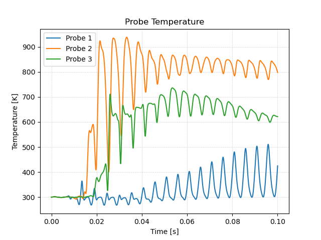
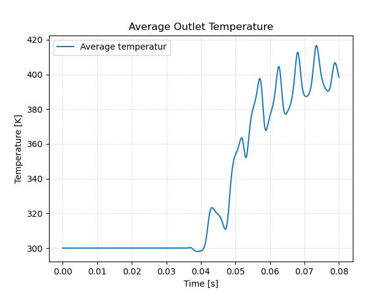
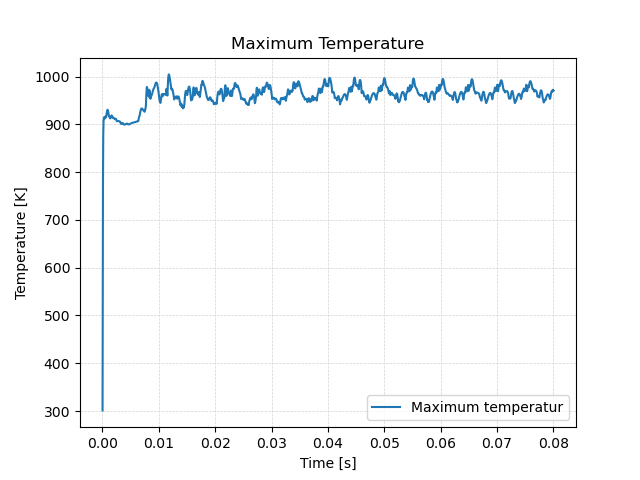

# Solving


## Running in Parallel

By default, OpenFOAM does only run on a single CPU core on a computer (e.g. it runs in serial). Even for smaller cases this might lead to long computational times. For example, the mesh for this simulation consists of about 80.000 cells. A simulation on a single CPU core would take about 24 min to finish. In contrast, most modern workstation computer and laptops come equipped with 8 - 16 CPU cores (not including hyperthreading). So it would just make sense to run OpenFOAM in parallel using several CPU cores at once to speed up the simulation.

Using OpenFOAM in parallel consists of three steps:
 1. Decomposing the mesh and initial/boundary conditions into individual processor folders,
 2. Running the case in parallel,
 3. Reconstructing the results from the individual processor folders.

### 1. Decomposing the case

At first, the computational mesh (e.g. the `constant/polyMesh` directory) and the intial and boundary conditions (typically the `0` folder) have to be decomposed into $$n$$ separate parts or sub-domains, where $$n$$ is the number of CPU cores to be used. This way, each CPU core gets a separate portion of the overall simulation domain. During a parallel run, a CPU core does only solve the governing equation in the assigned computational sub-domain.

The number of sub-domains is configured in the `decomposeParDict` in the `system` folder, which has the following content:

```
// * * * * * * * * * * * * * * * * * * * * * * * * * * * * * * * * * * * * * //

numberOfSubdomains  4;

method              scotch;
```

For this simulation, the number of sub-domains is set to 4 and the decomposition is computed using the `scotch` algorithm, which automatically tries to minimze the processor-processor communication for parallel computation. The decomposition itself can be performed using the following command:

```bash
decomposePar
```

Decomposing the exhaust gas recirculation system case for running in parallel results in the following processor subdomains:


{: .note }
> If the case has already been decomposed with `decomposePar`, running the tool again will result in an error as there are already processor folders present. In order to automatically remove old processor folders and decompse the case once again, an additional option can be sued when decomposing the case: `decomposePar -force`.


### 2. Run in parallel

Once the case has been decomposed, it can be solved in parallel using mpi (Message Passing Interface), which organizes the processor-processor communication. Instead of just typing `foamRun` into the terminal, for a parallel execution the command is as follows:

```bash
mpirun -np 4 foamRun -parallel
```

Here, `mpirun` takes care of the parallel execution, `-np 4` is an additional option specifying the number of processors used (here: 4), `foamRun` is the executable run in parallel and `-parallel` an additional option, so OpenFOAM knows to run the solver in parallel. Results folders created during parallel execution are stored in their respective processor folder. Furthermore, post-processing function objects are stored as normal in the `postProcessing` directory.

The progress of the job is written to the terminal window like normal. It tells the user the current time step (e.g. iteration in steady-state simulations), the equations being solved, initial and final residuals for all fields and should look like follows:


```
Courant Number mean: 0.0240667 max: 0.234012
Time = 0.08s

diagonal:  Solving for rho, Initial residual = 0, Final residual = 0, No Iterations 0
smoothSolver:  Solving for Ux, Initial residual = 0.00584081, Final residual = 3.60744e-06, No Iterations 1
smoothSolver:  Solving for Uy, Initial residual = 0.00152905, Final residual = 1.06892e-06, No Iterations 1
smoothSolver:  Solving for Uz, Initial residual = 0.00117061, Final residual = 1.0538e-06, No Iterations 1
smoothSolver:  Solving for h, Initial residual = 0.000756259, Final residual = 5.4808e-07, No Iterations 1
GAMG:  Solving for p, Initial residual = 0.00737078, Final residual = 1.37979e-05, No Iterations 1
diagonal:  Solving for rho, Initial residual = 0, Final residual = 0, No Iterations 0
time step continuity errors : sum local = 8.74165e-08, global = -1.77969e-09, cumulative = 4.61467e-05
GAMG:  Solving for p, Initial residual = 2.44065e-05, Final residual = 3.76191e-07, No Iterations 2
diagonal:  Solving for rho, Initial residual = 0, Final residual = 0, No Iterations 0
time step continuity errors : sum local = 2.37826e-09, global = 1.93121e-10, cumulative = 4.61469e-05
smoothSolver:  Solving for omega, Initial residual = 0.000145111, Final residual = 1.43467e-07, No Iterations 1
smoothSolver:  Solving for k, Initial residual = 0.00118793, Final residual = 1.22708e-06, No Iterations 1
bounding k, min: -0.373581 max: 49.3845 average: 0.382731
ExecutionTime = 482.009 s  ClockTime = 499 s

```

This output at time 0.08 tells us in summary:
 - Mean and maximum Courant number in the computational domain.
 - The solvers being used for the different governing equations, initial and final residuals, and the number of iterations per time step.
 - The error of the conservation of mass is denoted as `continuity error`. Since its value is very small, conservation of mass is maintained.
 - The execution time for the simulation up to this iteration is roughly 499 seconds as indicated by the `ExecutionTime`.


### 3. Reconstructing the case

Once the simulation has finished, the results can be visualized in ParaView, since ParaView can both visualize decomposed and reconstructed OpenFOAM data. However, it is highly recommended to reconstruct the individual subdomains back into a overall complete domain before continuing the post-processing. This way, the number of stored files and required storage space can be reduced and the case folder is less confusing. In order to reconstruct the subdomains, the following command is used:

```bash
reconstructPar
```

This tool automatically reconstructs all time folders in the individual processor folders into a single time folder in the case directory. Once simulation and reconstruction are completed, the individual processor folders should be deleted.

{: .note }
> If not all time folders should be reconstructed, the `reconstructPar` tool offers additional parameters for execution, such as `reconstructPar -latestTime` for only reconstructing the last time step, or `reconstructPar -time 0.05:0.1`, where a range of time steps can be specified.


## Monitoring the Simulation

Four function objects are defined in the `functions` file in the `system` folder to monitor the run:

```
#includeFunc residuals
(
    name    = residuals,
    fields  = (p U h k omega)
)

#includeFunc probes
(
    name    = probes,
    fields  = (T),
    points  = 
        (
            (0.12 0 0)
            (0.15 0 0)
            (0.18 0 0)
        )
)

#includeFunc patchAverage
(
    name    = avgT,
    patch   = outlet,
    fields  = (T)
)
#includeFunc cellMax
(
    name    = maxT,
    fields  = (T)
)
```

The `residuals` object writes the initial residuals of `(p U h k omega)`, so pressure, velocity, enthalpy, turbulent kinetic energy and specific dissipation rate, to `postProcessing/residuals/0/residuals.dat` at every time step.

The `probes` function object evaluates temperature at pre-defined monitor points and stores it under `postProcessing/probes/0/T`. In this case, three points are defined just below where the exhaust pipe intersects with the air pipe and further downstream as shown in the following figure:


The `patchAverage` function object evaluates the average temperature at the outlet patch and writes it to `postProcessing/avgT/0/surfaceFieldValue.dat`. The `cellMax` function object tracks the maximum temperature in the computational domain and stores it under `postProcessing/maxT/0/volFieldValue.dat`,

In order to quickly evaluate the monitored data, a script is added to the diffuser case directory called `create_plots.py`. Executing it will automatically create the diagrams and store them as png file.


The following diagram shows the residuals on the $$y$$-axis plotted against time on the $$x$$-axis:


The plot shows that while there is a clear trend in falling residuals, this trend is superimposed by large oscillations. This indicates that this is a stronly transient flow with no stationary state.

The diagram of the temperature over time for the individual probe points is follows:



It takes about 0.01 seconds until the hot exhaust gas reaches the location of the probe points. Then, their temperature rises quickly. At the end of the simulation, directly below the t-junction at probe 1, the temperature is highest with a maximum of over $$900\,\text{K}$$. Probe 2 has the somewhat lower temperature values of around $$750\,\text{K}$$. However, probe 3 monitores the lowest temperaturewith values below $$600\,\text{K}$$ due to the mixing of cold air and hot exhaust gas.

The average temperature at the outlet patch is shown next:



Similar to the previous plots, these results indicate a strongly transient flow problem with an average temperature of about $$400\,\text{K}$$.

The maximum temperature in the copmutational domain is as follows:



Note that the maximum is actually above the inlet temperatures of $$900\,\text{K}$$. This is **unphysical** and needs further investigation. It is probably due to the unlimited gradient in the second order upwind discretication scheme.

This concludes the setup of the exhaust gas recirculation system and the configuration of function objects for runtime postpressing.