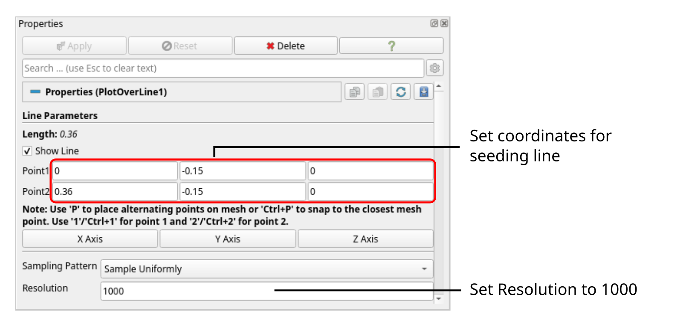
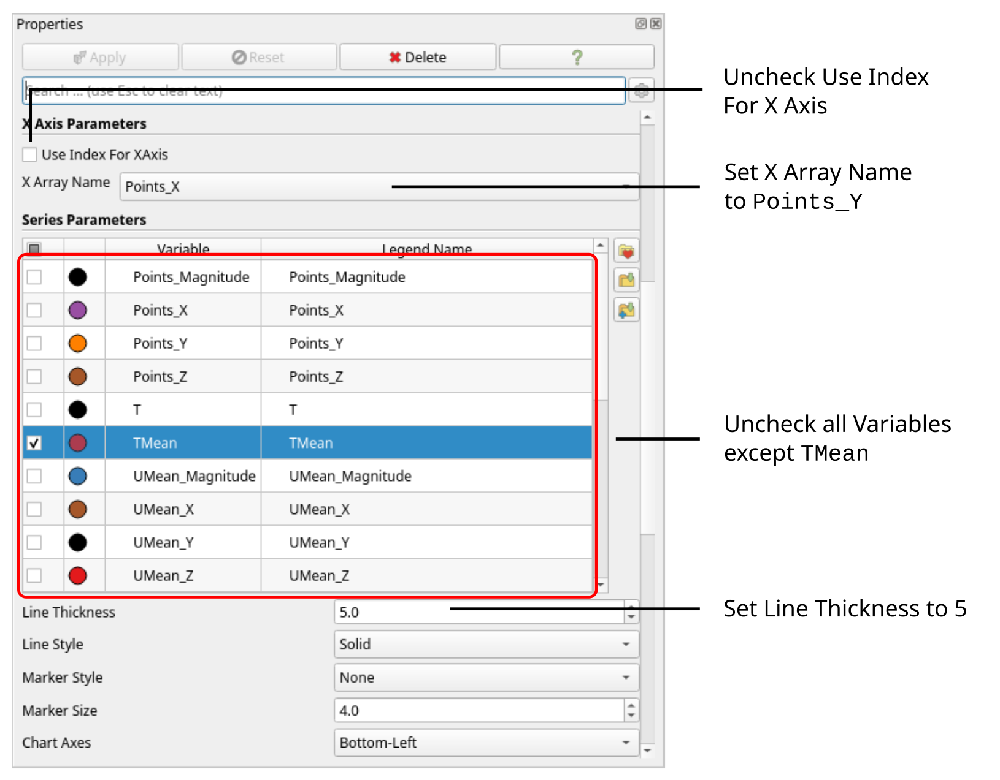
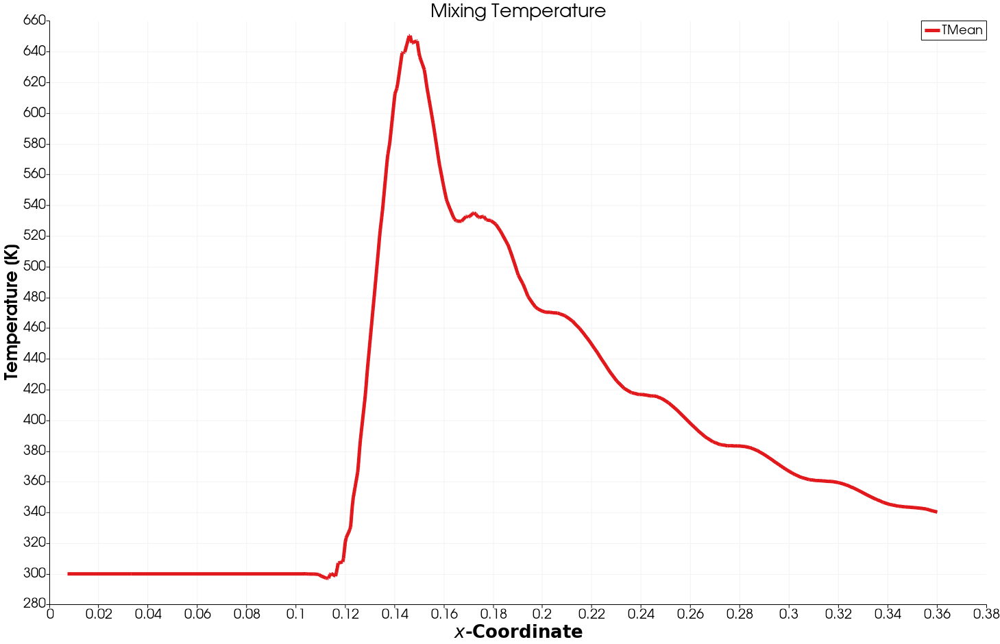

# Post-Processing


## Visualizing the Velocity Contour

As soon as results from the processor folders are reconstructed, they can be viewed using ParaView. Start ParaView in the background with the following command:

```bash
paraFoam &
```

To prepare ParaView to display the data of interest, the data of the last time step at $$t = 0.08\,\text{s}$$ must be loaded. If the case was run while ParaView was open, the output data in time directories will not be automatically loaded within ParaView. To load the data the user should click **Refresh** at the top **Properties** window (scroll up the panel if necessary).

To color the mesh by velocity magnitude (i.e. the velocity contour) of the flow, the following settings must be selected in the **Properties** panel, as descriped in the following figure:

1. Select **Surface** from the **Representation** menu,
2. Select **Coloring** by velocity magnitude U, and
3. Select **Rescale to Data Range**, if necessary.


When inspecting the velocity field, the increase of flow velocity at and downstream of the t-junction is apparent. This is simply due to conservation of mass as flow rates from both inlets have to pass through the main pipe.


When clicking the **Play** button in the **VCR Controls** at the very top of the ParaView window, one can see the transient nature of the flow and the characteristic flow separation just below the t-junction:


## Visualizing the Temperature Contour

The mixing of exhaust gas and fresh air is best visualized using the temperature field. Selecting temperature `T` in the **Properties** panel and rescaling the data range gives the following temperature contour:


Smaller flow structures with higher temperature can be seen downstream the t-junction. When selecting the time-averaged temperature field `TMean` instead, it shows a smooth temperature field and the mixing process of exhaust gas and fresh air:


## Analysing the Mixing Process

In order to analyse the mixing of exhaust gas and fresh air along the pipe, we can plot the average temperature over a line in the center of the main pipe. Select the **Plot over Line** filter from the **Domain** $$\rightarrow$$ **Data Analysis**. The **Properties** window panel should appear as shown in the following figure:



Tthe coordinates of the start and end point of the sampling line should be $$(0 \,\, -0.15\,\, 0)$$ and $$(0.36 \,\, -0.15\,\, 0)$$, respectively, with a spatial **Resolution** of 1000 points along this line. Clicking **Apply** will open a separate window plotting all variables solved over the length of the line. This resulting diagram is very cluttered. Therefore, in the **Properties** window deselect all variables except the average temperature labelled `TMean`. In order to plot over the $$x$$-coordiantes of the line, uncheck **Use Index for X Axis** and set **X Array Name** to `Points_X`. Finally, thile the mean temeprature is selected in the **Properties** window, change the **Line Thickness** to 5 for better readability. Optionally, line color can be changed and chart title as well as axis can be specified. The **Properties** window should now look like follows:



The resulting diagram should look like follows:



Just downstream the mixing temperature reaches its peak with about $$650\,\text{K}$$ and then falls rapidly with an average temperature of $$340\,\text{K}$$ at the outlet.


## Conclusion

This concludes the fifth seminar on the simulation of a compressible, turbulent flow through a exhaust gas recirculation system. A three-dimensional mesh was generated using `cartesianMesh` based on a geometry file. The inlet boundary conditions for air and exhaust gas were adjusted for a given volumetric flow rate. The simulation was then run using `rhoPimpleFoam`, and residuals, maximum and average outlet temperature were plotted. Finally, the flow field was visualized in ParaView.