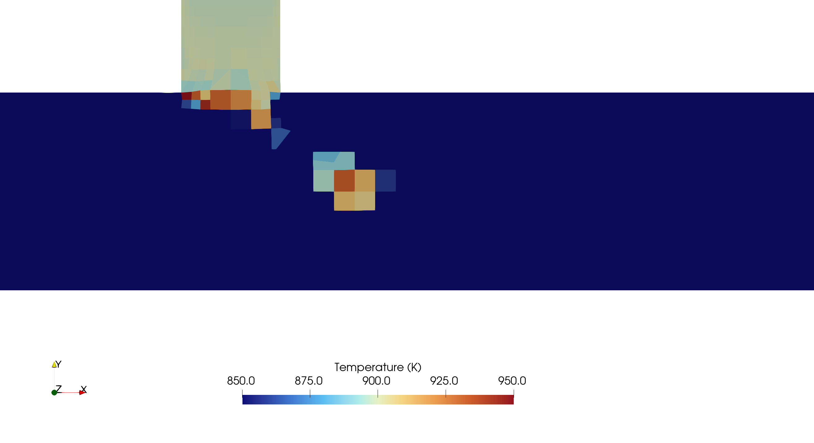

# Post-Processing


## Visualizing the Velocity Contour

As soon as results from the processor folders are reconstructed, they can be viewed using ParaView. Start ParaView in the background with the following command:

```bash
paraFoam &
```

Colour the surface by velocity magnitude `U` (Representation $$\rightarrow$$ **Surface**, Coloring $$\rightarrow$$ **U**, **Rescale to Data Range**). Navigate to the last time step at $$t = 0.08\,\text{s}$$ using the **Last Frame** button in the **VCR Controls**. When inspecting the velocity field, the increase of flow velocity at and downstream of the T-junction is apparent. This is due to conservation of mass, as the combined flow rates from both inlets have to pass through the main pipe.


When clicking the **Play** button in the **VCR Controls** at the very top of the ParaView window, one can see the transient nature of the flow and the characteristic flow separation just below the T-junction:


## Visualizing the Temperature Contour

The mixing of exhaust gas and fresh air is best visualized using the temperature field. Selecting temperature `T` in the **Properties** panel and rescaling the data range gives the following temperature contour:


In the solving section, the `cellMax` function object revealed that the maximum temperature in the domain exceeds the exhaust gas inlet temperature of $$900\,\text{K}$$, which is unphysical since no heat source is present. To locate where this overshoot occurs, we can adjust the ParaView visualization.

By default, ParaView interpolates field values from cell centres to vertices for a smooth rendering. To display the actual cell centre values without interpolation, select the temperature `T` next to the orange cell symbol when choosing the variable to visualize. Then, manually fix the colour scale range to $$[850, 950]\,\text{K}$$ by clicking **Rescale to Custom Data Range** to make the overshoots clearly visible. Finally, zoom into the region just downstream of the exhaust gas inlet.



Cells with temperatures exceeding $$900\,\text{K}$$ are concentrated at the interface between the cold air stream and the hot exhaust gas jet, precisely where the steepest temperature gradients occur. The unlimited second-order upwind scheme (`Gauss linearUpwind`) reconstructs the temperature at cell faces using an unbounded gradient, which can overshoot the physical bounds in regions of steep gradients. This is a well-known limitation of unlimited higher-order schemes and will be addressed in the exercise by switching to a bounded discretization scheme.


## Analysing the Mixing Process

In order to quantify the mixing of exhaust gas and fresh air along the pipe, the temperature can be plotted over a line along the centreline of the main pipe. With the `exhaust_gas_recirculation.OpenFOAM` module selected in the **Pipeline Browser**, apply the **Plot Over Line** filter (**Filters** $$\rightarrow$$ **Data Analysis**). Set the start and end points of the sampling line to $$(0\,\, 0\,\, 0)$$ and $$(0.36\,\, 0\,\, 0)$$, respectively, with a spatial **Resolution** of 1000 points. Click **Apply** to show the plot.


The resulting diagram is cluttered as all solved variables are displayed. In the **Properties** panel, deselect all variables except temperature `T`. Uncheck **Use Index for X Axis** and set **X Array Name**** to `Points_X` so that temperature is plotted along the streamwise coordinate. Increasing the **Line Thickness** (e.g. to 5) improves readability. The resulting diagram should look as follows:


Just downstream of the T-junction, the centreline temperature reaches its peak as the hot exhaust gas enters the main pipe. Further downstream, the temperature decreases as the mixing between the cold air and hot exhaust gas progresses. Note that the instantaneous temperature profile shows local fluctuations due to the transient vortex structures in the flow, unlike a time-averaged profile which would appear smooth.


## Conclusion

This concludes the sixth seminar on the simulation of a compressible, turbulent flow through an exhaust gas recirculation system. A three-dimensional mesh was generated using `snappyHexMesh` and the case was run in parallel using the compressible solver `fluid`. Residuals, probe temperatures, and average outlet temperature were monitored during runtime. Finally, the velocity and temperature fields were visualized in ParaView and the mixing process along the pipe was analysed.